# CTE

A **CTE (Common Table Expression)** is a temporary named result set in SQL that you define using the `WITH` keyword. It exists only for the duration of a single SQL statement and helps make complex queries easier to read, write, and maintain.

**Basic Syntax**

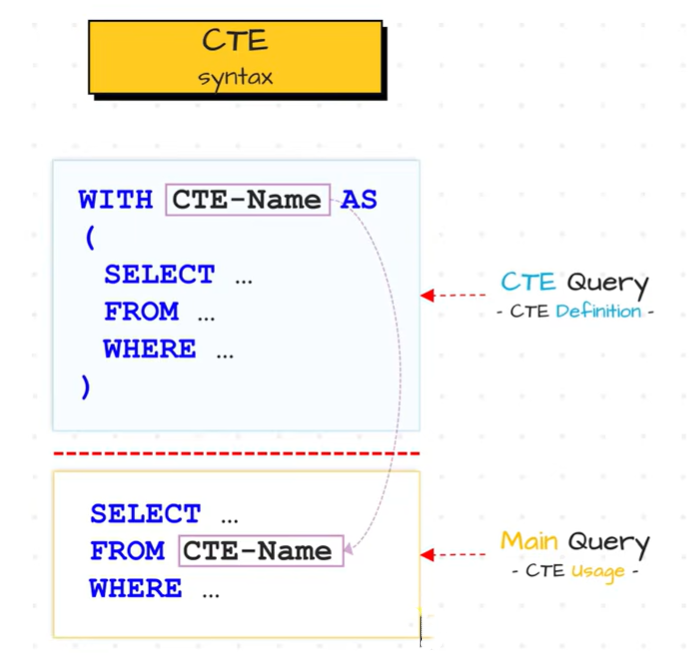

<br>

>[!NOTE]
> we cannot use an `ORDER BY` clause inside a Common Table Expression (CTE) just to sort the intermediate data.


**Why Use CTEs?**

A Common Table Expression (CTE) is used in SQL to break down complex queries into simpler, named blocks of code, acting like a temporary virtual table that exists only during that query's execution. By defining these blocks at the top of your script, you dramatically improve code readability and maintainability compared to using messy, deeply nested subqueries. Furthermore, CTEs allow you to reuse the same temporary data subset multiple times without rewriting the logic, and they provide the only standard way to perform recursive operations for hierarchical data, such as organizational charts or family trees.

<br>


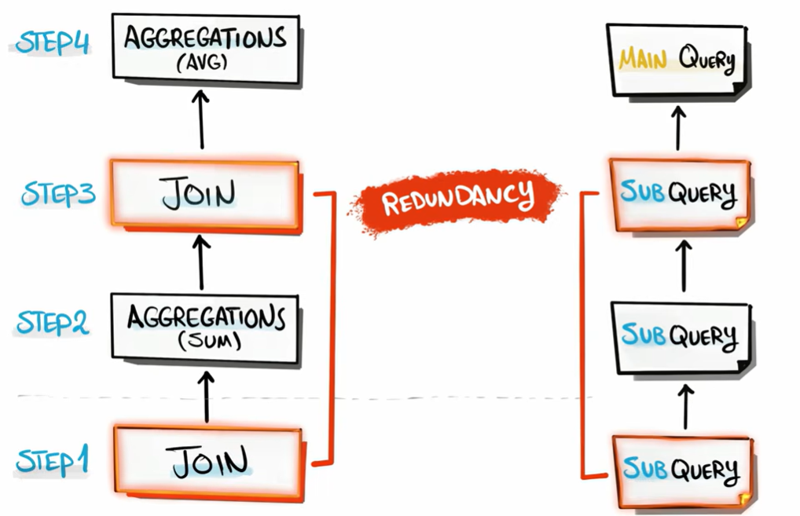

<br>

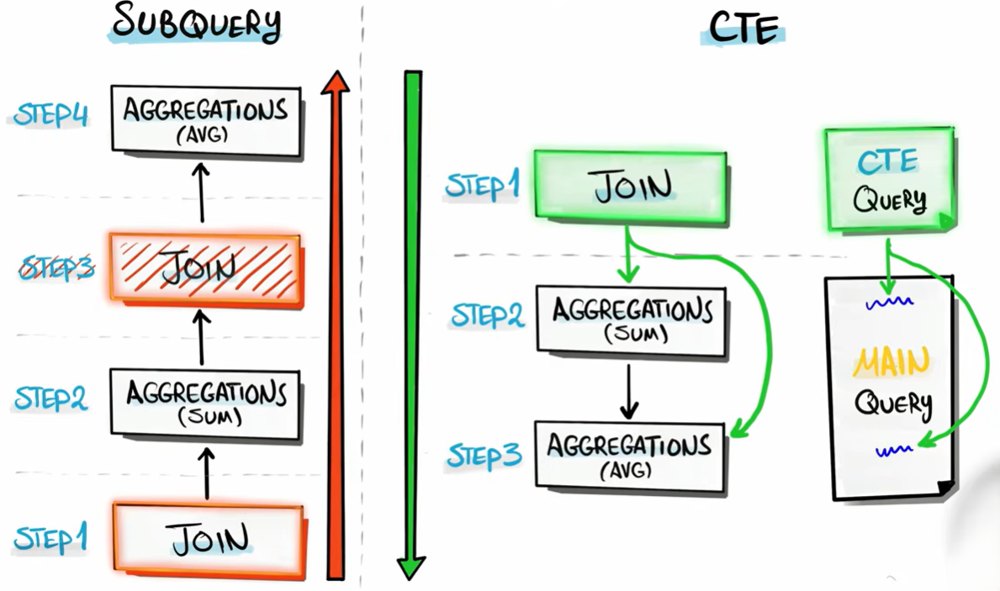


<br>

**Advantages of CTE**

* Improves readability
* Makes complex queries easier
* Eliminates repeated subqueries
* Supports recursion
* Easier debugging
* Can be referenced multiple times within the same query

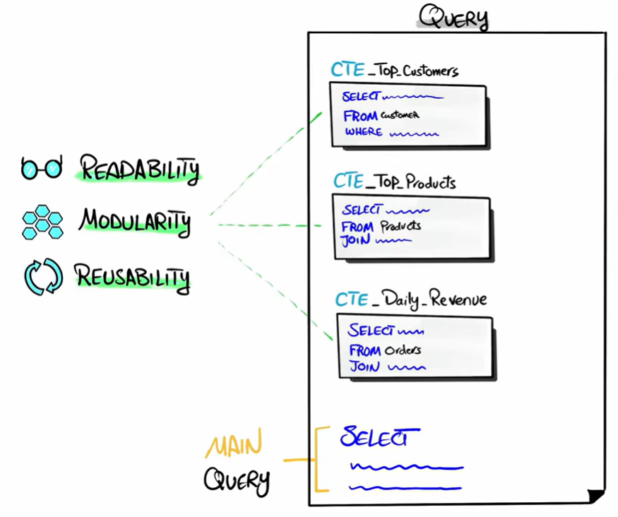

<br>

---

## Types of CTE

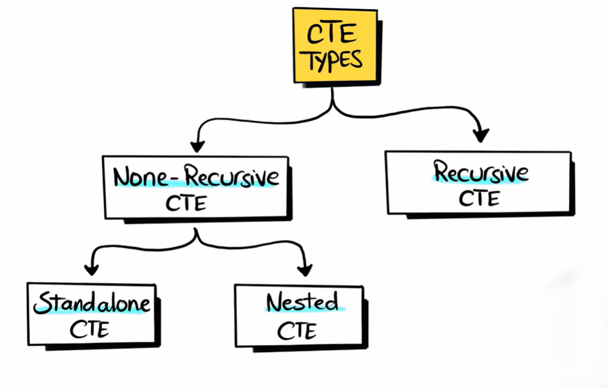

Let's understand each one in detail.


### 1. Non-Recursive CTE

A Non-Recursive CTE does **not refer to itself**.

or in simple words we can say CTE which is only executed once with out any repetition 

It executes only **once**.

**Structure**

```sql
WITH cte_name AS
(
    SELECT ...
)

SELECT ...
FROM cte_name;
```

There are two common forms:

* Standalone CTE
* Nested CTE

---

#### A. Standalone CTE

A standalone CTE is independent and does not rely on other CTE and queries 

It is created once and directly used by the main query.

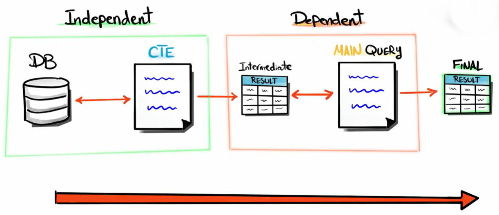


**Example**

Employee Table

| ID  | Name  | Salary |
| --- | ----- | ------ |
| 1   | John  | 50000  |
| 2   | Alice | 80000  |
| 3   | Bob   | 90000  |

Query

```sql
WITH HighSalary AS
(
    SELECT *
    FROM Employees
    WHERE Salary > 60000
)

SELECT *
FROM HighSalary;
```

Execution

Step 1

SQL executes

```sql
SELECT *
FROM Employees
WHERE Salary > 60000
```

Temporary result

| ID  | Name  | Salary |
| --- | ----- | ------ |
| 2   | Alice | 80000  |
| 3   | Bob   | 90000  |

Step 2

Main query

```sql
SELECT *
FROM HighSalary;
```

Output

| ID  | Name  | Salary |
| --- | ----- | ------ |
| 2   | Alice | 80000  |
| 3   | Bob   | 90000  |


**Why use Standalone CTE?**

Without CTE

```sql
SELECT *
FROM
(
    SELECT *
    FROM Employees
    WHERE Salary > 60000
) X;
```

With CTE

```sql
WITH HighSalary AS
(
    SELECT *
    FROM Employees
    WHERE Salary > 60000
)

SELECT *
FROM HighSalary;
```

The second version is much cleaner.


#### **Multiple Standalone CTES**

<br>

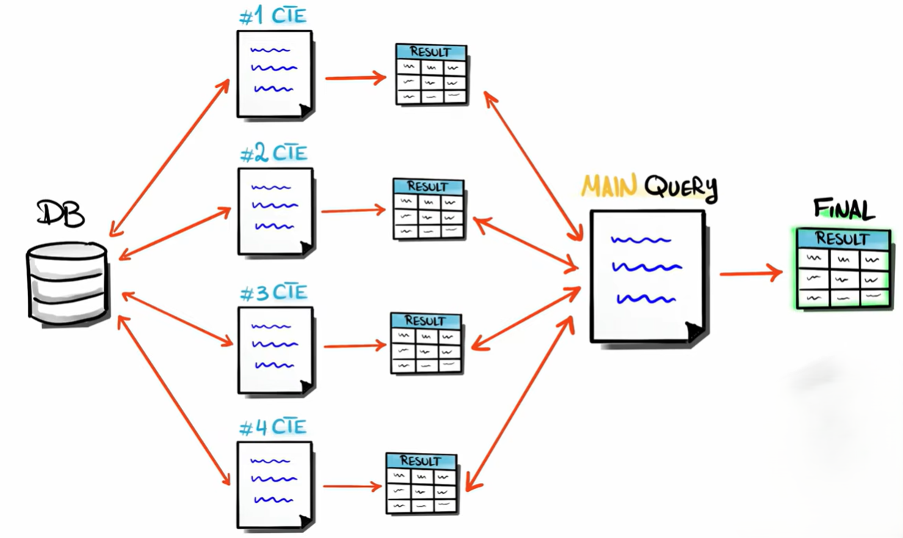


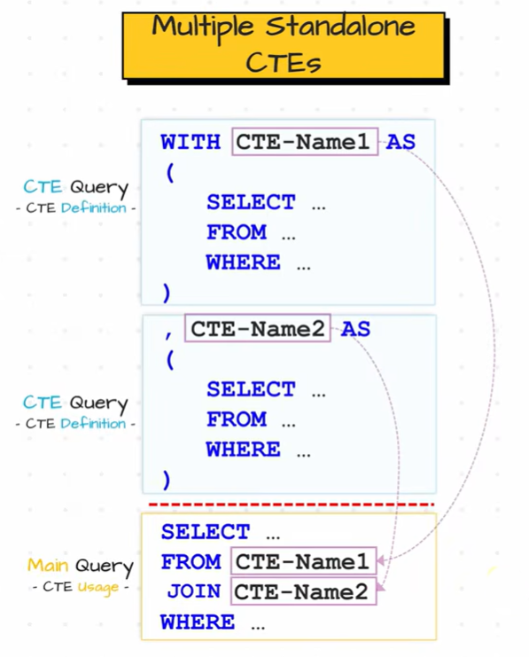


---

#### B. Nested CTE

A Nested CTE means **one CTE uses another CTE**.

Instead of writing one huge query, you divide it into multiple logical steps.

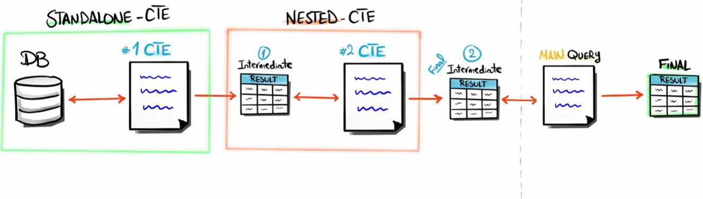

<br>

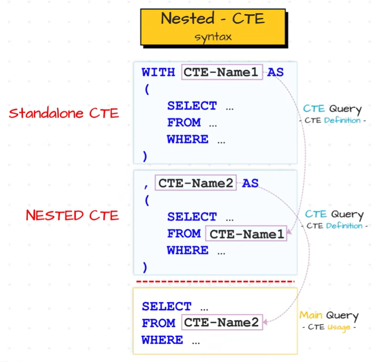

<br>

Example

```sql
WITH

DeptEmployees AS
(
    SELECT *
    FROM Employees
    WHERE Department='IT'
),

HighSalary AS
(
    SELECT *
    FROM DeptEmployees
    WHERE Salary > 60000
)

SELECT *
FROM HighSalary;
```

Notice

```
DeptEmployees
       ↓
HighSalary
       ↓
Main Query
```

Execution

Step 1

```sql
DeptEmployees
```

Result

| Name | Salary | Department |
| ---- | ------ | ---------- |
| John | 50000  | IT         |
| Bob  | 90000  | IT         |

Step 2

```sql
HighSalary
```

uses DeptEmployees.

Result

| Name | Salary |
| ---- | ------ |
| Bob  | 90000  |

Step 3

Main query

```sql
SELECT *
FROM HighSalary;
```

Output

Bob only.

---

### 2. Recursive CTE

A Recursive CTE **references itself**.

It repeatedly executes until a stopping condition is met.

Used for

* Employee hierarchy
* Parent-child relationships
* Folder structure
* Category tree
* Organization chart
* Number generation
* Graph traversal

<br>

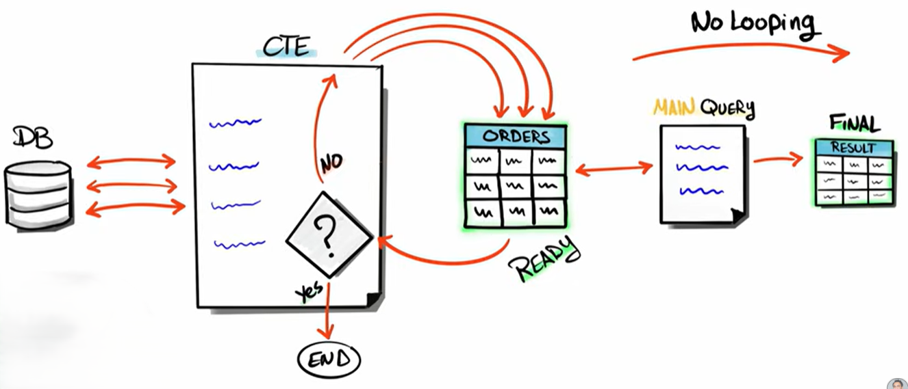

<br>


---

**syntax**

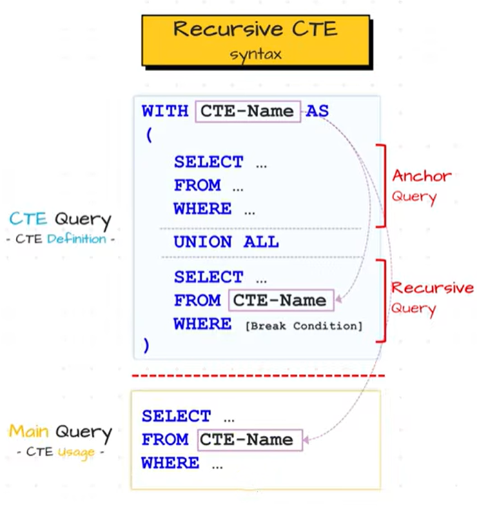

---

**Example**

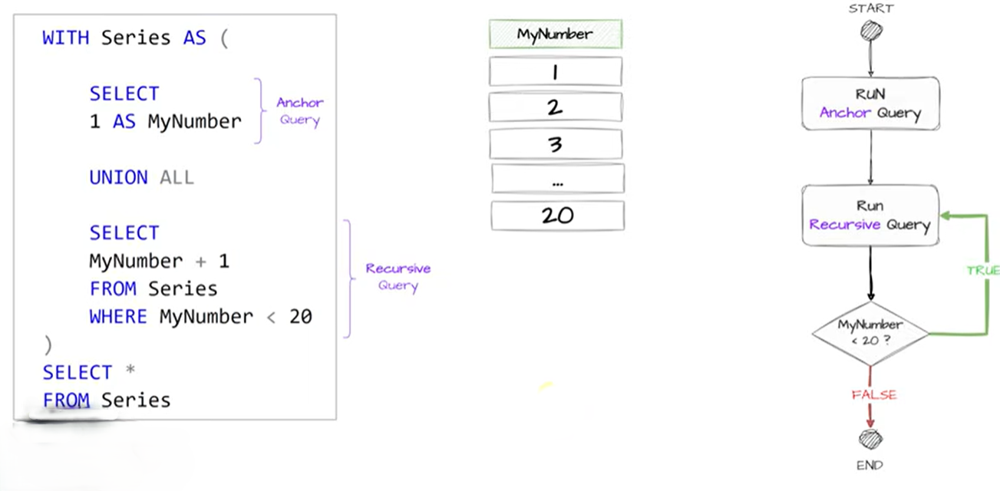


---

**Example**

Here's one of the simplest recursive CTE examples that generates numbers from **1 to 5**:

```sql
WITH Numbers AS
(
    -- Anchor query
    SELECT 1 AS Num

    UNION ALL

    -- Recursive query
    SELECT Num + 1
    FROM Numbers
    WHERE Num < 5
)
SELECT * FROM Numbers;
```

**How it works**

**Anchor query** (runs once):

```text
1
```

**Recursive query** (runs repeatedly):

```text
2
3
4
5
```

**Final output:**

```text
1
2
3
4
5
```

**Remember**

* **Anchor query** → Starting point (`1`)
* **Recursive query** → Generates the next number (`Num + 1`)
* **`UNION ALL`** → Adds each new number to the result
* **`WHERE Num < 5`** → Stops the recursion at 5

**Another example**

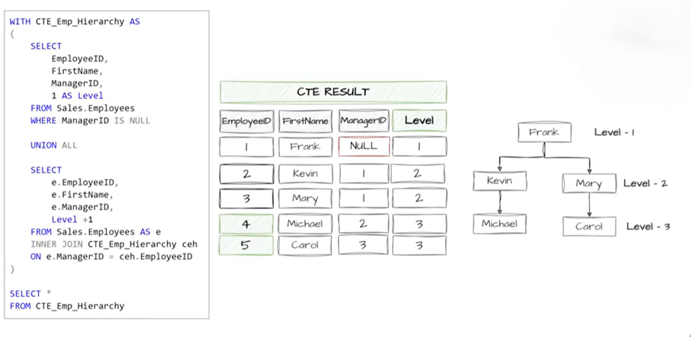

---

**summery**

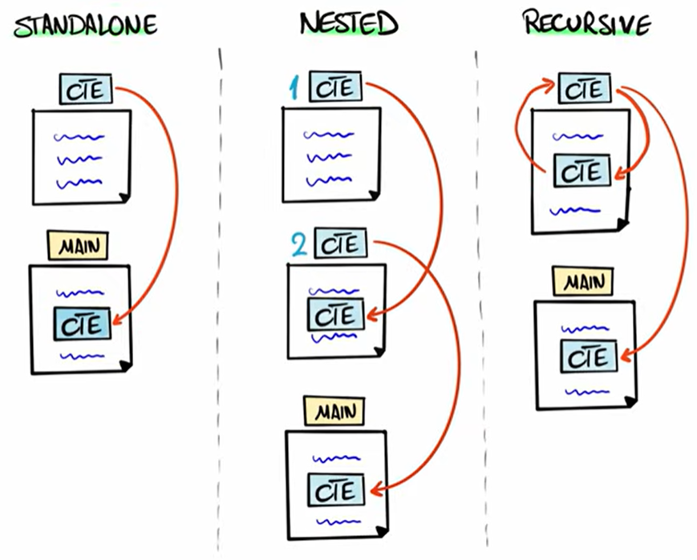
