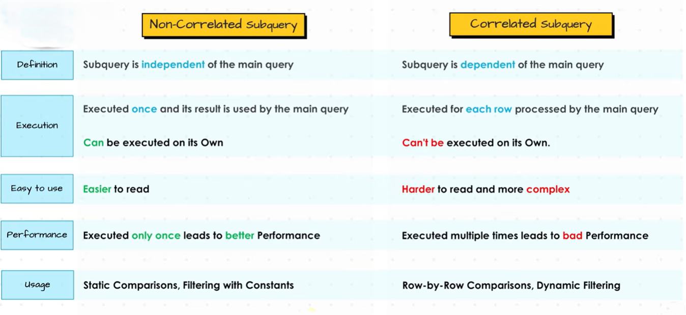

# Dependency Subqueries Types

**"Subqueries based on dependency are classified according to whether they depend on the outer query for execution. They are of two types:"**

1. **Non-Correlated Subquery:** Does not depend on the outer query and executes only once.
2. **Correlated Subquery:** Depends on the outer query and executes once for each row of the outer query.


## 1. Non-Correlated Subquery (Independent Subquery)

A **non-correlated subquery** can run **by itself** because it does **not depend on the outer query**.

* Executes **only once**.
* The result is passed to the outer query.
* Faster than correlated subqueries in many cases.

**Example**

Suppose you have an `Employees` table:

| EmpID | Name  | Salary | DeptID |
| ----- | ----- | ------ | ------ |
| 1     | Alice | 50000  | 10     |
| 2     | Bob   | 70000  | 20     |
| 3     | Carol | 60000  | 10     |

Find employees whose salary is greater than the average salary.

```sql
SELECT Name, Salary
FROM Employees
WHERE Salary >
(
    SELECT AVG(Salary)
    FROM Employees
);
```

**How it works**

1. Inner query executes first:

   ```sql
   SELECT AVG(Salary) FROM Employees;
   ```

   Result:

   ```
   60000
   ```
2. Outer query becomes:

   ```sql
   SELECT Name, Salary
   FROM Employees
   WHERE Salary > 60000;
   ```

Output:

| Name | Salary |
| ---- | ------ |
| Bob  | 70000  |

---

## 2. Correlated Subquery (Dependent Subquery)

A **correlated subquery** depends on the outer query.

* Cannot execute independently.
* Executes **once for every row** processed by the outer query.
* Usually slower because it runs repeatedly.

**Example**

Find employees who earn more than the average salary in **their own department**.

```sql
SELECT e1.Name, e1.Salary
FROM Employees e1
WHERE e1.Salary >
(
    SELECT AVG(e2.Salary)
    FROM Employees e2
    WHERE e2.DeptID = e1.DeptID
);
```

**How it works**

For **Alice (Dept 10)**

Inner query becomes:

```sql
SELECT AVG(Salary)
FROM Employees
WHERE DeptID = 10;
```

Average = 55000

Alice's salary = 50000 → Not selected

---

For **Carol (Dept 10)**

Average = 55000

Salary = 60000 → Selected

---

For **Bob (Dept 20)**

Average = 70000

Salary = 70000 → Not selected (because it's not greater)

Output:

| Name  | Salary |
| ----- | ------ |
| Carol | 60000  |

---

# Key Differences


