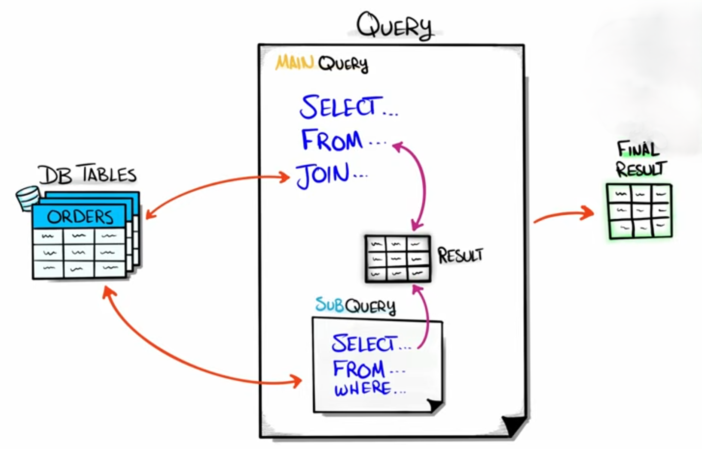
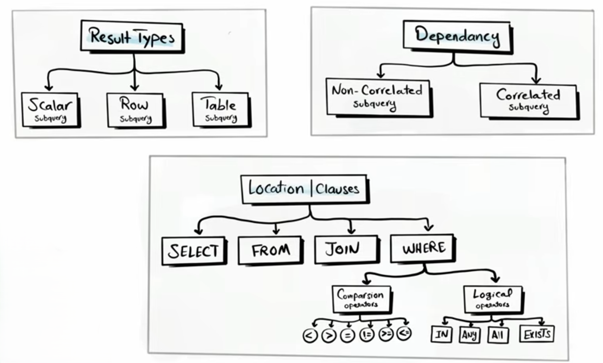

# Subquery

A **subquery** (also called a **nested query** or **inner query**) is an SQL query written inside another SQL query. The result of the inner query is used by the outer query.




<br>

**Basic Syntax**

```sql
SELECT column_name
FROM table_name
WHERE column_name OPERATOR (
    SELECT column_name
    FROM another_table
);
```

**Example**

Suppose you have two tables:

**Employees**

| EmployeeID | Name  | DepartmentID | Salary |
| ---------- | ----- | ------------ | ------ |
| 1          | Ali   | 1            | 50000  |
| 2          | Sara  | 2            | 70000  |
| 3          | Ahmed | 1            | 60000  |

**Departments**

| DepartmentID | DepartmentName |
| ------------ | -------------- |
| 1            | HR             |
| 2            | IT             |

Find employees working in the IT department.

```sql
SELECT Name
FROM Employees
WHERE DepartmentID = (
    SELECT DepartmentID
    FROM Departments
    WHERE DepartmentName = 'IT'
);
```

**Output**

| Name |
| ---- |
| Sara |

---

## Types of Subqueries

here are the types and categories of Subqueries that we will discuss



<br>

- [Result types](./Result%20types/Readme.md)
- [location(clauses)](./location-clauses/Readme.md)
- [Dependency](./Dependency/Readme.md)
