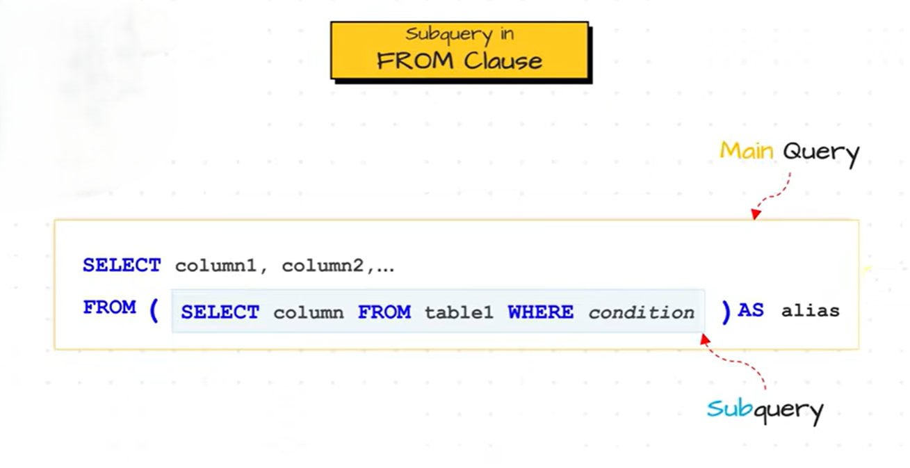

# Subquery in the `FROM` Clause

A **subquery in the `FROM` clause** is a subquery that is used as a **temporary table** (also called a **derived table**) for the outer query. The outer query treats the result of the subquery just like a regular table and can perform operations such as `SELECT`, `JOIN`, `WHERE`, and `GROUP BY` on it.

Unlike a subquery in the `SELECT` clause, a subquery in the `FROM` clause can return **multiple rows and multiple columns**.    

> [!Note]
> A subquery in the `FROM` clause **must be given an alias**, as SQL treats it as a temporary table.



<br>

**Syntax**

```sql
SELECT column_list
FROM
(
    SELECT column_list
    FROM table_name
    WHERE condition
) AS alias_name;
```

---

#### Example 1: Calculate Average Salary by Department**

**Employees**

| EmployeeID | Name  | DepartmentID | Salary |
| ---------- | ----- | ------------ | ------ |
| 1          | Ali   | 1            | 50000  |
| 2          | Sara  | 2            | 70000  |
| 3          | Ahmed | 1            | 60000  |
| 4          | John  | 2            | 80000  |

**Query**

```sql
SELECT DepartmentID, AvgSalary
FROM
(
    SELECT DepartmentID,
           AVG(Salary) AS AvgSalary
    FROM Employees
    GROUP BY DepartmentID
) AS DeptAverage;
```

**How it Works**

**Step 1:** The subquery executes first.

```sql
SELECT DepartmentID,
       AVG(Salary) AS AvgSalary
FROM Employees
GROUP BY DepartmentID;
```

**Subquery Result**

| DepartmentID | AvgSalary |
| ------------ | --------- |
| 1            | 55000     |
| 2            | 75000     |

**Step 2:** The outer query treats this result as a temporary table named `DeptAverage`.

**Output**

| DepartmentID | AvgSalary |
| ------------ | --------- |
| 1            | 55000     |
| 2            | 75000     |

---

#### Example 2: Find Departments with Average Salary Greater Than 60000

```sql
SELECT *
FROM
(
    SELECT DepartmentID,
           AVG(Salary) AS AvgSalary
    FROM Employees
    GROUP BY DepartmentID
) AS DeptAverage
WHERE AvgSalary > 60000;
```

**Subquery Result**

| DepartmentID | AvgSalary |
| ------------ | --------- |
| 1            | 55000     |
| 2            | 75000     |

**Output**

| DepartmentID | AvgSalary |
| ------------ | --------- |
| 2            | 75000     |

The outer query filters the temporary table to display only departments whose average salary is greater than **60000**.

---

### Why Use a Subquery in the `FROM` Clause?

Suppose you first calculate the average salary for each department and then want to filter those averages. SQL does not allow you to directly filter an aggregate alias in the same query using `WHERE`. A subquery solves this problem by first creating a temporary table containing the calculated values, which the outer query can then filter or process further.

---

### Key Points

* A subquery in the **`FROM` clause** acts as a **temporary table (derived table)**.
* It can return **multiple rows and multiple columns**.
* The outer query can perform `SELECT`, `WHERE`, `JOIN`, `GROUP BY`, and `ORDER BY` on the subquery result.
* **An alias is mandatory** for the subquery.
* It is commonly used when intermediate calculations or aggregations are needed before further processing.

---

### Advantages

* Simplifies complex queries by breaking them into smaller parts.
* Makes aggregate calculations easier to reuse.
* Improves query readability.
* Allows filtering or joining on calculated results.

---

### Limitation

Every subquery in the `FROM` clause **must have an alias**.

**Incorrect Query**

```sql
SELECT *
FROM
(
    SELECT DepartmentID,
           AVG(Salary) AS AvgSalary
    FROM Employees
    GROUP BY DepartmentID
);
```

**Error**

```text
Every derived table must have its own alias.
```

**Correct Query**

```sql
SELECT *
FROM
(
    SELECT DepartmentID,
           AVG(Salary) AS AvgSalary
    FROM Employees
    GROUP BY DepartmentID
) AS DeptAverage;
```

This assigns the alias `DeptAverage` to the derived table, allowing the outer query to reference it correctly.
