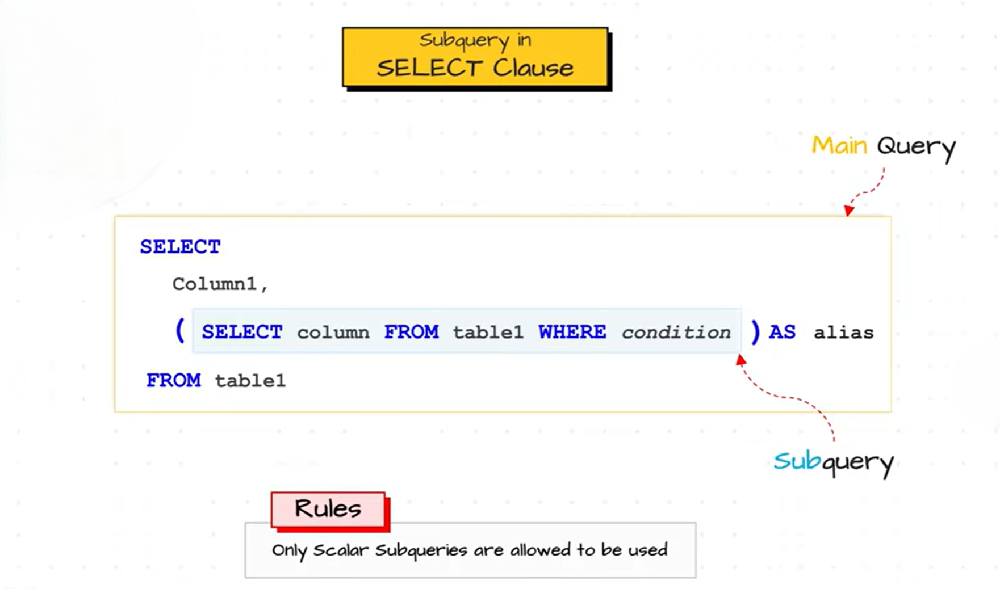

# Subquery in the `SELECT` Clause

A **subquery in the `SELECT` clause** is a subquery that appears in the list of columns of the `SELECT` statement. It is used to return a **single value (scalar value)** for each row returned by the main query.

Since the `SELECT` clause expects one value for each column in every row, the subquery should return **only one row and one column**. Therefore, it is typically a **Scalar Subquery**.




**Syntax**

```sql
SELECT column1,
       column2,
       (
           SELECT expression
           FROM table_name
           WHERE condition
       ) AS alias_name
FROM table_name;
```

#### Example 1: Display Average Salary with Every Employee

**Employees**

| EmployeeID | Name  | Salary |
| ---------- | ----- | ------ |
| 1          | Ali   | 50000  |
| 2          | Sara  | 70000  |
| 3          | Ahmed | 60000  |

Query:

```sql
SELECT Name,
       Salary,
       (
           SELECT AVG(Salary)
           FROM Employees
       ) AS AverageSalary
FROM Employees;
```

**How it Works**

**Step 1:** The subquery executes first.

```sql
SELECT AVG(Salary)
FROM Employees;
```

**Result**

| AVG(Salary) |
| ----------- |
| 60000       |

**Step 2:** The outer query uses this value for every row.

**Output**

| Name  | Salary | AverageSalary |
| ----- | ------ | ------------- |
| Ali   | 50000  | 60000         |
| Sara  | 70000  | 60000         |
| Ahmed | 60000  | 60000         |

---

#### Example 2: Display Department Name for Each Employee

**Employees**

| EmployeeID | Name  | DepartmentID |
| ---------- | ----- | ------------ |
| 1          | Ali   | 1            |
| 2          | Sara  | 2            |
| 3          | Ahmed | 1            |

**Departments**

| DepartmentID | DepartmentName |
| ------------ | -------------- |
| 1            | HR             |
| 2            | IT             |

Query:

```sql
SELECT Name,
       (
           SELECT DepartmentName
           FROM Departments
           WHERE Departments.DepartmentID = Employees.DepartmentID
       ) AS Department
FROM Employees;
```

**How it Works**

For each employee:

* If `DepartmentID = 1`, the subquery returns **HR**.
* If `DepartmentID = 2`, the subquery returns **IT**.

**Output**

| Name  | Department |
| ----- | ---------- |
| Ali   | HR         |
| Sara  | IT         |
| Ahmed | HR         |

---

## Key Points

* A subquery in the **`SELECT` clause** returns a value that appears as a column in the result.
* It is usually a **Scalar Subquery**, meaning it returns **one row and one column**.
* It is executed to provide a value for each row of the outer query.
* Commonly used with aggregate functions such as `AVG()`, `MAX()`, `MIN()`, `COUNT()`, and `SUM()`.
* The returned value should be **a single value**; otherwise, SQL will produce an error.

---

## Advantages

* Adds calculated or lookup values directly to the output.
* Eliminates the need for additional joins in simple lookup scenarios.
* Makes the query more readable when only a single value is required.

---

## Limitation

The subquery **must return only one value**. If it returns multiple rows, SQL raises an error.

**Incorrect Example**

```sql
SELECT Name,
       (
           SELECT DepartmentName
           FROM Departments
       ) AS Department
FROM Employees;
```

**Error:**

```
Subquery returns more than one row.
```

This happens because the subquery returns multiple department names instead of a single value for each employee.
