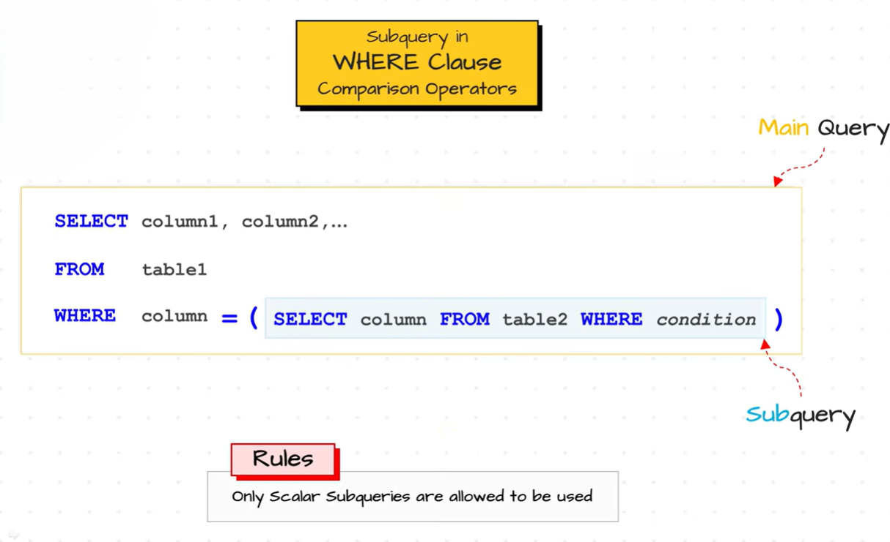
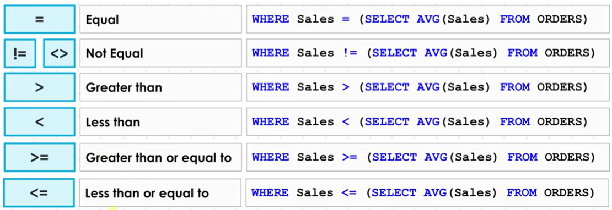

# Subquery in the `WHERE` Clause

A **subquery in the `WHERE` clause** is a subquery that is used to **filter rows** returned by the outer query. The subquery provides a value or a set of values, and the outer query uses these results to determine which records satisfy the specified condition.

The subquery is executed first, and its result is then used by the `WHERE` clause of the outer query.

Subqueries in the `WHERE` clause are the **most commonly used type of subqueries** in SQL.


**Syntax**

```sql
SELECT column_list
FROM table_name
WHERE column_name operator
(
    SELECT column_name
    FROM table_name
    WHERE condition
);
```

The **operator** can be:

* Comparison Operators (`=`, `>`, `<`, `>=`, `<=`, `<>`)

    
    


<br>
<br>


* Logical Operators (`IN`, `ANY`, `ALL`, `EXISTS`)


---

# 1. Using Comparison Operators

Comparison operators are used when the subquery returns a **single value (Scalar Subquery)**.

## Example: Find Employees Earning More Than the Average Salary

**Employees**

| EmployeeID | Name  | Salary |
| ---------- | ----- | ------ |
| 1          | Ali   | 50000  |
| 2          | Sara  | 70000  |
| 3          | Ahmed | 60000  |

### Query

```sql
SELECT Name, Salary
FROM Employees
WHERE Salary >
(
    SELECT AVG(Salary)
    FROM Employees
);
```

### How it Works

**Step 1:** The subquery executes first.

```sql
SELECT AVG(Salary)
FROM Employees;
```

**Result**

| AVG(Salary) |
| ----------- |
| 60000       |

**Step 2:** The outer query becomes:

```sql
SELECT Name, Salary
FROM Employees
WHERE Salary > 60000;
```

### Output

| Name | Salary |
| ---- | ------ |
| Sara | 70000  |

---

# 2. Using `IN`

The `IN` operator is used when the subquery returns **multiple values**. It checks whether a value exists in the list returned by the subquery.

## Example: Find Employees Working in Existing Departments

**Departments**

| DepartmentID |
| ------------ |
| 1            |
| 2            |

```sql
SELECT Name
FROM Employees
WHERE DepartmentID IN
(
    SELECT DepartmentID
    FROM Departments
);
```

### Output

| Name  |
| ----- |
| Ali   |
| Sara  |
| Ahmed |

---

# 3. Using `ANY`

The `ANY` operator returns **TRUE** if the comparison is true for **at least one** value returned by the subquery.

## Example

```sql
SELECT Name, Salary
FROM Employees
WHERE Salary > ANY
(
    SELECT Salary
    FROM Employees
    WHERE DepartmentID = 1
);
```

Suppose Department 1 salaries are:

| Salary |
| ------ |
| 50000  |
| 60000  |

The condition becomes:

```text
Salary > 50000
```

### Output

| Name  | Salary |
| ----- | ------ |
| Sara  | 70000  |
| Ahmed | 60000  |

---

# 4. Using `ALL`

The `ALL` operator returns **TRUE** only if the comparison is true for **every** value returned by the subquery.

## Example

```sql
SELECT Name, Salary
FROM Employees
WHERE Salary > ALL
(
    SELECT Salary
    FROM Employees
    WHERE DepartmentID = 1
);
```

Department 1 salaries:

| Salary |
| ------ |
| 50000  |
| 60000  |

The condition becomes:

```text
Salary > 50000
AND
Salary > 60000
```

### Output

| Name | Salary |
| ---- | ------ |
| Sara | 70000  |

---

# 5. Using `EXISTS`

The `EXISTS` operator checks whether the subquery returns **at least one row**. If the subquery returns one or more rows, `EXISTS` evaluates to **TRUE**.

## Example

**Departments**

| DepartmentID | DepartmentName |
| ------------ | -------------- |
| 1            | HR             |
| 2            | IT             |

```sql
SELECT Name
FROM Employees e
WHERE EXISTS
(
    SELECT *
    FROM Departments d
    WHERE d.DepartmentID = e.DepartmentID
);
```

### How it Works

For each employee:

* If a matching department exists, the employee is included.
* If no matching department exists, the employee is excluded.

### Output

| Name  |
| ----- |
| Ali   |
| Sara  |
| Ahmed |

---

# Summary of Operators

| Operator                        | Returns                               | Used For                               |
| ------------------------------- | ------------------------------------- | -------------------------------------- |
| `=`, `>`, `<`, `>=`, `<=`, `<>` | Single value                          | Scalar Subqueries                      |
| `IN`                            | Multiple values                       | Check whether a value exists in a list |
| `ANY`                           | At least one matching value           | Compare against multiple values        |
| `ALL`                           | All values must satisfy the condition | Compare against every value            |
| `EXISTS`                        | Checks whether rows exist             | Test for existence of matching rows    |

---

# Key Points

* A subquery in the **`WHERE` clause** is used to **filter rows** returned by the outer query.
* The subquery executes **before** the outer query.
* It can return either a **single value** or **multiple values**, depending on the operator used.
* It is commonly used with comparison operators (`=`, `>`, `<`, etc.) and logical operators (`IN`, `ANY`, `ALL`, `EXISTS`).
* This is the **most frequently used location** for subqueries in SQL.

---

# Advantages

* Simplifies complex filtering conditions.
* Eliminates the need for temporary tables in many cases.
* Makes queries easier to understand and maintain.
* Supports both single-value and multiple-value comparisons.

---

# Limitation

The operator used in the `WHERE` clause must match the type of result returned by the subquery.

**Incorrect Query**

```sql
SELECT Name
FROM Employees
WHERE DepartmentID =
(
    SELECT DepartmentID
    FROM Departments
);
```

**Error**

```text
Subquery returns more than one row.
```

**Reason:** The `=` operator expects a **single value**, but the subquery returns multiple rows.

**Correct Query**

```sql
SELECT Name
FROM Employees
WHERE DepartmentID IN
(
    SELECT DepartmentID
    FROM Departments
);
```

Here, the `IN` operator correctly handles multiple values returned by the subquery.
