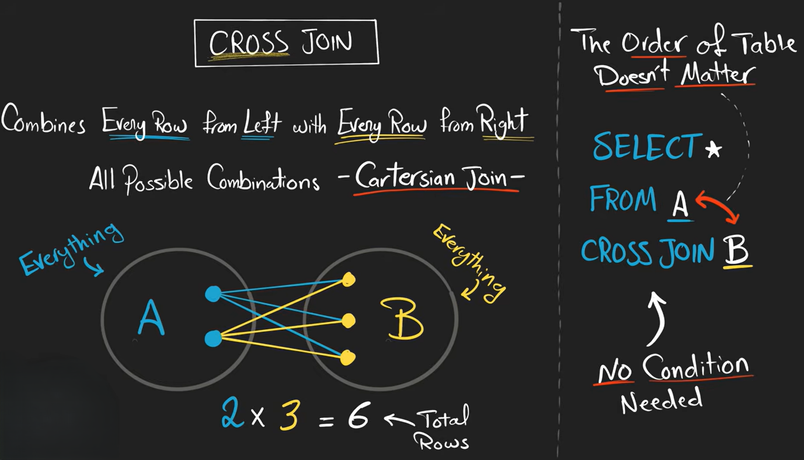

# CROSS JOIN

A `CROSS JOIN` combines **every row** from the first table with **every row** from the second table.

It creates all possible combinations.

**Syntax**

```sql id="c7m2qp"
SELECT *
FROM customers
CROSS JOIN orders;
```




**Formula**

```text
rows_in_table1 × rows_in_table2
```

---

### Important Difference

Other joins use:

```sql id="f1w6zn"
ON condition
```

But `CROSS JOIN` does NOT match anything.

It simply pairs everything with everything.

---

# Equivalent Query

These are the same:

```sql id="q3p9lx"
SELECT *
FROM customers
CROSS JOIN orders;
```

and

```sql id="u8t5bm"
SELECT *
FROM customers, orders;
```

though `CROSS JOIN` is clearer and recommended.

---

## Warning

If tables are large:

```text id="s6e1vk"
1000 × 1000 = 1,000,000 rows
```

So CROSS JOIN can become huge very quickly.
