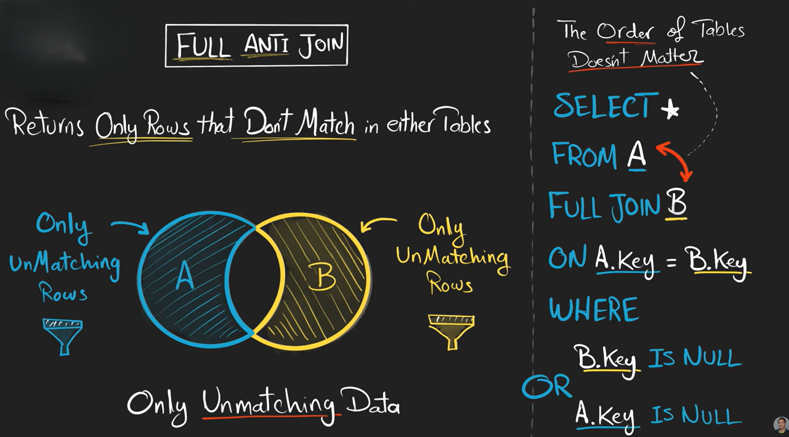
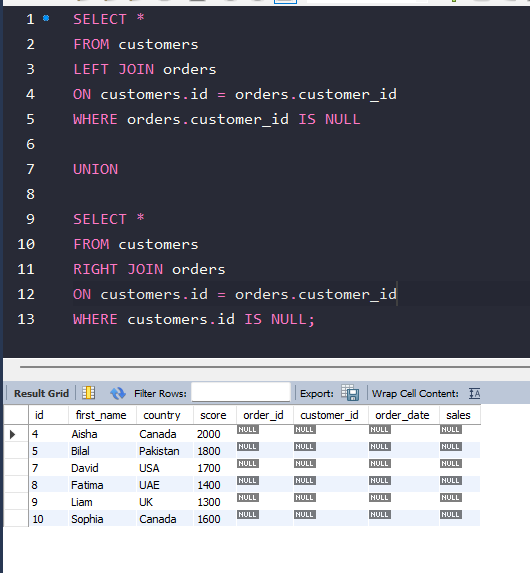

# Full Anti Join

A **Full Anti Join** returns:

> rows that do NOT have matches in either table.

It gives:

* unmatched rows from the left table
* unmatched rows from the right table


```text id="m4q8zy"
LEFT unmatched rows
+
RIGHT unmatched rows
```




## Method 1 — Using FULL JOIN

(Works in databases supporting FULL JOIN like PostgreSQL)

```sql id="j8x4kp"
SELECT *
FROM customers
FULL JOIN orders
ON customers.id = orders.customer_id
WHERE customers.id IS NULL
   OR orders.customer_id IS NULL;
```

## Method 2 — MySQL Compatible

MySQL does not support FULL JOIN directly.

So use:

```sql id="u6z3qy"
SELECT *
FROM customers
LEFT JOIN orders
ON customers.id = orders.customer_id
WHERE orders.customer_id IS NULL

UNION

SELECT *
FROM customers
RIGHT JOIN orders
ON customers.id = orders.customer_id
WHERE customers.id IS NULL;
```


