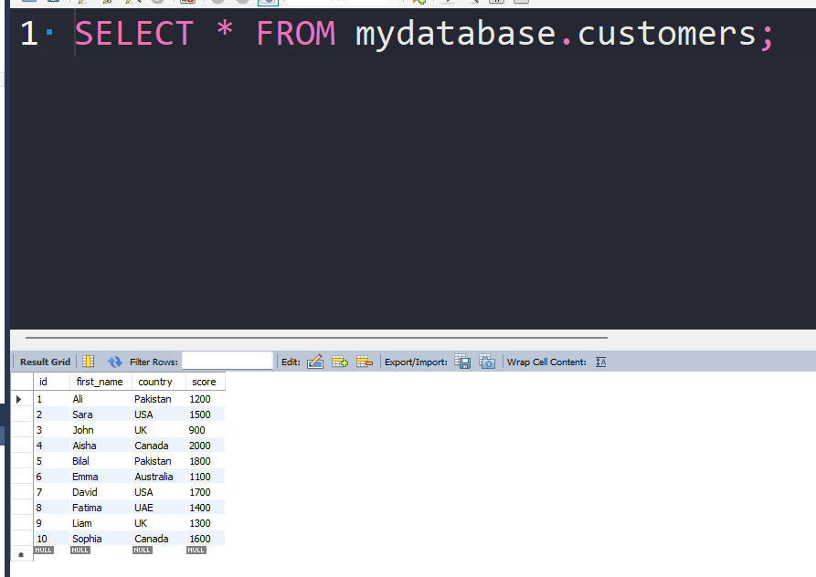
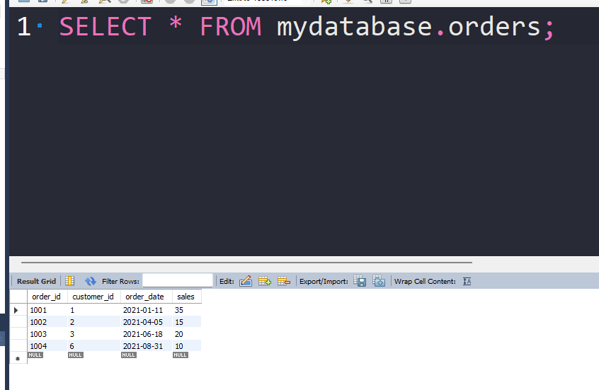
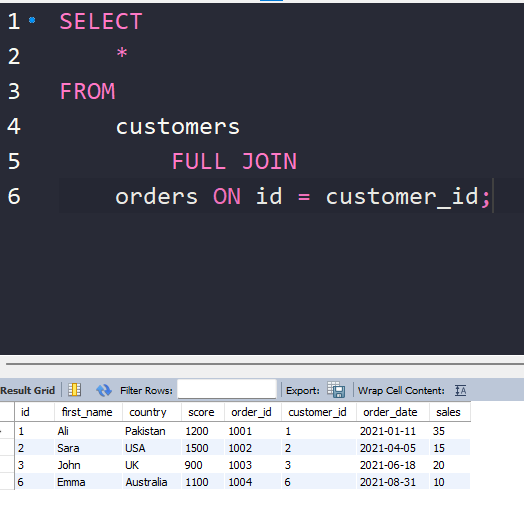
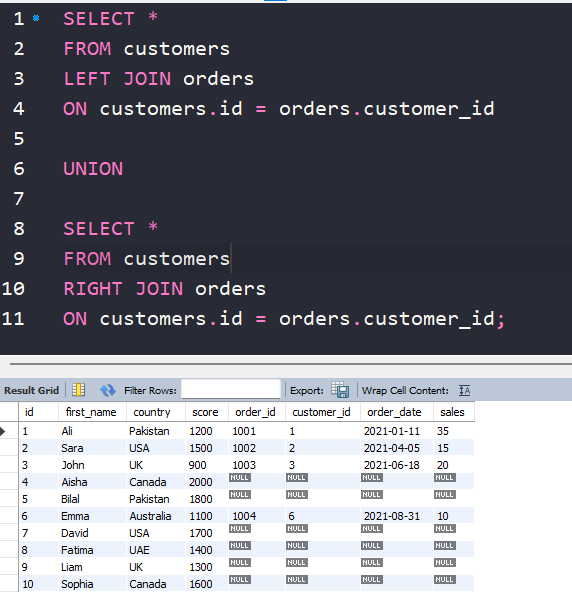

# FULL JOIN

`FULL JOIN` (also called `FULL OUTER JOIN`) returns:

* all rows from the left table
* all rows from the right table
* matched rows combined together
* unmatched rows filled with `NULL`


<br>

**Syntax**

```sql id="7f6d2a"
SELECT columns
FROM table1
FULL JOIN table2
ON table1.common_column = table2.common_column;
```

---

## How FULL JOIN Works

A `FULL JOIN`:

1. Keeps all rows from the left table
2. Keeps all rows from the right table
3. Matches rows where possible
4. Uses `NULL` where no match exists

---

# Important Note

Some databases like older versions of MySQL do **not** support `FULL JOIN` directly.

People often simulate it using:

```sql id="c8z3vf"
LEFT JOIN
UNION
RIGHT JOIN
```

i am using mysql which does not support full-join lets see an example




<br>



but when i do an full join i do not get the full result



so the solution is to use Union which we will learn in future

```sql
SELECT *
FROM customers
LEFT JOIN orders
ON customers.id = orders.customer_id

UNION

SELECT *
FROM customers
RIGHT JOIN orders
ON customers.id = orders.customer_id;
```




---

## Example

