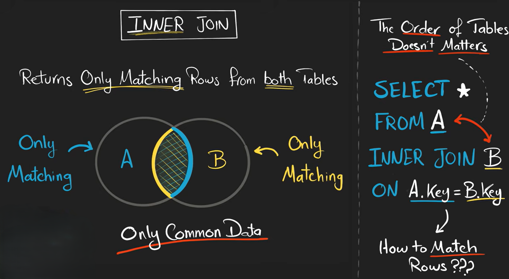
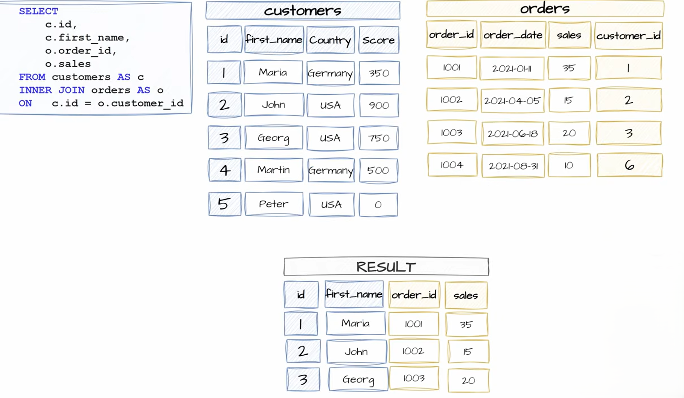

# INNER JOIN

An **INNER JOIN** is used to combine rows from two tables **only when there is a matching value in both tables**.

It returns the **common records** between tables.

INNER JOIN removes:

* rows from first table with no match
* rows from second table with no match

Only intersection/common data is returned.




<br>

**Syntax**

```sql"
SELECT column_names
FROM table1
<TYPE> JOIN table2
ON table1.common_column = table2.common_column;
```

* `table1` → first table
* `table2` → second table
* `ON` → condition for matching rows
* `<Type>` here it would be inner by default the type is inner

---


# Using Aliases

Aliases make queries shorter.

```sql"
SELECT s.name, m.marks
FROM Students s
INNER JOIN Marks m
ON s.student_id = m.student_id;
```

Here:

* `s` = Students
* `m` = Marks

---

# INNER JOIN on Multiple Tables

You can join more than 2 tables.

**Example**

```sql"
SELECT Students.name, Courses.course_name, Marks.marks
FROM Students
INNER JOIN Marks
ON Students.student_id = Marks.student_id
INNER JOIN Courses
ON Marks.course_id = Courses.course_id;
```

`INNER JOIN` combines data from multiple tables using related columns.

First, `Students` is joined with `Marks` using `student_id`.

Then `Marks` is joined with `Courses` using `course_id`.

The final result shows matching student names, course names, and marks together.


---

# Common Mistake

Wrong:

```sql"
SELECT *
FROM Students
INNER JOIN Marks;
```

This gives error because `ON` condition is missing.

Correct:

```sql id="w2r4bo"
SELECT *
FROM Students
INNER JOIN Marks
ON Students.student_id = Marks.student_id;
```

---


## Example 

here is an simple inner join example




