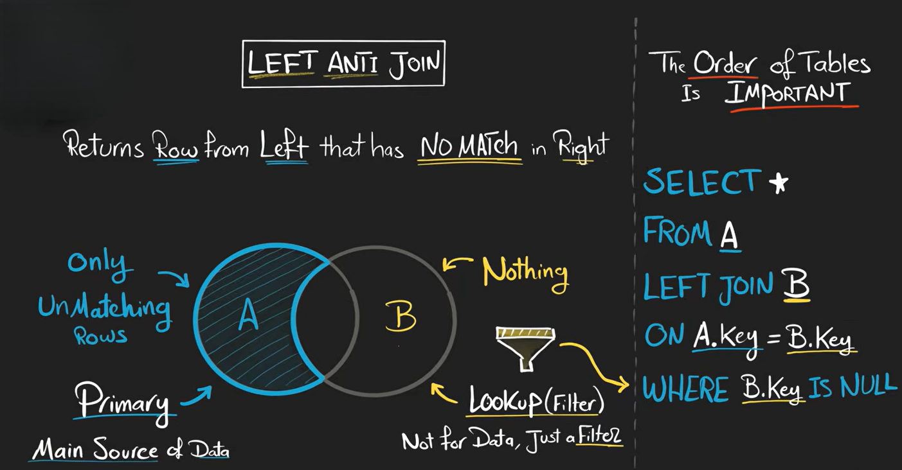
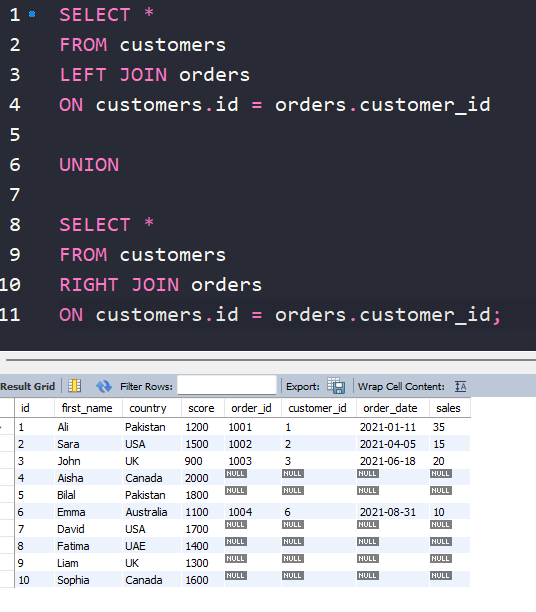
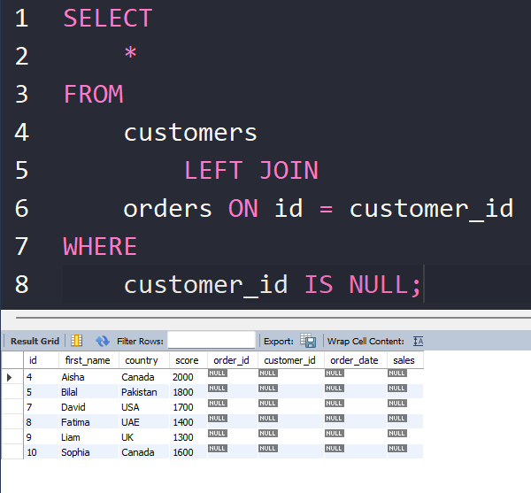

# Left Anti Join

A **Left Anti Join** returns rows from the left table that do **NOT** have matching rows in the right table.

It is basically:

```text
LEFT table
MINUS
matching rows
```





## Why It Is Called "Anti"

Normal join:

```text
returns matching rows
```

Anti join:

```text
returns NON-matching rows
```

It does the opposite.


---

## Important Note

SQL has no official keyword:

```sql
LEFT ANTI JOIN
```

Instead, we simulate it using:

```sql id="x3r6lm"
LEFT JOIN + WHERE NULL
```

---

## Alternative Using NOT EXISTS

Another common method:

```sql id="y8t5vo"
SELECT *
FROM customers c
WHERE NOT EXISTS (
    SELECT 1
    FROM orders o
    WHERE c.id = o.customer_id
);
```

This gives the same result.

---

## Example 

here is an simple example 




here we can see that we have many customers that have still not ordered so if we want only the people who have still not order we can use the below Left Anti Join

```sql
SELECT 
    *
FROM
    customers
        LEFT JOIN
    orders ON id = customer_id
WHERE
    customer_id IS NULL;
```

