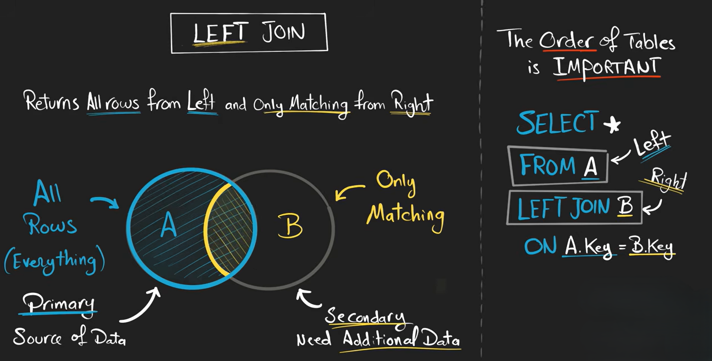
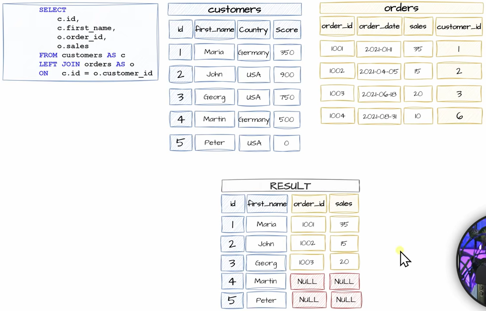

# LEFT JOIN

`LEFT JOIN` in SQL is used to combine rows from **two tables** while keeping **all records from the left table** even if there is no matching data in the right table.




**Syntax**

```sql
SELECT columns
FROM table1
LEFT JOIN table2
ON table1.common_column = table2.common_column;
```

* `table1` → Left table
* `table2` → Right table
* `ON` → condition used to match rows

---

## How LEFT JOIN Works

A `LEFT JOIN`:

1. Takes **all rows** from the left table
2. Finds matching rows in the right table
3. If no match exists, SQL fills right-table columns with `NULL`

---

# Multiple LEFT JOINs

You can join many tables.

```sql
SELECT Students.name, Courses.course_name, Marks.marks
FROM Students
LEFT JOIN Marks
ON Students.student_id = Marks.student_id
LEFT JOIN Courses
ON Marks.course_id = Courses.course_id;
```

This:

1. keeps all students
2. adds marks if found
3. adds course if found

---

## Example



