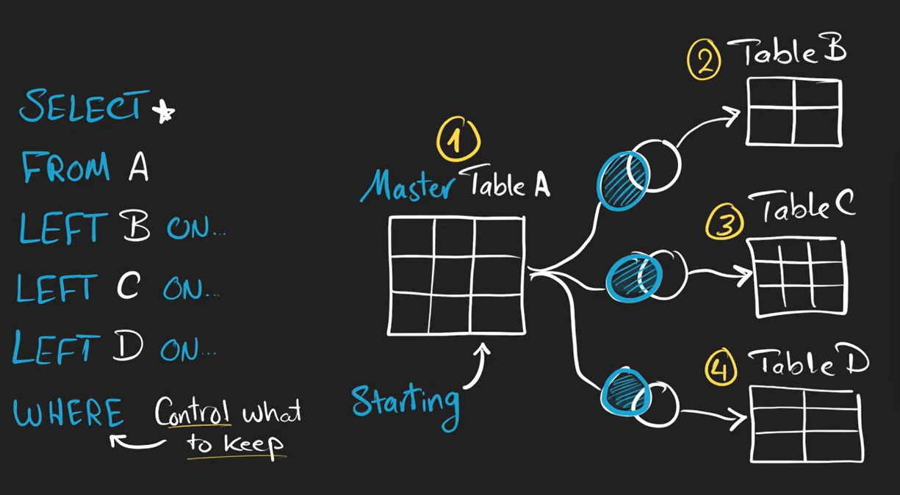
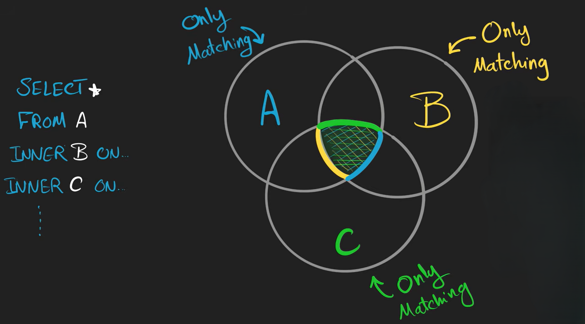
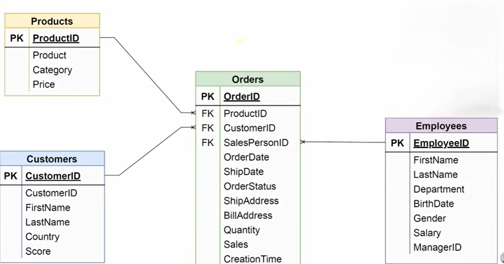
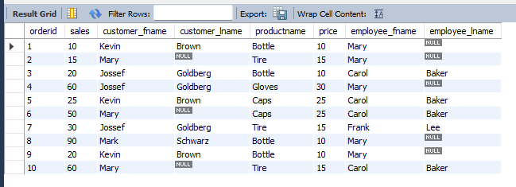

# Multi-Table JOIN

A **multi-table JOIN** means joining **more than two tables** together in a single query.

Instead of:

```text
Table A + Table B
```

you do:

```text
Table A + Table B + Table C + ...
```




---

## Why Multi-Table JOINs Are Used

Real databases split data into multiple related tables.

Example:

| Table     | Stores          |
| --------- | --------------- |
| customers | customer info   |
| orders    | orders          |
| products  | product info    |
| payments  | payment details |

To get complete information, SQL joins them together.

---

## Basic Syntax

```sql
SELECT columns
FROM table1
JOIN table2
ON condition
JOIN table3
ON condition
JOIN table4
ON condition;
```


## Important Concept

Each JOIN uses:

```text id="f1r6kp"
current result + next table
```

SQL builds the result step-by-step.

---

## Table Aliases (Very Important)

Multi-table joins become long.

So aliases are used.


**Without aliases**

```sql id="b3v7rx"
SELECT customers.name, orders.order_id
FROM customers
JOIN orders
ON customers.id = orders.customer_id;
```

**With aliases**

```sql id="k6m1zp"
SELECT c.name, o.order_id
FROM customers c
JOIN orders o
ON c.id = o.customer_id;
```

---

## Visual Representation 



---

## Example

heres an simple example which would help you understand Multi-Table JOIN
 
heres an [Entity–relationship model](https://en.wikipedia.org/wiki/Entity%E2%80%93relationship_model) for you to understand the database



so we just need to combine these tables into one we will use the following query

```sql
SELECT 
    o.orderid,
    o.sales,
    c.firstname As customer_fname,
    c.lastname AS customer_lname,
    p.product AS productname,
    p.price,
    e.firstname AS employee_fname,
    e.lastname AS employee_lname
FROM
    salesdb.orders AS o
        LEFT JOIN
    salesdb.customers AS c ON o.customerid = c.customerid
        LEFT JOIN
    salesdb.products AS p ON o.productid = p.productid
        LEFT JOIN
    salesdb.employees AS e ON o.salespersonid = e.employeeid
```



here we have successfully joined multiple tables together