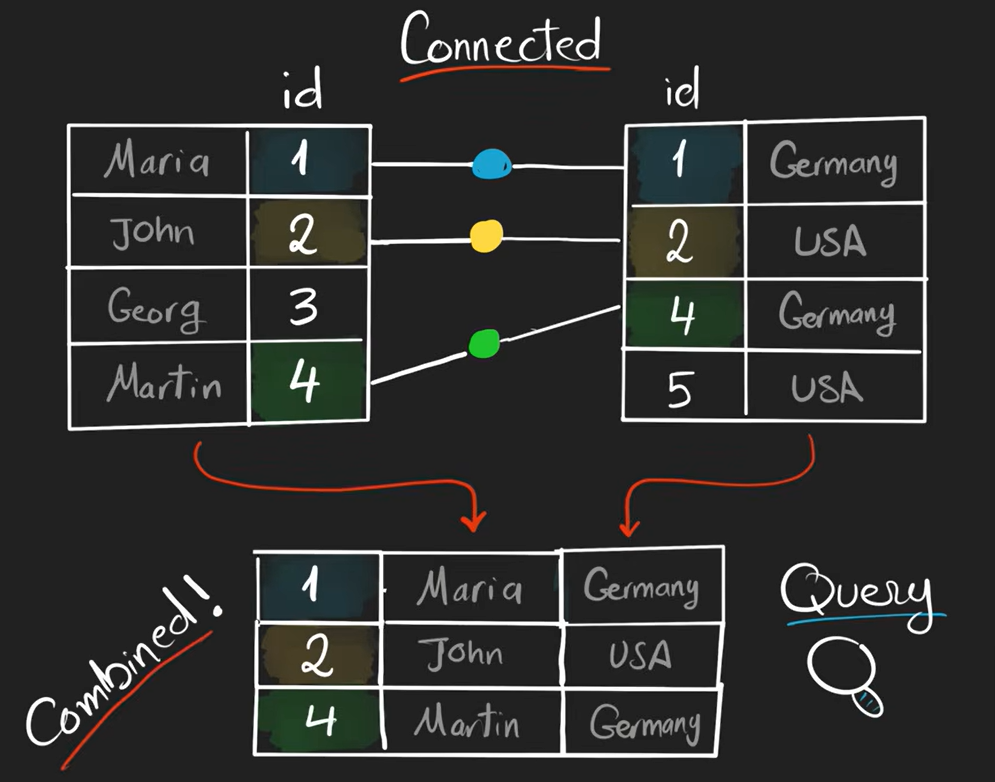
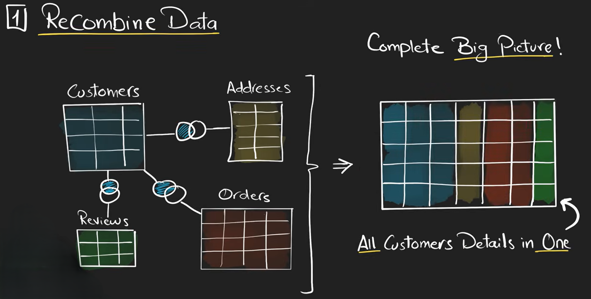
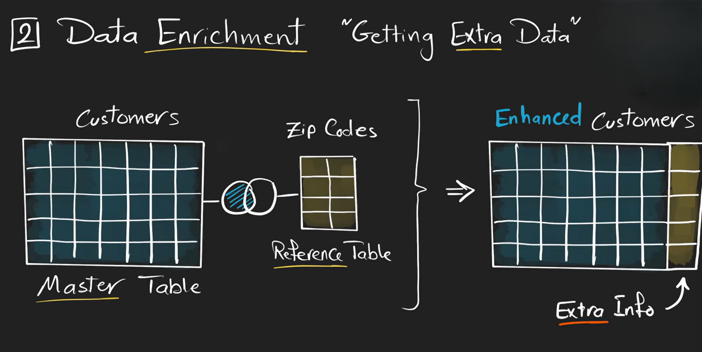
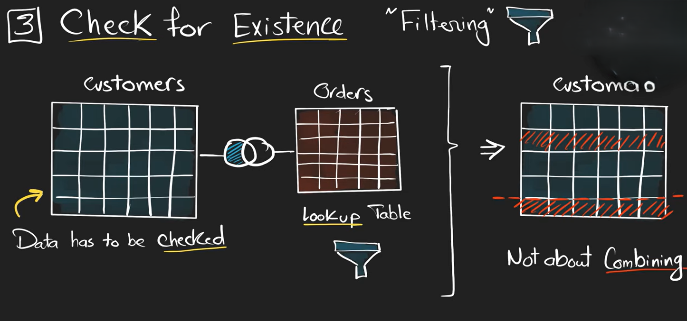
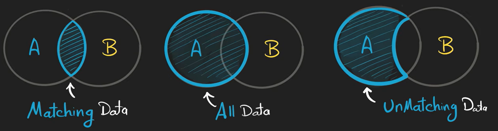
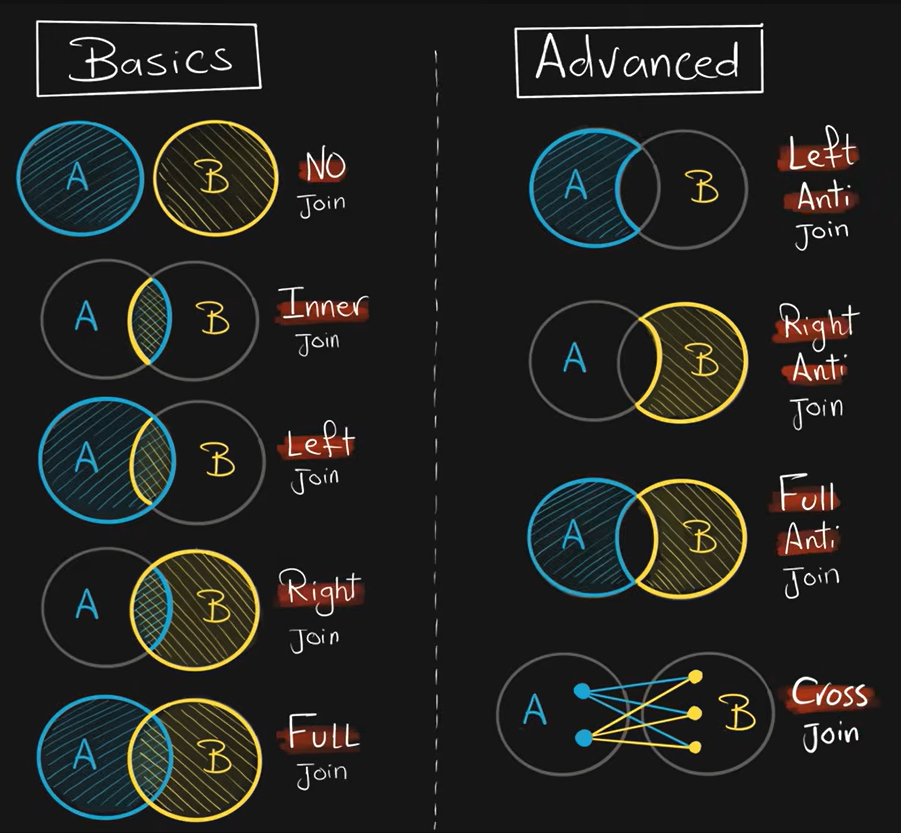

# JOIN in SQL

A **JOIN** in SQL is used to combine data from **two or more tables** based on a related column between them.

In databases, information is usually stored in separate tables to avoid repetition.
JOIN helps us connect those tables and retrieve meaningful combined data.

## Why Do We Use JOIN?

here are the three scenarios where you can use join

### Recombine data

### Data Enrichment

### Check for existence

---

## Join Types

these are the three scenarios that will generate join types

below is the table which shows the types of join

 
 
 

## Basic

- [No-join](./no-join/Readme.md)
- [Inner-join](./Inner-join/Readme.md)
- [Inner-join](./Inner-join/Readme.md)

## Advance