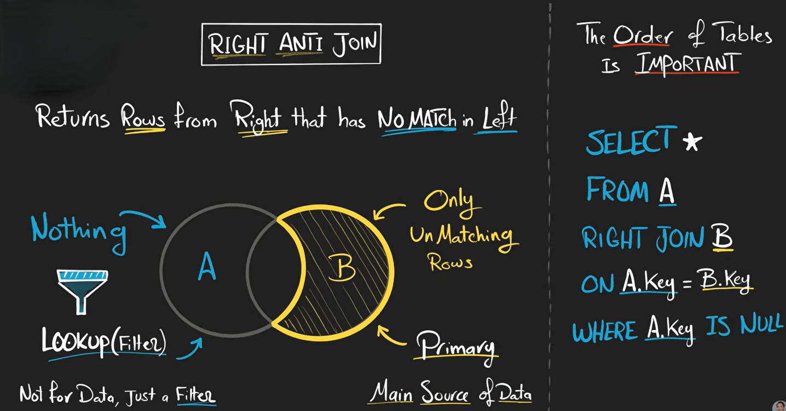
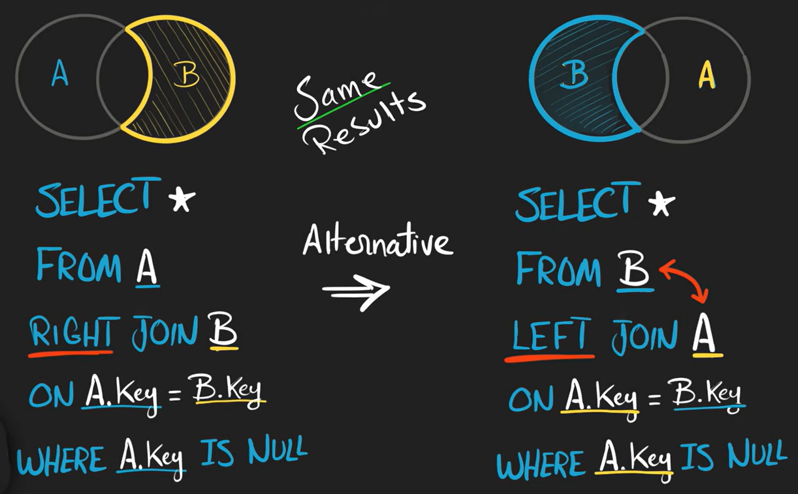

# Right Anti Join

A **Right Anti Join** returns rows from the **right table** that do **NOT** have matching rows in the left table.

It is the opposite of a Left Anti Join.




**SQL Query**

```sql id="m5q2ka"
SELECT orders.*
FROM customers
RIGHT JOIN orders
ON customers.id = orders.customer_id
WHERE customers.id IS NULL;
```
---

## Important Note

SQL does not have an official:

```sql id="s0x2ej"
RIGHT ANTI JOIN
```

keyword.

We simulate it using:

```sql id="u3n5fw"
RIGHT JOIN + WHERE left_table.column IS NULL
```

---


## How It Works

**Step 1 — RIGHT JOIN**

```sql id="r1v8np"
SELECT *
FROM customers
RIGHT JOIN orders
ON customers.id = orders.customer_id;
```

Result:

| id   | name | order_id | customer_id |
| ---- | ---- | -------- | ----------- |
| 1    | Ali  | 10       | 1           |
| 2    | Sara | 11       | 2           |
| NULL | NULL | 12       | 4           |

---

**Step 2 — Filter NULL Matches**

```sql id="n4w7zd"
WHERE customers.id IS NULL
```

This keeps only rows where:

* no matching customer exists

Result:

| order_id | customer_id |
| -------- | ----------- |
| 12       | 4           |

---


## Alternative Using NOT EXISTS

```sql id="h7k1ma"
SELECT *
FROM orders o
WHERE NOT EXISTS (
    SELECT 1
    FROM customers c
    WHERE c.id = o.customer_id
);
```

This gives the same result.

---

## Using LEFT



