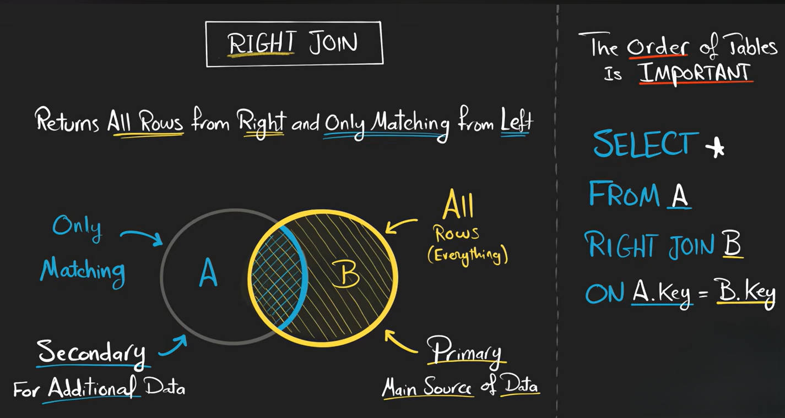
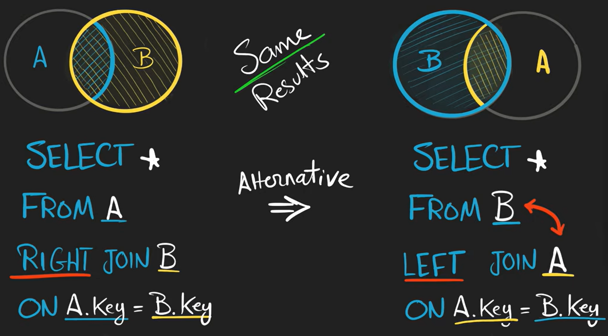

# RIGHT JOIN

`RIGHT JOIN` is the opposite of `LEFT JOIN`.

It keeps **all rows from the right table** and adds matching rows from the left table.

If no match exists, SQL fills left-table columns with `NULL`.




**Syntax**

```sql id="1t5ef2"
SELECT columns
FROM table1
RIGHT JOIN table2
ON table1.common_column = table2.common_column;
```

---

## How RIGHT JOIN Works

A `RIGHT JOIN`:

1. Takes all rows from the **right table**
2. Finds matching rows in the left table
3. If no match exists, left-table columns become `NULL`

--

## Equivalent Conversion

These two queries are equivalent:

**RIGHT JOIN**

```sql id="n2j31r"
SELECT *
FROM A
RIGHT JOIN B
ON A.id = B.id;
```

---

**LEFT JOIN**

```sql id="fd62oj"
SELECT *
FROM B
LEFT JOIN A
ON B.id = A.id;
```




Many developers prefer `LEFT JOIN` because it is easier to read.


---

## Finding Unmatched Right Rows

```sql id="5mz6pv"
SELECT Marks.student_id
FROM Students
RIGHT JOIN Marks
ON Students.student_id = Marks.student_id
WHERE Students.student_id IS NULL;
```

---

