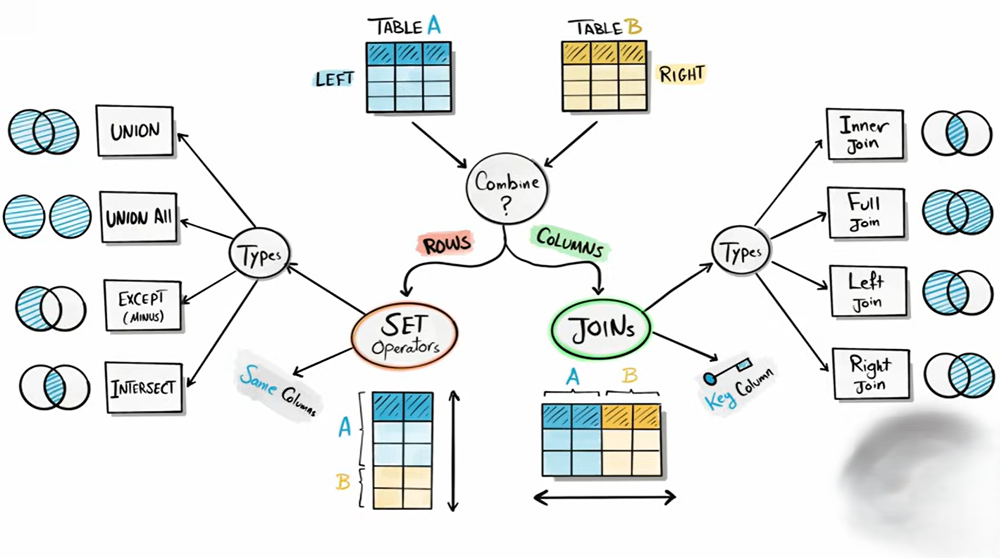

# **Combining Data**

**Combining Data** in SQL means **bringing together data from one or more tables or queries** to analyze, report, or use it in one result set. This is essential because in real databases, data is often spread across multiple tables.

There are **two main ways** to combine data:

- **[Joins](./Joins/Readme.md)**
- **[Set Operators](./Set%20Operators/Readme.md)**

 
 

