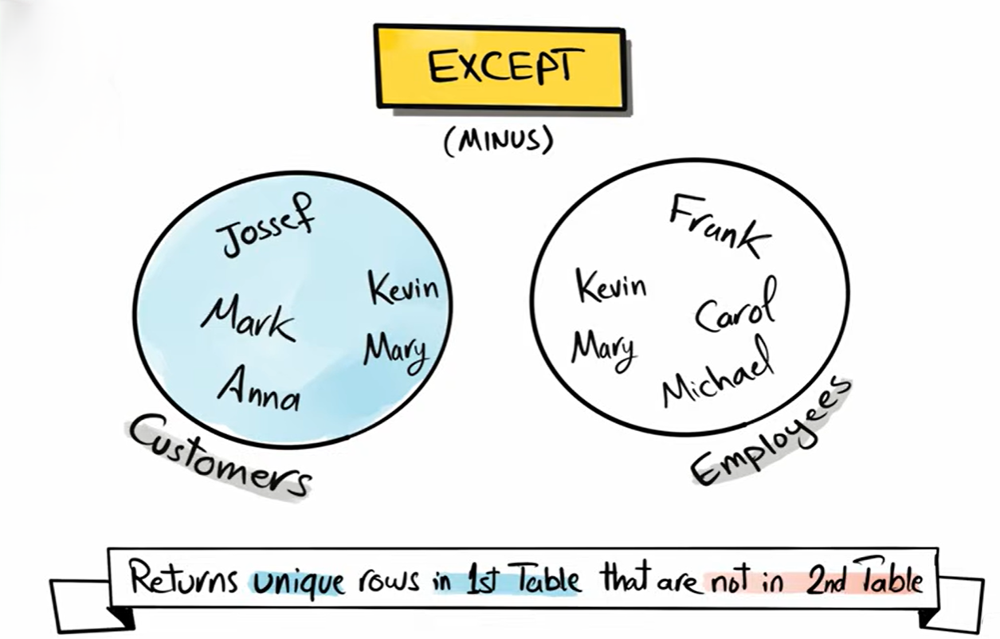
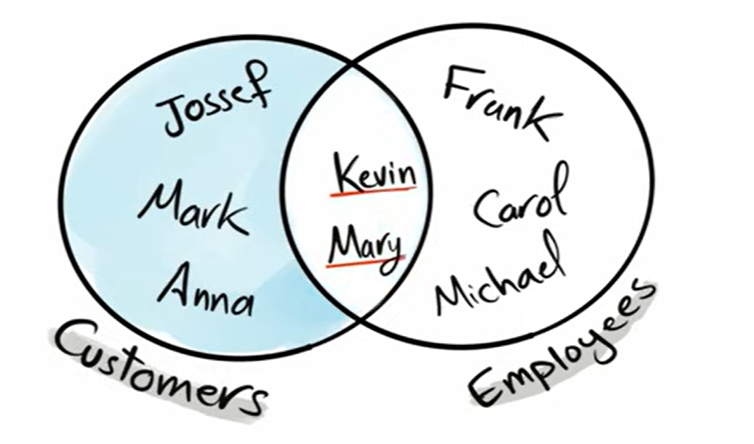
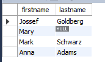
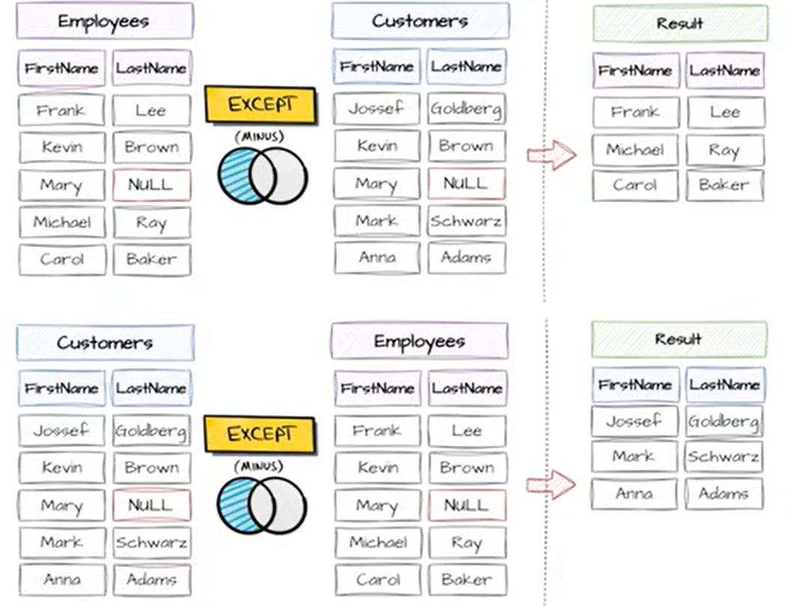

# EXCEPT

`EXCEPT` is a SQL set operator used to return:

> rows from the **first query** that do NOT exist in the second query.




<br>
<br>




Meaning:

> “Give me rows in A that are NOT in B”


**Basic Syntax**

```sql id="v7k2qp"
SELECT column1, column2
FROM table1

EXCEPT

SELECT column1, column2
FROM table2;
```

---

## Important Rule

`EXCEPT` automatically removes duplicates.

So it behaves more like:

```text
DISTINCT(A - B)
```

---

## Performance Notes

`EXCEPT` internally:

* sorts data
* compares rows
* removes duplicates

So:

> slower than simple filtering sometimes

---

## MYSQL alternative 

EXCEPT does NOT work in MySQL.

so its alternative is `NOT EXISTS`

here how it works 


```sql
SELECT DISTINCT
    e.firstname,
    e.lastname
FROM salesdb.employees e
WHERE NOT EXISTS (
    SELECT 1
    FROM salesdb.customers c
    WHERE e.firstname <=> c.firstname
      AND e.lastname <=> c.lastname
);
```

“If no matching row exists in the subquery, show the row.”

here `SELECT 1` is just a dummy value. It means: “If a matching row exists, return the number 1.”

so the where result becomes

```text
EXISTS      → found
NOT EXISTS  → not found
```

`DISTINCT` removes duplicates from the final output rows produced by that SELECT statement.

Also, `<=>` here is very important because if you do not use it, rows containing `NULL` values will not be matched correctly, since `NULL = NULL` is not TRUE in SQL.\


`<=>` in MySQL is called the NULL-safe equality operator.

It works like `=`, but it can also correctly compare NULL values.

if we don't use `<=>` and use `=` instead we will get the following result which is incorrect



if we use `<=>` we would get the following result 


---

## Example




>[!NOTE]
> the order of tables always matter

