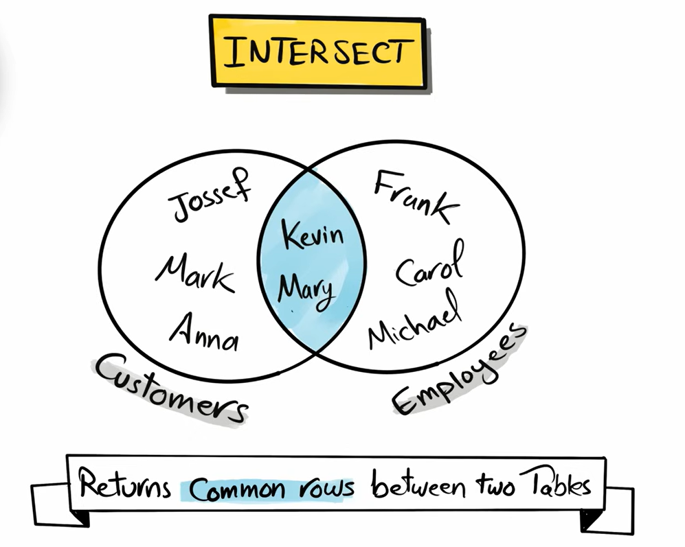
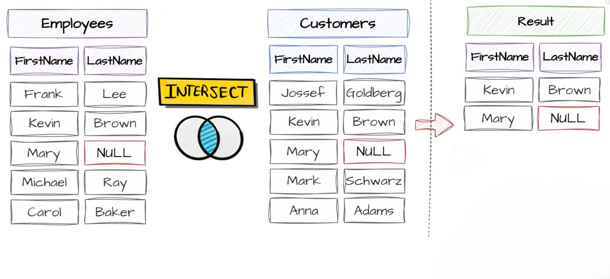

# INTERSECT

`INTERSECT` is a **set operator** used to return only the **common rows between two SELECT queries**.

It returns rows that exist in **both result sets**.

**Syntax**

```sql
SELECT column1, column2
FROM table1

INTERSECT

SELECT column1, column2
FROM table2;
```


<br>



---

## Key rules of INTERSECT

- Returns only common rows
- Removes duplicates automatically
- Column count must match
- Data types must be compatible
- Column order must match

---

## MySQL version

MySQL does NOT support `INTERSECT`.

Equivalent:

```sql id="q1m8xk"
SELECT DISTINCT e.firstname, e.lastname
FROM employees e
INNER JOIN customers c
ON e.firstname <=> c.firstname
AND e.lastname <=> c.lastname;
```

---

## Example




<br>

>[!NOTE]
> the order of table does not matter here