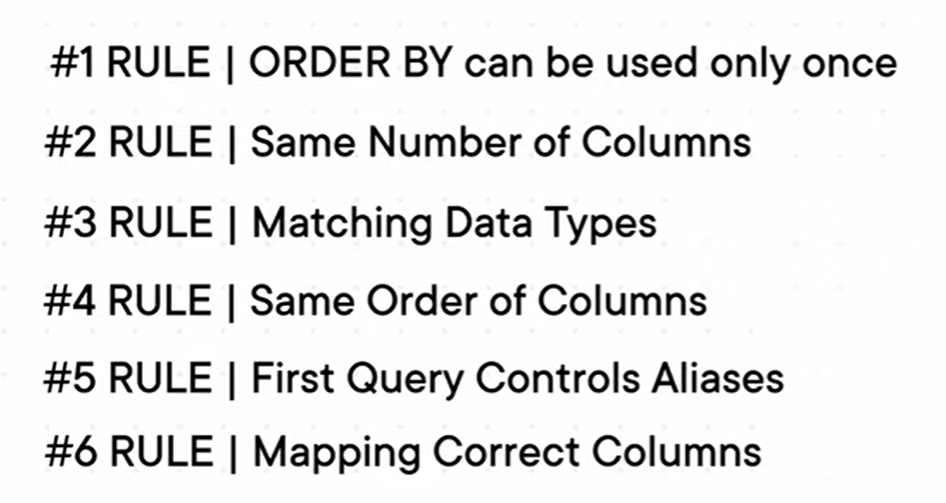
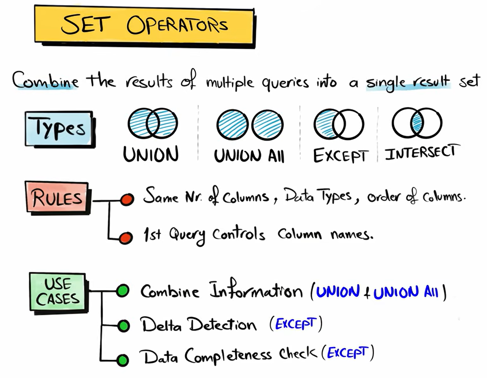

# Set Operators

Set operators are used to **combine the results of two or more `SELECT` queries** into a single result set.

They work similarly to mathematical sets.

- **Rules for Using Set Operators**

## TYPES

The main SQL set operators are:

 

1. [UNION](./UNION/Readme.md)
2. [UNION ALL](./UNION%20ALL/Readme.md)
3. [EXCEPT](./EXCEPT/Readme.md) (called `MINUS` in Oracle)
4. [INTERSECT](./INTERSECT/Readme.md)

---

## Summary

