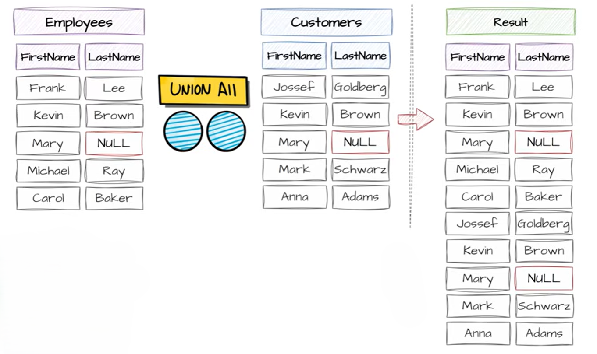

# UNION ALL

`UNION ALL` is a **set operator** in SQL used to combine results from **two or more SELECT queries**, but unlike `UNION`, it **does NOT remove duplicates**.

**Basic Syntax**

```sql id="u1q9k2"
SELECT column1, column2
FROM table1

UNION ALL

SELECT column1, column2
FROM table2;
```

---

## UNION vs UNION ALL

| Feature            | UNION                      | UNION ALL     |
| ------------------ | -------------------------- | ------------- |
| Removes duplicates | Yes                        | No            |
| Speed              | Slower                     | Faster        |
| Processing         | Extra step (deduplication) | No extra step |
| Result size        | Smaller                    | Larger        |

---

## Example 

