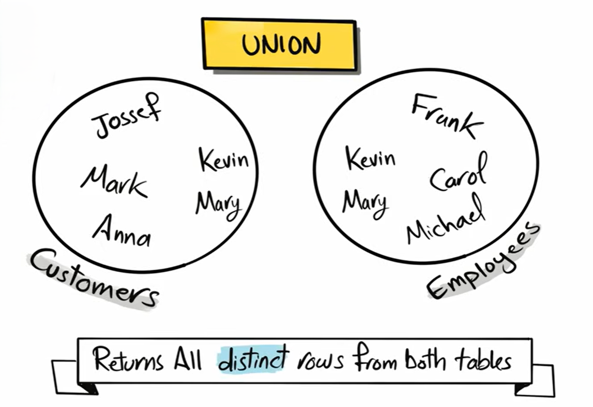
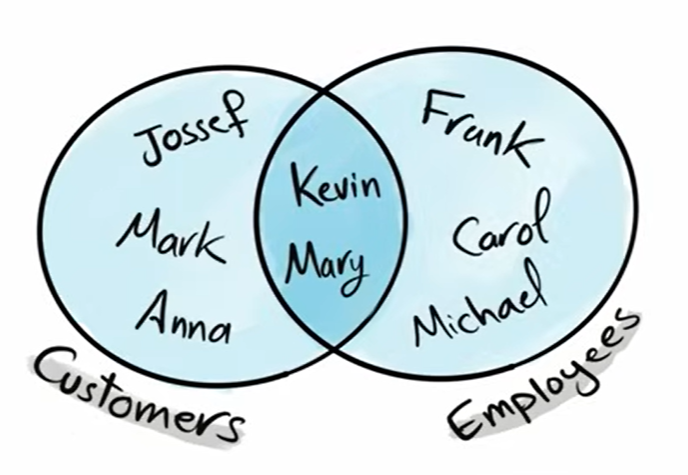
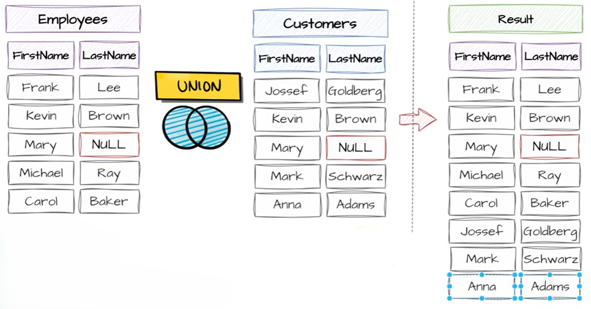

# UNION in SQL

`UNION` is a **set operator** in SQL used to combine the results of **two or more `SELECT` statements** into a single result set.

> `UNION` combines results of multiple `SELECT` statements into one result set and removes duplicates automatically.

**Basic Syntax**

```sql
SELECT column1, column2
FROM table1

UNION

SELECT column1, column2
FROM table2;
```



<br>




---

## Important Rules of UNION

For `UNION` to work:

### 1. Same Number of Columns

Both queries must return the **same number of columns**.

✅ Correct:

```sql
SELECT id, name FROM students
UNION
SELECT id, name FROM teachers;
```

❌ Wrong:

```sql
SELECT id, name FROM students
UNION
SELECT id FROM teachers;
```

Error because column counts differ.

---

### 2. Similar Data Types

Columns should have compatible data types.

✅ Correct:

```sql
SELECT name FROM students
UNION
SELECT teacher_name FROM teachers;
```

Both are text.

❌ Wrong:

```sql
SELECT age FROM students
UNION
SELECT salary FROM employees;
```

Possible mismatch depending on DBMS.

---

### 3. Column Names Come From First Query

The final result uses column names from the **first `SELECT` statement**.

Example:

```sql
SELECT student_name AS Name
FROM students

UNION

SELECT teacher_name
FROM teachers;
```

Result column name = `Name`

---

## How UNION Works

`UNION`:

1. Executes first query
2. Executes second query
3. Combines results
4. Removes duplicate rows automatically

---

## Multiple UNIONs

You can combine many queries.

**Example**

```sql
SELECT name FROM students
UNION
SELECT name FROM teachers
UNION
SELECT name FROM employees;
```

---

## Example



here in this example you can see that the duplicates are removed from the final result 

