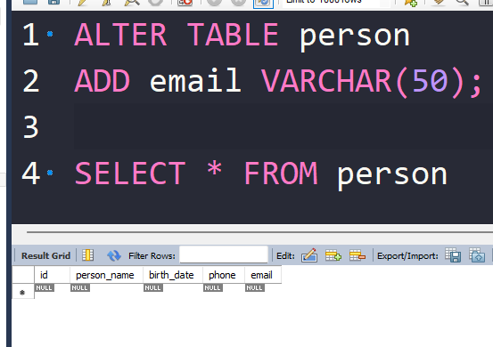
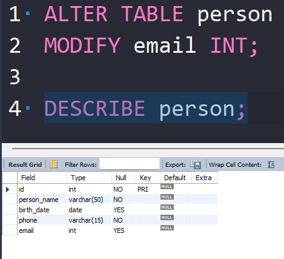
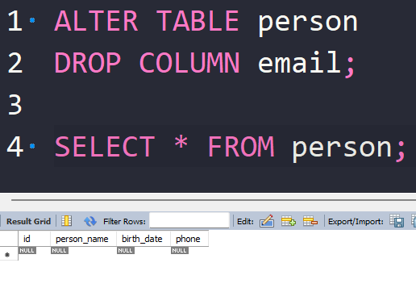
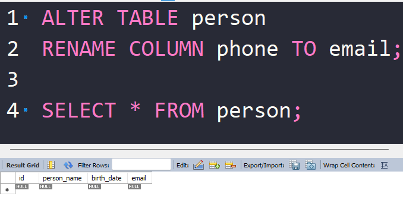
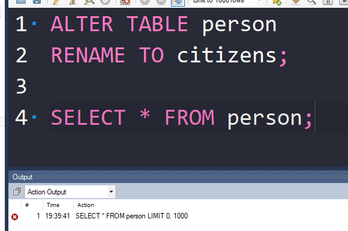
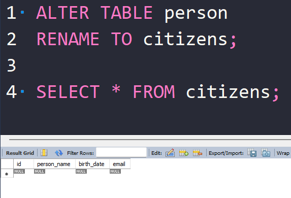
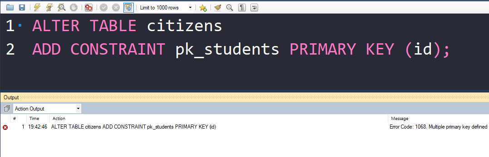
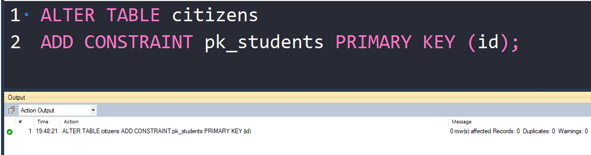

# **ALTER Command in SQL**

The **ALTER** command is part of **DDL (Data Definition Language)**.
It is used to **modify the structure of an existing table** without deleting the data.

With `ALTER`, you can:

* Add new columns
* Modify existing columns
* Drop (remove) columns
* Rename columns or tables
* Add or drop constraints

---

we will use this table which we have previously used in the [CREATE](../CREATE/Readme.md) section

```sql
CREATE TABLE person (
    id INT NOT NULL,
    person_name VARCHAR(50) NOT NULL,
    birth_date DATE,
    phone VARCHAR(15) NOT NULL,
    CONSTRAINT pk_persons PRIMARY KEY (id)    
)
```

soo lets perform the folowing on this table


### **Add a Column**

```sql
ALTER TABLE table_name
ADD column_name datatype;
```

**Example:**

```sql
ALTER TABLE person
ADD email VARCHAR(50);
```



<br>

>[!NOTE]
> The new coloumn is always added at the end of the table.
> 
> if you want to add the coloumn before in some other place lets say after `person_name` the  you then need to drop the whole table and create it from scratch which might be bad if you have data inside the table 

---

### **Modify a Column**

```sql
ALTER TABLE table_name
MODIFY column_name new_datatype constraints;
```

**Example:**

```sql
ALTER TABLE person
MODIFY email INT;
```



now here we can see that the type of email has changed from `VARCHAR(50)` to `INT`


> Some databases use `ALTER COLUMN` instead of `MODIFY`.

**What happens to the data?**

- Data is preserved if it fits the new data type and constraints.
- If existing data cannot fit the new type or constraint, the command fails.

---

### **Drop a Column**

```sql
ALTER TABLE table_name
DROP COLUMN column_name;
```

**Example:**

```sql
ALTER TABLE person
DROP COLUMN email;
```



now the email coloumn is droped

---

### **Rename a Column**

```sql
ALTER TABLE table_name
RENAME COLUMN old_name TO new_name;
```

**Example:**

```sql
ALTER TABLE person
RENAME COLUMN phone TO email;
```


---

### **Rename a Table**

```sql
ALTER TABLE old_table_name
RENAME TO new_table_name;
```

**Example:**

```sql
ALTER TABLE person
RENAME TO citizens;
```



it is giving error as we have changed the name from `person` to `citizens`




now it works

---

### **Add or Drop Constraints**

```sql
-- Add primary key
ALTER TABLE citizens
ADD CONSTRAINT pk_students PRIMARY KEY (id);
```




here we can see the error that `Multiple primary key defined` which is because we have primary key in the table so we have to remove it first


```sql
-- Drop constraint
ALTER TABLE citizens
DROP PRIMARY KEY;
```

so run the command to add primary key again



now it runs with out any error

---

# **Key Points About ALTER**

1. **Changes table structure without losing data**
2. Can add, modify, drop columns or constraints
3. Auto-committed in most databases (DDL behavior)
4. Useful when database evolves over time

---
