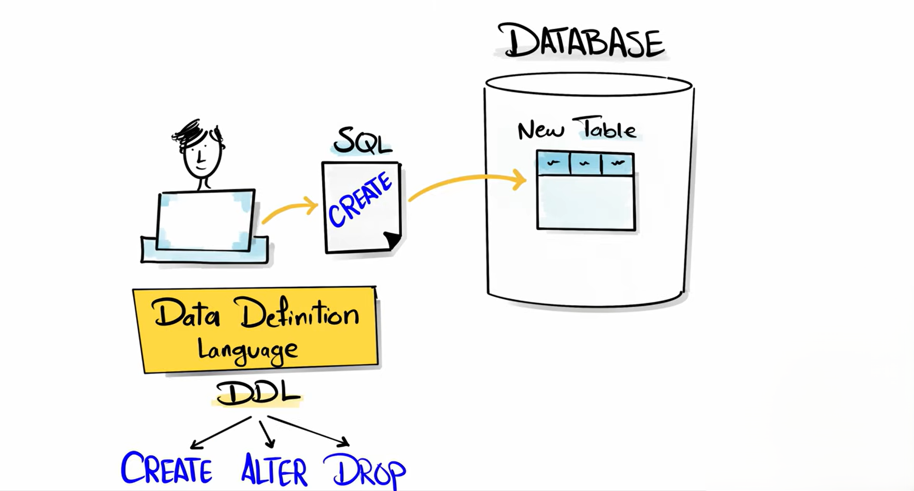

# **DDL (Data Definition Language)**

**DDL (Data Definition Language)** is a category of SQL commands used to **define, create, modify, and delete** database structures such as:

* tables
* schemas
* views
* indexes
* constraints

DDL commands **change the structure** of the database, not the data inside it.

DDL commands are **auto-committed**, meaning once executed, the change is permanent.

---

# **Main DDL Commands**

- **[CREATE](./CREATE/Readme.md)**
- **[ALTER](./ALTER/Readme.md)**
- **DROP**
- **TRUNCATE**
- **RENAME**

# **Characteristics of DDL**

1. **Auto-commit**
   Changes are saved permanently without needing `COMMIT`.

2. **Affects structure, not data**
   DDL changes how the database is built.

3. **Cannot be easily undone**
   Once executed, you cannot retrieve dropped tables unless you have a backup.

4. **Used by database administrators** for designing databases.

