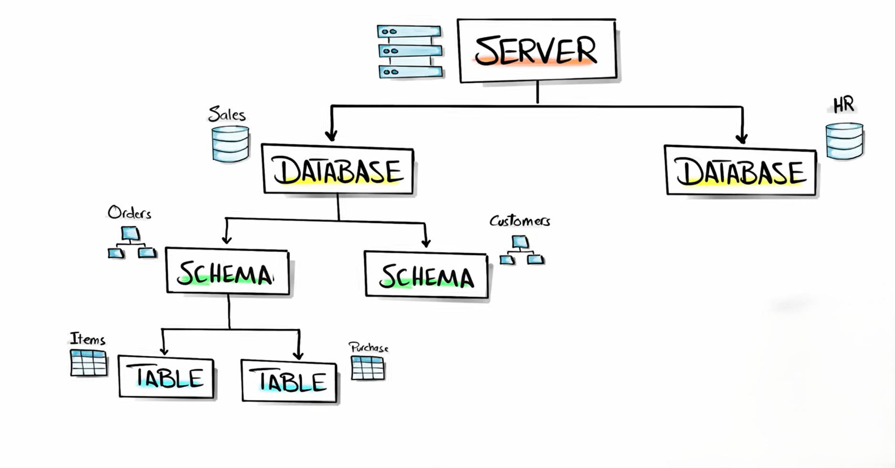
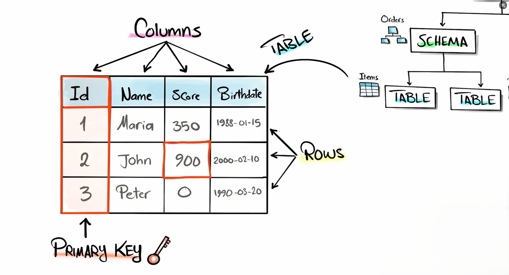

# **Database Structures**

### **Database**

A **database** is an organized collection of data that is stored electronically to allow easy access, management, and manipulation. It serves as a central repository where related data is stored systematically, ensuring that information can be retrieved efficiently whenever needed. A database typically contains multiple **schemas**, which act as blueprints defining the structure of the data, along with tables, views, indexes, and other objects that organize the information logically. By maintaining data in a structured and consistent manner, databases enable users and applications to perform operations such as storing, updating, querying, and securing data effectively.

---

### **Schema**

A **schema** is the logical blueprint of a database that defines how the data is organized and how different database objects are related. It specifies the structure of tables, the relationships between them, and other components such as views, indexes, and constraints. Essentially, a schema provides a clear framework that ensures data is stored consistently and can be accessed efficiently. 

For example, in a university database, a schema might include tables for `Students`, `Courses`, and `Results`, outlining how student information, course details, and grades are connected and managed within the system.

---

### **Table**

A **table**, also known as a **relation** in relational databases, is a structured way of storing data in rows and columns. Each row represents a single record, while each column represents a specific attribute or field of that record. Tables are uniquely named within a database to distinguish them from other tables, allowing organized storage and easy retrieval of information. 

For example, a `Students` table may store details such as student ID, name, department, and GPA, with each row representing one student’s complete information.

---

### **Row (Record / Tuple)**

A **row**, also called a **record** or **tuple**, represents a single complete entry of data within a table. It contains values for every column defined in that table, collectively describing one instance of the stored information. Each row is treated as an independent unit of data and typically corresponds to one real-world entity, such as a student, employee, or product. 

For example, the data `1, "Ali", "CS", 3.8` in a Students table represents one student’s record, including their ID, name, department, and GPA.

---

### **Column (Attribute / Field)**

A **column**, also known as an **attribute** or **field**, represents a single property or characteristic of the data stored in a table. Each column defines the type of information that can be recorded for every row and is assigned a specific data type such as integer, string, or date to control the format of stored values. Columns help organize data into meaningful categories, making it easier to store, search, and analyze information. 

For example, in a Students table, columns like `Student_ID`, `Name`, `Department`, and `GPA` describe different attributes of each student record.

---

### **Primary Key**

A **primary key** is a column or a set of columns that uniquely identifies each row in a table. It ensures that every record can be distinguished from others by enforcing uniqueness and preventing duplicate entries. Additionally, a primary key cannot contain NULL values because each record must have a valid identifier. Primary keys play an essential role in maintaining data integrity and establishing relationships between tables. 

For example, `Student_ID` in a Students table can serve as a primary key since it uniquely identifies each student record.

---

