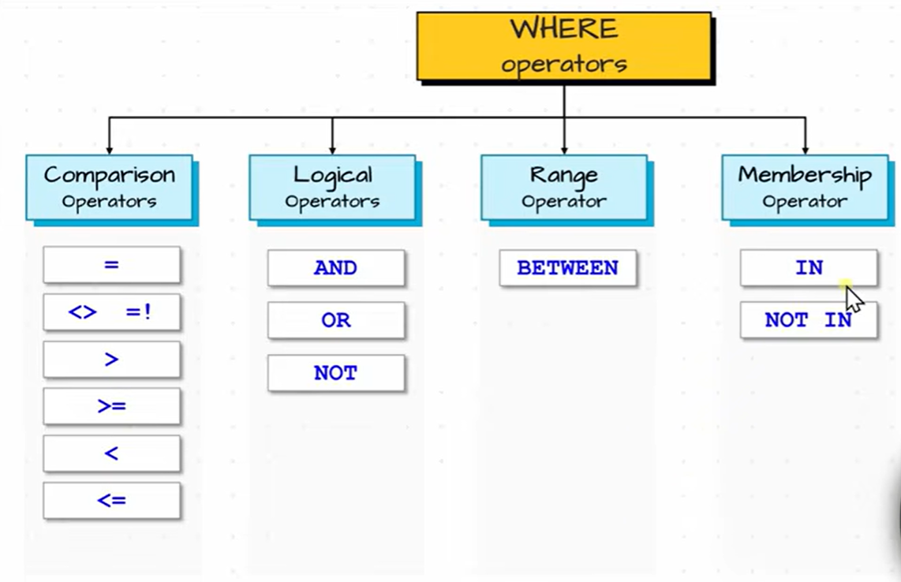
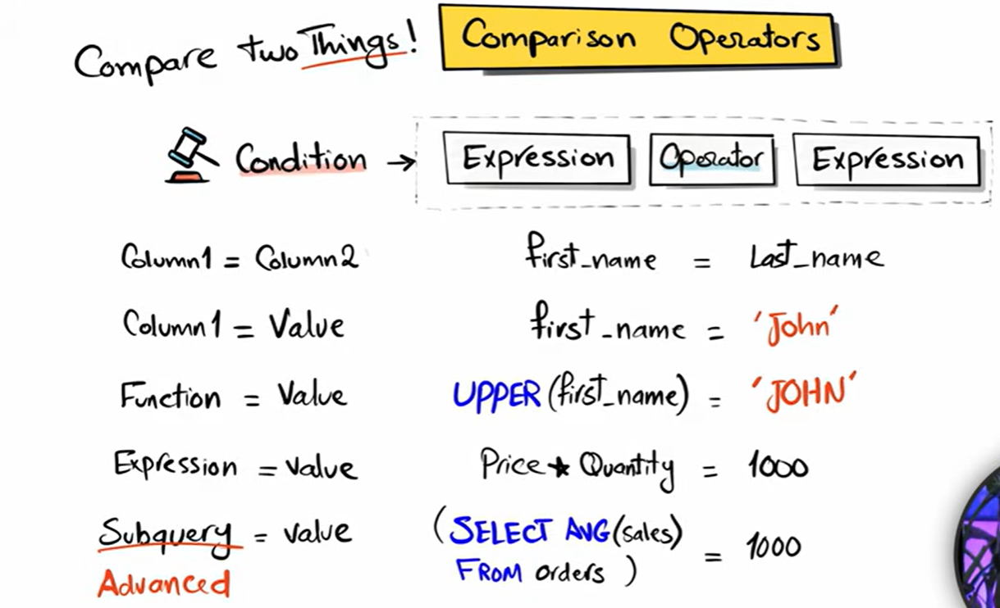
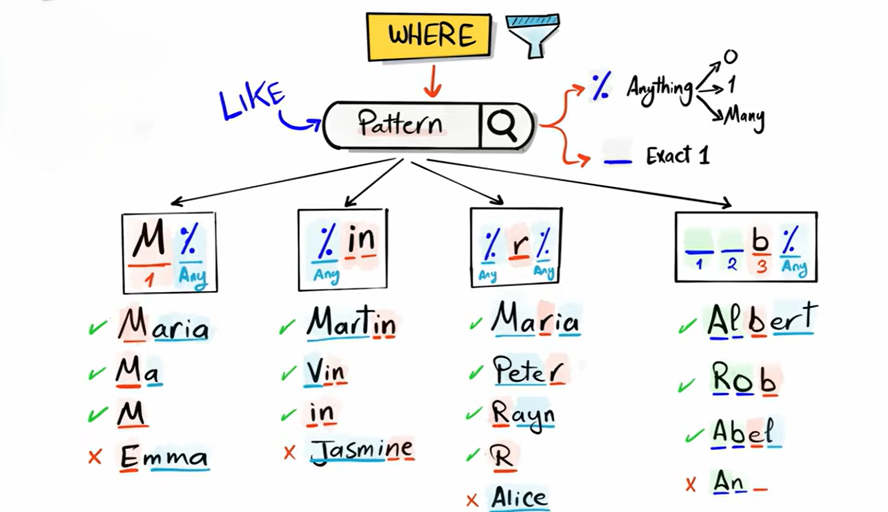

# **Filtering Data in SQL**

Filtering data means **selecting specific rows** from a table based on certain conditions.
In SQL, filtering is mainly done using **WHERE**, **AND**, **OR**, **NOT**, comparison operators, pattern matching, and range filters.

Below is the complete guide.


### **WHERE Clause (Main Filtering Tool)**

`WHERE` is used to filter rows based on a condition.


```sql
SELECT column1, column2
FROM table_name
WHERE condition;
```

**Example**

```sql
SELECT *
FROM students
WHERE age > 18;
```

This returns only students whose **age is greater than 18**.


## **Operators**



<br>

---


### Comparison operators

| Operator     | Meaning               | Example            |
| ------------ | --------------------- | ------------------ |
| `=`          | Equal to              | `age = 18`         |
| `<>` or `!=` | Not equal to          | `city <> 'Lahore'` |
| `>`          | Greater than          | `salary > 50000`   |
| `<`          | Less than             | `marks < 40`       |
| `>=`         | Greater than or equal | `age >= 15`        |
| `<=`         | Less than or equal    | `price <= 1000`    |


**Example Query**

```sql
SELECT *
FROM students
WHERE age >= 18;
```
<br>




here this shows that in sql we can compare a lot of things 


---

### Logical operators

| Operator | Meaning                             | Example                                  |
| -------- | ----------------------------------- | ---------------------------------------- |
| **AND**  | All conditions must be TRUE         | `age > 18 AND city = 'Lahore'`           |
| **OR**   | At least one condition must be TRUE | `city = 'Karachi' OR city = 'Islamabad'` |
| **NOT**  | Reverses a condition (NOT true)     | `NOT status = 'Cancelled'`               |

**Examples**

**AND**

```sql
SELECT *
FROM students
WHERE age > 18 AND marks >= 70;
```

**OR**

```sql
SELECT *
FROM employees
WHERE department = 'HR' OR department = 'IT';
```

**NOT**

```sql
SELECT *
FROM orders
WHERE NOT status = 'Delivered';
```

---

### Range operator

**BETWEEN**

`BETWEEN` is used to filter values **within a range**.
It includes the **start** and **end** values (inclusive).

```sql
column BETWEEN lower_value AND upper_value;
```
**Example**

```sql
SELECT *
FROM students
WHERE marks BETWEEN 60 AND 90;
```

This returns all rows where marks are **60, 61, 62 … up to 90**.

**NOT BETWEEN**

To exclude a range:

```sql
SELECT *
FROM students
WHERE marks NOT BETWEEN 60 AND 90;
```

>[!NOTE]
> `BETWEEN` is **inclusive**, meaning it includes both the lower and upper values.


but what if you want exclusive then use simple Comparison operators they are more clear

---

### **Membership Operators**

The main membership operator is:

**IN**

It checks whether a value **belongs to a list** of values.

```sql
column IN (value1, value2, value3)
```

**Example**

```sql
SELECT *
FROM students
WHERE city IN ('Lahore', 'Karachi', 'Islamabad');
```

This returns rows where the city is **Lahore**, **Karachi**, or **Islamabad**.

**NOT IN**

To exclude values from the list:

```sql
SELECT *
FROM employees
WHERE department NOT IN ('HR', 'Finance');
```

---


### **Search Operator**

`LIKE` is the main search operator used to find patterns in text.

It works with two wildcards:

| Symbol | Meaning                              |
| ------ | ------------------------------------ |
| `%`    | Any number of characters (0 or more) |
| `_`    | Exactly one character                |


```sql
column LIKE pattern
```
<br>



<br>

**Examples**

1. Starts with "A"

```sql
name LIKE 'A%'
```

2. Ends with "n"

```sql
name LIKE '%n'
```

3. Contains "ali"

```sql
name LIKE '%ali%'
```

4. Exactly 4 letters starting with "J"

```sql
name LIKE 'J___'
```

---

**NOT LIKE**

To exclude a pattern:

```sql
name NOT LIKE 'A%'
```

---


