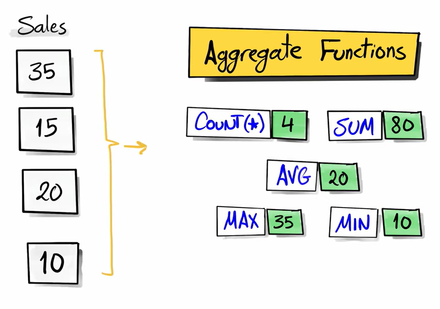

# Aggregate Functions

An **aggregate function** performs a calculation on **multiple rows** and returns **a single value**.

For example, if you have 100 employee salaries, an aggregate function can calculate:

* Total salary (`SUM`)
* Average salary (`AVG`)
* Highest salary (`MAX`)
* Lowest salary (`MIN`)
* Number of employees (`COUNT`)

<br>



<br>

**Why are they called Aggregate Functions?**

Because they **aggregate (combine)** data from many rows into one result.

Table:

| empid | salary |
| ----- | ------ |
| 1     | 40000  |
| 2     | 50000  |
| 3     | 60000  |

Instead of returning 3 rows, an aggregate function returns one value:

```sql
SELECT AVG(salary)
FROM employees;
```

Result:

| AVG(salary) |
| ----------- |
| 50000       |

---

## Main Aggregate Functions

### 1. COUNT()

Counts rows.

Count all rows

```sql
SELECT COUNT(*)
FROM employees;
```

Result:

```text
3
```

How COUNT(*) works

SQL counts every row:

| empid | salary |
| ----- | ------ |
| 1     | 40000  |
| 2     | NULL   |
| 3     | 60000  |

```sql
SELECT COUNT(*)
FROM employees;
```

Result:

```text
3
```

`COUNT(*)` counts rows, not values.

---

**COUNT(column)**

Counts non-NULL values.

```sql
SELECT COUNT(salary)
FROM employees;
```

Table:

| salary |
| ------ |
| 40000  |
| NULL   |
| 60000  |

Result:

```text
2
```

Because NULL is ignored.

---

**COUNT(DISTINCT)**

Counts unique values.

```sql
SELECT COUNT(DISTINCT departmentid)
FROM employees;
```

Table:

| departmentid |
| ------------ |
| 1            |
| 1            |
| 2            |
| 2            |
| 3            |

Result:

```text
3
```

---

### 2. SUM()

Adds values together.

Table:

| salary |
| ------ |
| 40000  |
| 50000  |
| 60000  |

```sql
SELECT SUM(salary)
FROM employees;
```

Result:

```text
150000
```

**SUM ignores NULL**

Table:

| salary |
| ------ |
| 40000  |
| NULL   |
| 60000  |

```sql
SELECT SUM(salary)
FROM employees;
```

Result:

```text
100000
```

NULL is ignored.

---

### 3. AVG()

Calculates average.

Formula:

```text
AVG = SUM(values) / COUNT(non-null values)
```

Table:

| salary |
| ------ |
| 40000  |
| 50000  |
| 60000  |

```sql
SELECT AVG(salary)
FROM employees;
```

Result:

```text
50000
```

Because:

```text
(40000 + 50000 + 60000) / 3
```

**AVG ignores NULL**

Table:

| salary |
| ------ |
| 40000  |
| NULL   |
| 60000  |

```sql
SELECT AVG(salary)
FROM employees;
```

Result:

```text
50000
```

Because:

```text
(40000 + 60000) / 2
```

---

### 4. MIN()

Returns the smallest value.

```sql
SELECT MIN(salary)
FROM employees;
```

Result:

```text
40000
```

---

**MIN on strings**

```sql
SELECT MIN(firstname)
FROM employees;
```

Returns the alphabetically first value.

Example:

```text
Ahmed
```

---

### 5. MAX()

Returns the largest value.

```sql
SELECT MAX(salary)
FROM employees;
```

Result:

```text
60000
```

**MAX on strings**

```sql
SELECT MAX(firstname)
FROM employees;
```

Returns alphabetically last value.

Example:

```text
Zain
```

---

### Aggregate Functions and NULL

Very important.

Table:

| value |
| ----- |
| 10    |
| 20    |
| NULL  |

Query:

```sql
SELECT
    COUNT(*),
    COUNT(value),
    SUM(value),
    AVG(value),
    MIN(value),
    MAX(value)
FROM test;
```

Result:

| Function     | Result |
| ------------ | ------ |
| COUNT(*)     | 3      |
| COUNT(value) | 2      |
| SUM(value)   | 30     |
| AVG(value)   | 15     |
| MIN(value)   | 10     |
| MAX(value)   | 20     |

Most aggregate functions ignore NULL.

---

## Aggregate Functions with GROUP BY

This is where aggregates become powerful.

Table:

| dept | salary |
| ---- | ------ |
| IT   | 50000  |
| IT   | 60000  |
| HR   | 40000  |
| HR   | 45000  |

Query:

```sql
SELECT
    dept,
    AVG(salary)
FROM employees
GROUP BY dept;
```

Result:

| dept | AVG(salary) |
| ---- | ----------- |
| IT   | 55000       |
| HR   | 42500       |

**What GROUP BY Does**

Without GROUP BY:

```sql
SELECT AVG(salary)
FROM employees;
```

Result:

```text
48750
```

One average for the whole table.

With GROUP BY:

```sql
SELECT dept, AVG(salary)
FROM employees
GROUP BY dept;
```

Result:

Separate average for each department.