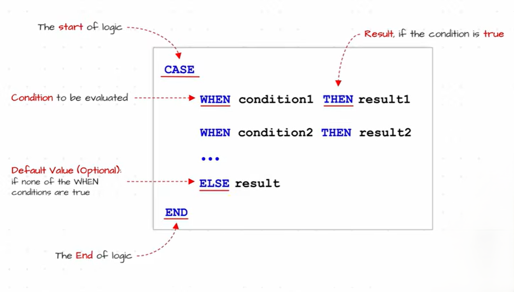
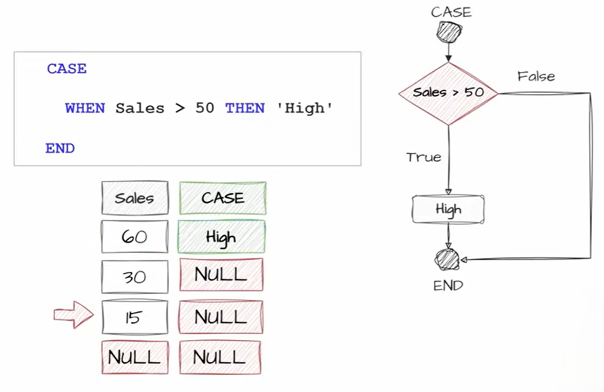
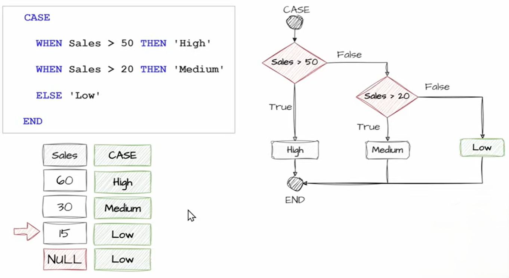

# CASE Statement

The `CASE` statement is SQL's equivalent of an **IF-ELSE** statement. It allows you to return different values based on conditions.




---

## Syntax 1: Simple CASE

Compares a column/expression against multiple values.

```sql
CASE expression
    WHEN value1 THEN result1
    WHEN value2 THEN result2
    ELSE result3
END
```

**Example**

```sql
SELECT
    employeeid,
    departmentid,
    CASE departmentid
        WHEN 1 THEN 'IT'
        WHEN 2 THEN 'HR'
        WHEN 3 THEN 'Finance'
        ELSE 'Unknown'
    END AS department
FROM employees;
```

**Result**

| employeeid | departmentid | department |
| ---------- | ------------ | ---------- |
| 1          | 1            | IT         |
| 2          | 2            | HR         |
| 3          | 5            | Unknown    |

---

## Syntax 2: Searched CASE**

Uses conditions instead of direct comparisons.

```sql
CASE
    WHEN condition1 THEN result1
    WHEN condition2 THEN result2
    ELSE result3
END
```

**Example**

```sql
SELECT
    employeeid,
    salary,
    CASE
        WHEN salary >= 100000 THEN 'High'
        WHEN salary >= 50000 THEN 'Medium'
        ELSE 'Low'
    END AS salary_grade
FROM employees;
```

**Result**

| employeeid | salary | salary_grade |
| ---------- | ------ | ------------ |
| 1          | 120000 | High         |
| 2          | 70000  | Medium       |
| 3          | 30000  | Low          |

---

## CASE in SELECT

Most common use.

```sql
SELECT
    firstname,
    salary,
    CASE
        WHEN salary > 50000 THEN 'Bonus'
        ELSE 'No Bonus'
    END AS status
FROM employees;
```

---

## CASE in WHERE

Filter based on conditions.

```sql
SELECT *
FROM employees
WHERE
    CASE
        WHEN departmentid = 1 THEN salary > 50000
        ELSE salary > 30000
    END;
```

Although possible, this is rarely used because normal conditions are usually clearer.

---

## CASE in ORDER BY

Custom sorting.

```sql
SELECT *
FROM employees
ORDER BY
    CASE departmentid
        WHEN 1 THEN 1
        WHEN 2 THEN 2
        ELSE 3
    END;
```

This ensures IT employees appear first, HR second, and everyone else last.

---

## CASE in UPDATE

```sql
UPDATE employees
SET salary =
    CASE
        WHEN departmentid = 1 THEN salary * 1.10
        WHEN departmentid = 2 THEN salary * 1.05
        ELSE salary
    END;
```

---

## CASE with Aggregate Functions

Very common in reports.

### Count males and females

```sql
SELECT
    SUM(CASE WHEN gender = 'M' THEN 1 ELSE 0 END) AS males,
    SUM(CASE WHEN gender = 'F' THEN 1 ELSE 0 END) AS females
FROM employees;
```

---

### Count orders by status

```sql
SELECT
    SUM(CASE WHEN status = 'Pending' THEN 1 ELSE 0 END) AS pending,
    SUM(CASE WHEN status = 'Shipped' THEN 1 ELSE 0 END) AS shipped
FROM orders;
```

---

## CASE with NULL

```sql
SELECT
    firstname,
    CASE
        WHEN commission IS NULL THEN 'No Commission'
        ELSE 'Has Commission'
    END AS commission_status
FROM employees;
```

Remember:

```sql
commission = NULL
```

❌ Wrong

```sql
commission IS NULL
```

✅ Correct

---

## CASE Evaluation Order

SQL checks conditions from top to bottom.

```sql
CASE
    WHEN salary > 50000 THEN 'A'
    WHEN salary > 100000 THEN 'B'
END
```

If salary is `120000`:

* First condition is TRUE.
* SQL stops.
* Result = `'A'`.

Therefore, write more specific conditions first:

```sql
CASE
    WHEN salary > 100000 THEN 'B'
    WHEN salary > 50000 THEN 'A'
END
```

---

## ELSE Clause

If no condition matches:

```sql
CASE
    WHEN salary > 50000 THEN 'High'
END
```

Result:

```text
NULL
```

for rows not matching.

Using `ELSE`:

```sql
CASE
    WHEN salary > 50000 THEN 'High'
    ELSE 'Low'
END
```

gives a value for every row.

---

## Simple CASE vs Searched CASE

**Simple CASE**

```sql
CASE departmentid
    WHEN 1 THEN 'IT'
    WHEN 2 THEN 'HR'
END
```

Only checks equality.

---

**Searched CASE**

```sql
CASE
    WHEN salary > 50000 THEN 'High'
    WHEN salary > 30000 THEN 'Medium'
END
```

Can use any condition (`>`, `<`, `BETWEEN`, `LIKE`, `IS NULL`, etc.).

---


## Example



heres another example 





