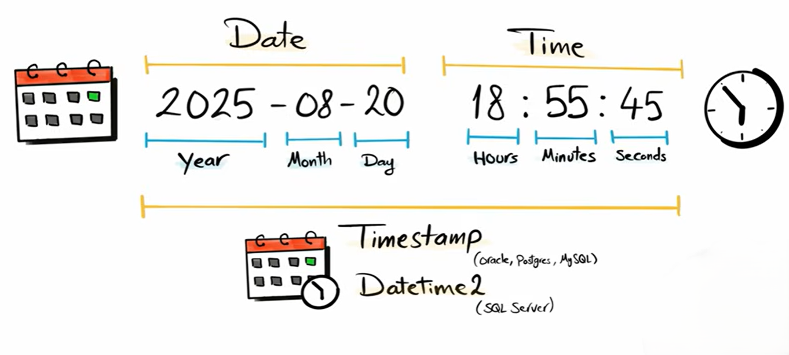
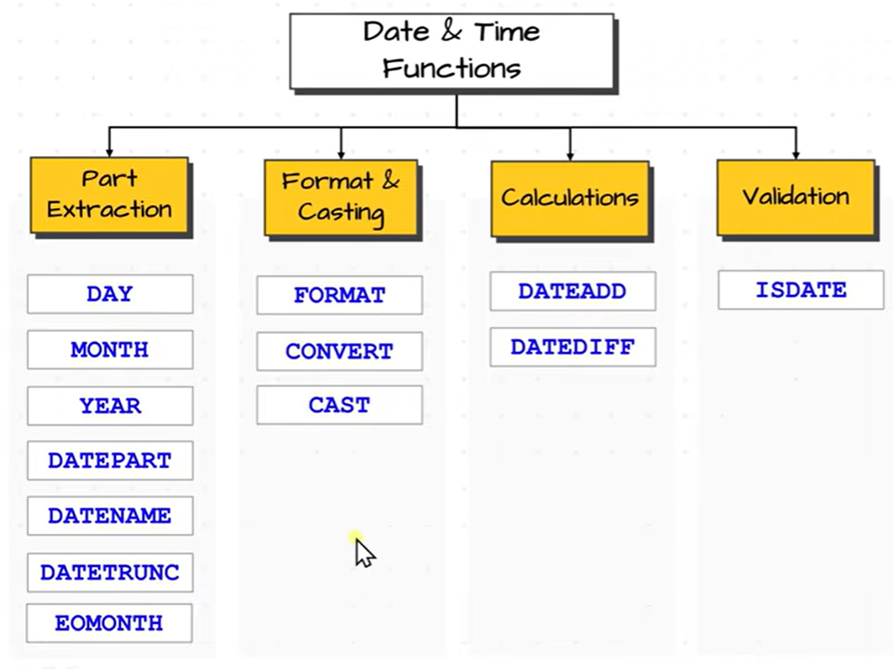

# Date & Time Functions

Date and time functions are used to **work with dates, times, and timestamps** in SQL.

---

## TYPES

Here are some of SQL date & time functions (MySQL focused):

## Current Date & Time Functions

| Function                                                  | Description                        |
| --------------------------------------------------------- | ---------------------------------- |
| [NOW](./NOW/Readme.md)                                    | Returns current date and time      |
| [CURDATE](./CURDATE/Readme.md)                            | Returns current date only          |
| [CURTIME](./CURTIME/Readme.md)                            | Returns current time only          |
| [CURRENT_TIMESTAMP](./CURRENT_TIMESTAMP/) (same as `NOW`) | Same as NOW(), returns date & time |
| `LOCALTIME` (Same as `NOW` )                              | Returns current local date & time  |
| `LOCALTIMESTAMP`                                          | Same as LOCALTIME()                |

 

>[!NOTE]
>`LOCALTIME()` returns the current date and time based on the server’s local time zone.
Other functions like `CURRENT_TIMESTAMP()` are standard and aim to give a consistent timestamp across databases.

---

## Extract Parts of Date

| Function                           | Description                        |
| ---------------------------------- | ---------------------------------- |
| [YEAR](./YEAR/Readme.md)           | Extracts year from a date          |
| [MONTH](./MONTH/Readme.md)         | Extracts month from a date         |
| [DAY](./DAY/Readme.md)             | Extracts day from a date           |
| `DAYOFMONTH`                       | Returns day of month (1–31)        |
| [DAYOFWEEK](./DAYOFWEEK/Readme.md) | Returns weekday number (1–7)       |
| [DAYOFYEAR](./DAYOFYEAR/Readme.md) | Returns day number in year (1–366) |
| [HOUR](./HOUR/Readme.md)           | Extracts hour from time            |
| [MINUTE](./MINUTE/Readme.md)       | Extracts minutes from time         |
| [SECOND](./SECOND/Readme.md)       | Extracts seconds from time         |
| [WEEK](./WEEK/Readme.md)           | Returns week number of year        |
| [QUARTER](./QUARTER/Readme.md)     | Returns quarter (1–4)              |

---

## Add / Subtract Date

| Function                         | Description                    |
| -------------------------------- | ------------------------------ |
| [DATE_ADD](./DATE_ADD/Readme.md) | Adds interval to a date        |
| [DATE_SUB](./DATE_SUB/Readme.md) | Subtracts interval from a date |
| `ADDDATE`                        | Same as DATE_ADD()             |
| `SUBDATE`                        | Same as DATE_SUB()             |

---

## Date Difference

| Function                         | Description                                 |
| -------------------------------- | ------------------------------------------- |
| [DATEDIFF](./DATEDIFF/Readme.md) | Difference between two dates (in days)      |
| [TIMEDIFF](./TIMEDIFF/Readme.md) | Difference between two time values          |
| [CONVERT](./TIMEDIFF/Readme.md)  | changes the data type to another data type  |
| [CAST](./CAST/Readme.md)         | explicitly convert one data type to another |

---

## Formatting Functions

| Function                               | Description                     |
| -------------------------------------- | ------------------------------- |
| [DATE_FORMAT](./DATE_FORMAT/Readme.md) | Formats date into custom format |
| [TIME_FORMAT](./TIME_FORMAT/Readme.md) | Formats time into custom format |

---

## Other Useful Functions

| Function                               | Description                               |
| -------------------------------------- | ----------------------------------------- |
| [EXTRACT](./EXTRACT/Readme.md)         | Extracts part of date/time (SQL standard) |
| [STR_TO_DATE](./STR_TO_DATE/Readme.md) | Converts string to date                   |
| `TO_DAYS()`                            | Converts date to number of days           |
| `FROM_DAYS()`                          | Converts days number back to date         |
| `UNIX_TIMESTAMP()`                     | Converts date to Unix time                |
| `FROM_UNIXTIME()`                      | Converts Unix time to readable date       |

---
