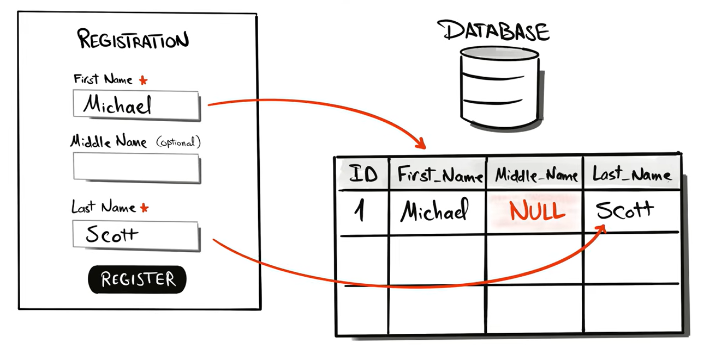

# NULL

In SQL, **NULL** is a special marker that represents **missing, unknown, or undefined data**. It’s not the same as zero, an empty string, or false—it literally means *“no value is stored here.”*





### **Key points about NULL**

**1. NULL is not equal to anything (even itself)**

```sql
SELECT * FROM table WHERE column = NULL;   -- ❌ wrong
SELECT * FROM table WHERE column IS NULL;  -- ✅ correct
```

To check NULL values, always use:

* `IS NULL`
* `IS NOT NULL`

---

**2. Operations with NULL return NULL**

```sql
SELECT 5 + NULL;  -- result: NULL
```

Any arithmetic or expression involving NULL usually results in NULL.

---

**3. NULL affects comparisons**

```sql
SELECT * FROM employees WHERE salary > 5000;
```

Rows where `salary` is NULL will **not be returned**, because NULL is unknown—not greater or less than anything.

---

**4. Use functions to handle NULL**

Common functions:

* In MySQL:

  ```sql
  SELECT IFNULL(column, 0) FROM table;
  ```

* In SQL Server:

  ```sql
  SELECT ISNULL(column, 0) FROM table;
  ```

* Standard SQL (works in most DBs like PostgreSQL and Oracle Database):

  ```sql
  SELECT COALESCE(column, 0) FROM table;
  ```

---

**5. NULL in aggregate functions**

* `COUNT(column)` → ignores NULL
* `COUNT(*)` → counts all rows
* `SUM()`, `AVG()` → ignore NULL values

---


# NULL Functions

When working with NULL values, SQL provides several functions to **replace**, **test**, or **handle** NULLs. Different database systems provide different functions.

**1. COALESCE()**

The most important and standard NULL function.

**Syntax**

```sql
COALESCE(expr1, expr2, expr3, ...)
```

Returns the **first non-NULL value** from the list.

**Example**

```sql
SELECT COALESCE(NULL, NULL, 10, 20);
```

Result:

```text
10
```

SQL checks values from left to right:

```text
NULL  → skip
NULL  → skip
10    → return
20    → never checked
```


### Why COALESCE is preferred

* ANSI SQL Standard
* Works in most DBMSs:

  * MySQL
  * PostgreSQL
  * SQL Server
  * Oracle Database

---

**2. IFNULL() (MySQL)**

**Syntax**

```sql
IFNULL(expression, replacement)
```

If expression is NULL, return replacement.

**Example**

```sql
SELECT IFNULL(NULL, 100);
```

Result

```text
100
```

**Example**

```sql
SELECT IFNULL(salary, 0)
FROM employees;
```

Equivalent to:

```sql
SELECT COALESCE(salary, 0)
FROM employees;
```

Limitation:

Only accepts 2 arguments.

```sql
IFNULL(a,b)
```

Not:

```sql
IFNULL(a,b,c)
```

---

**3. ISNULL()**

Different meaning depending on DBMS.


**SQL Server**

**Syntax**

```sql
ISNULL(expression, replacement)
```

Example:

```sql
SELECT ISNULL(NULL, 500);
```

Result:

```text
500
```

Example:

```sql
SELECT ISNULL(commission,0)
FROM employees;
```

---

**MySQL**

In MySQL, ISNULL is a test function.

**Syntax**

```sql
ISNULL(expression)
```

Returns:

```text
1 = NULL
0 = NOT NULL
```

Example

```sql
SELECT ISNULL(NULL);
```

Result

```text
1
```

Example

```sql
SELECT ISNULL(100);
```

Result

```text
0
```

---

**4. NULLIF()**

Very useful and often misunderstood.

**Syntax**

```sql
NULLIF(expr1, expr2)
```

Returns:

```text
NULL  if expr1 = expr2
expr1 otherwise
```

**Example**

```sql
SELECT NULLIF(5,5);
```

Result:

```text
NULL
```

---

**Practical Use**

Avoid division by zero.

Without NULLIF:

```sql
SELECT salary / bonus
FROM employees;
```

If bonus = 0:

```text
Error
```

Using NULLIF:

```sql
SELECT salary / NULLIF(bonus,0)
FROM employees;
```

If bonus is 0:

```sql
NULLIF(0,0)
```

becomes

```text
NULL
```

Result:

```text
NULL
```

instead of an error.

---

**5. NVL() (Oracle)**

Oracle's traditional NULL function.

**Syntax**

```sql
NVL(expression, replacement)
```

Example

```sql
SELECT NVL(commission,0)
FROM employees;
```

Equivalent to:

```sql
COALESCE(commission,0)
```

---

**6. NVL2() (Oracle)**

**Syntax**

```sql
NVL2(expr, value_if_not_null, value_if_null)
```

Example

```sql
SELECT NVL2(commission,
            'Has Commission',
            'No Commission')
FROM employees;
```

If commission contains value:

```text
Has Commission
```

If commission is NULL:

```text
No Commission
```

---

**7. CASE with NULL**

Sometimes more flexible than NULL functions.

**Example**

```sql
SELECT
CASE
    WHEN commission IS NULL THEN 0
    ELSE commission
END
FROM employees;
```

Equivalent to:

```sql
COALESCE(commission,0)
```

---

**8. IS NULL**

Not really a function, but essential.

**Syntax**

```sql
column IS NULL
```

Example

```sql
SELECT *
FROM employees
WHERE commission IS NULL;
```

---

**9. IS NOT NULL**

**Syntax**

```sql
column IS NOT NULL
```

Example

```sql
SELECT *
FROM employees
WHERE commission IS NOT NULL;
```

---

# Comparison of NULL Functions

| Function    | Purpose              | DBMS       |
| ----------- | -------------------- | ---------- |
| COALESCE()  | First non-NULL value | Most DBMS  |
| IFNULL()    | Replace NULL         | MySQL      |
| ISNULL()    | Replace NULL         | SQL Server |
| ISNULL()    | Test NULL            | MySQL      |
| NULLIF()    | Return NULL if equal | Most DBMS  |
| NVL()       | Replace NULL         | Oracle     |
| NVL2()      | Two-way NULL check   | Oracle     |
| IS NULL     | Find NULL values     | All        |
| IS NOT NULL | Find non-NULL values | All        |

