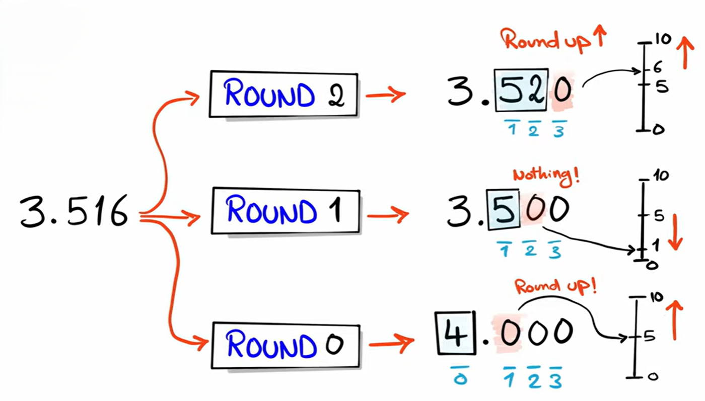

# `ROUND()`

`ROUND()` is a numeric function used to round a number to a specified number of decimal places.

**Syntax**

```sql id="r1"
ROUND(number, decimal_places)
```

* `number` → value to round
* `decimal_places` → how many digits after decimal point




---

**Example**

```sql id="r2"
SELECT ROUND(12.567, 2);
```

Result:

```id="r3"
12.57
```

because `7` causes `6` to round up.

---

## Rounding whole numbers

```sql id="r6"
SELECT ROUND(12.8);
```

Result:

```id="r7"
13
```

---

## Negative numbers

```sql id="r8"
SELECT ROUND(-4.6);
```

Result:

```id="r9"
-5
```

---

# Decimal place behavior

| Query              | Result   |
| ------------------ | -------- |
| `ROUND(15.678, 0)` | `16`     |
| `ROUND(15.678, 1)` | `15.7`   |
| `ROUND(15.678, 2)` | `15.68`  |
| `ROUND(15.678, 3)` | `15.678` |

---

## Using negative decimal places

You can round digits before the decimal point.

```sql id="r10"
SELECT ROUND(1567, -2);
```

Result:

```id="r11"
1600
```

Explanation:

* `-1` → nearest 10
* `-2` → nearest 100
* `-3` → nearest 1000

---

## NULL behavior

```sql id="r13"
SELECT ROUND(NULL, 2);
```

Result:

```id="r14"
NULL
```

---