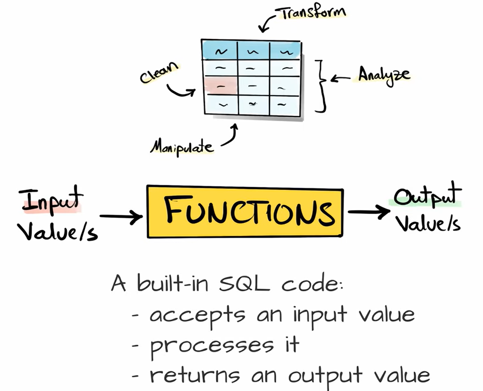
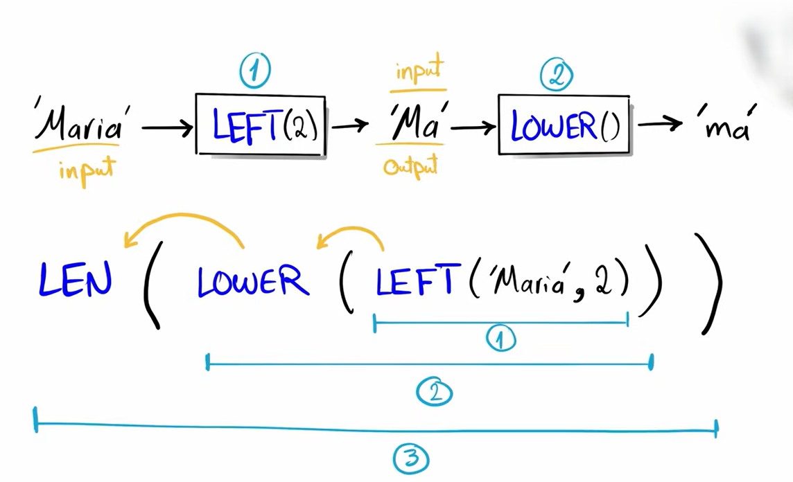
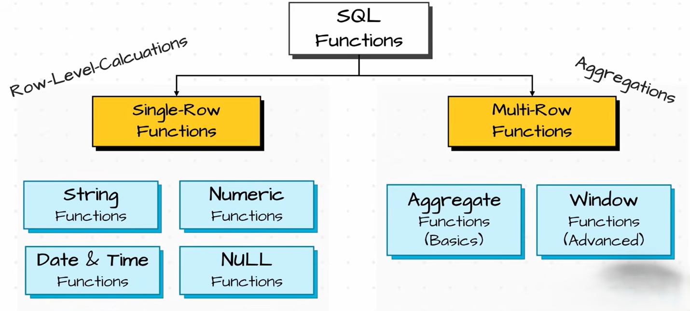

# Functions

In SQL, **functions** are built-in operations that take input values, perform a task on them, and return a single result.

---

## Nested functions

**Nested functions** are functions written inside another function, where the output of the inner function becomes the input of the outer function.

---

## Types

 

### Single-row functions

- [String](./String/Readme.md)
- [Numeric](./Numeric/Readme.md)
- [DATE & TIME](./DATE&TIME/Readme.md)
- [NULL FUNCTIONS](./NULL-FUNCTIONS/Readme.md)
- [CASE Statement](./CASE%20Statement/Readme.md)

### Multi-row functions

- [Aggregate function](./Aggregate%20function/Readme.md)
- [Window Function](./Window%20Function/Readme.md)

