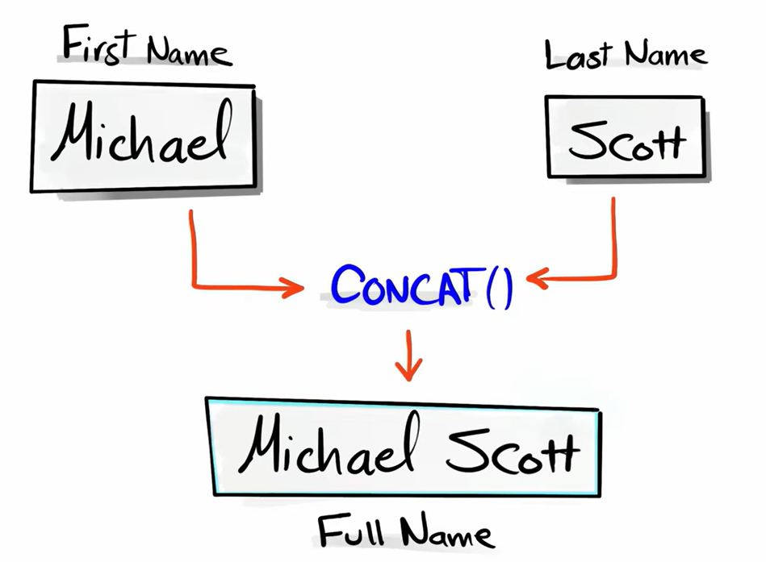
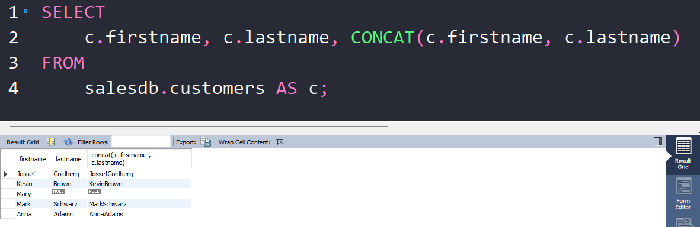
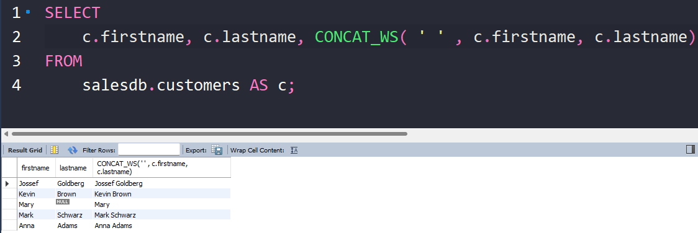

# CONCAT()

`CONCAT()` is a **string function** used to **join two or more strings together into one single string**.


**Basic syntax**

```sql id="c1m9q2"
CONCAT(string1, string2, string3, ...)
```

It takes multiple inputs and returns one combined string.




---

## Important rule about NULL

If any value is `NULL`, result depends on behavior:

```sql id="n2k8m1"
SELECT CONCAT('A', NULL, 'B');
```

Result:

```
NULL
```

Because SQL treats NULL as “unknown”.




---

## Better version: `CONCAT_WS()`

`CONCAT_WS` = CONCAT with separator

```sql id="w3m9x2"
CONCAT_WS(' ', firstname, lastname)
```

* `' '` is separator
* automatically ignores NULL values




<br>

>[!NOTE]
> In `CONCAT_WS()`, the separator is mandatory it is the first required argument.

