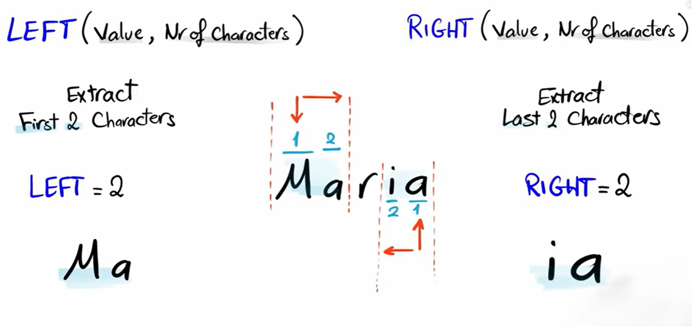

# `LEFT()` and `RIGHT()`

These are **string functions** used to extract characters from a string.




## `LEFT()`

> `LEFT()` returns a specified number of characters from the **start (left side)** of a string.

**Syntax**

```sql id="l1"
LEFT(string, number_of_characters)
```

---

## `RIGHT()`

> `RIGHT()` returns a specified number of characters from the **end (right side)** of a string.

**Syntax**

```sql id="r1"
RIGHT(string, number_of_characters)
```

---

# Important notes

* If number is greater than string length → returns full string

**Example**

```sql
LEFT('SQL', 10)
```

Result:

```text
SQL
```


* If value is `NULL` → result is `NULL`

**Example**

```sql id="n1"
SELECT LEFT(NULL, 3);
```

Result:

```
NULL
```

---