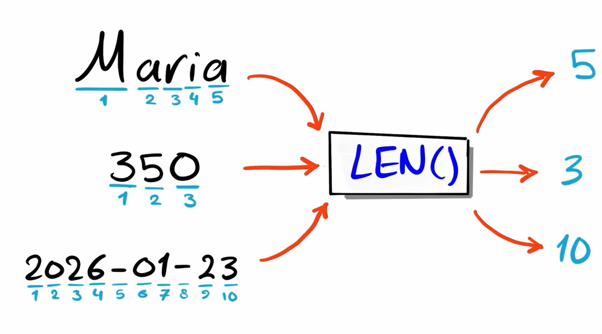

# `LENGTH()`

`LENGTH()` is a string function used to find the **number of bytes or characters in a string** (depending on the database).

**Syntax**

```sql id="l1"
LENGTH(string)
```



---

### Important notes:

* In MySQL, `LENGTH()` counts **bytes**
* For pure character count, use `CHAR_LENGTH()` instead

**Example**

```sql id="l4"
SELECT LENGTH('€');      -- may return 3 (byte size)
SELECT CHAR_LENGTH('€'); -- returns 1 (character count)
```

---

### If value is `NULL`, then:

```sql id="n1"
SELECT LENGTH(NULL);
```

Result:

```id="n2"
NULL
```

Because in SQL:

* `NULL` means “unknown / no value”
* So the length is also **unknown**
* Therefore functions like `LENGTH()` return `NULL` instead of a number

so we can use `IFNULL()` & `COALESCE()` here 

```sql id="n3"
SELECT LENGTH(COALESCE(column_name, ''));
```

or

```sql id="n3"
SELECT LENGTH(IFNULL(column_name, ''));
```


This will return `0` for NULL values.


---

### Other databases


In some databases the function name is not same

| Database   | Function                     |
| ---------- | ---------------------------- |
| MySQL      | `LENGTH()` / `CHAR_LENGTH()` |
| SQL Server | `LEN()`                      |
| PostgreSQL | `LENGTH()`                   |