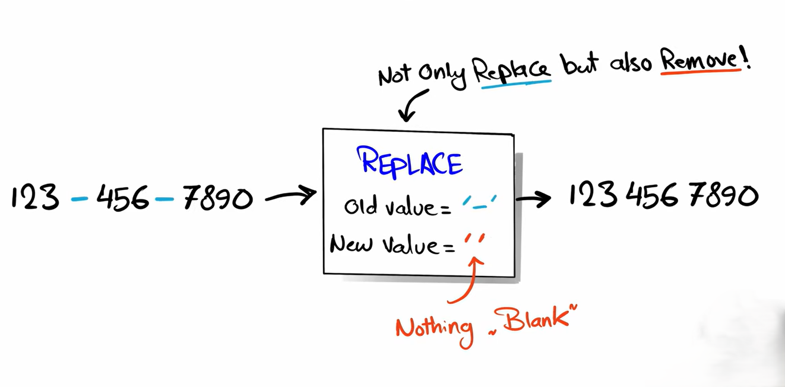

# `REPLACE()`

> `REPLACE()` searches for a specified substring in a string and replaces it with another substring.


**Syntax**

```sql id="r1"
REPLACE(original_string, old_value, new_value)
```



---

## Removing characters

If replacement is an empty string `''`, the characters are removed.

```sql id="r4"
SELECT REPLACE('Emma', 'm', '');
```

Result:

```id="r5"
Ea
```

Both `m`s are removed.

---

## Important behavior

#### 1. Replaces ALL occurrences

```sql id="r7"
SELECT REPLACE('banana', 'a', 'X');
```

Result:

```text
bXnXnX
```

All `a`s are replaced.


#### 2. Case-sensitive in many SQL systems

```sql id="r9"
SELECT REPLACE('Hello', 'h', 'X');
```

May not replace anything because `H ≠ h`.


#### 3. Does not modify actual table data

It only changes query output unless used with `UPDATE`.

---

## Using with UPDATE

```sql id="r10"
UPDATE customers
SET first_name = REPLACE(first_name, 'a', '@');
```

This permanently changes stored data.

---

## NULL behavior

```sql id="r11"
SELECT REPLACE(NULL, 'a', 'b');
```

Result:

```id="r12"
NULL
```


so you might be asking how to remove the `NULL` we can use `IFNULL()` & `COALESCE()`

```sql
SELECT IFNULL(NULL, 'Unknown');
```

this would replace the NULL with Unknown

we can also use it in replace heres an simple example


```sql id="n11"
SELECT REPLACE(IFNULL(first_name, ''), 'a', 'b')
FROM customers;
```

What happens:

1. `IFNULL(first_name, '')` checks for `NULL`
2. If value is `NULL`, it becomes `''`
3. `REPLACE()` then safely replaces `a` with `b` without errors

now lets do it using `COALESCE()`

`COALESCE()` returns the first non-NULL value from a list of expressions.
It is used to handle NULL values by providing fallback options.

example 

```sql
SELECT COALESCE(NULL, NULL, 'Hello', 'World');
```

here it will return `'Hello'` as an output 


>![NOTE]
> if all the values are NULL like below 

```sql
SELECT COALESCE(NULL, NULL);
```

the output will also be `NULL`


here the query to solve the above problem 

```sql id="c14"
SELECT REPLACE(COALESCE(first_name, ''), 'a', 'b')
FROM customers;
```

* `COALESCE(first_name, '')` checks if `first_name` is `NULL`
* If it is `NULL`, SQL uses an empty string `''`
* This prevents `REPLACE()` from returning `NULL`
* `REPLACE(..., 'a', 'b')` changes every `a` into `b`
* Example: `Sara` → `Sbrb`
* So this query safely handles NULL values and performs replacement together


---
