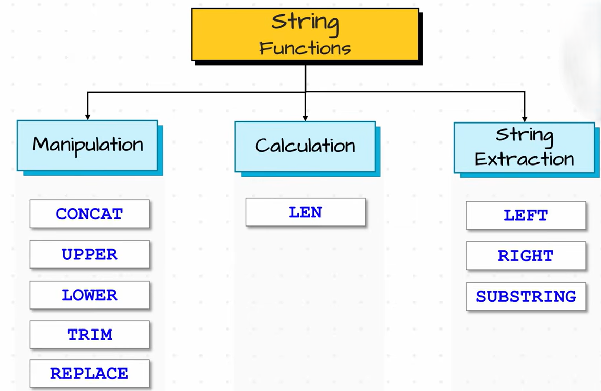
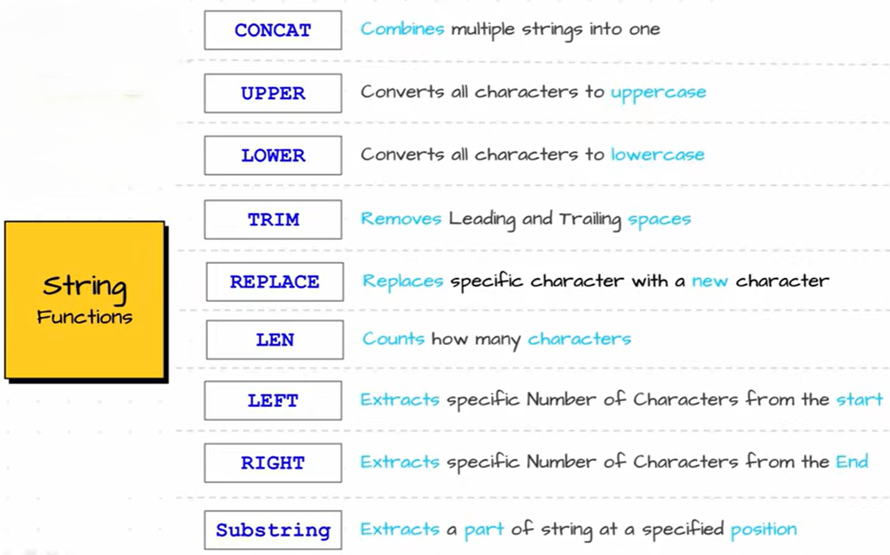

# String functions

**String functions** are built-in SQL functions used to **manipulate and work with text (strings)** like names, addresses, etc.

 
 

- Manipulation
    - [CONCAT](./CONCAT/Readme.md)
    - [UPPER & LOWER](./UPPER&LOWER/Readme.md)
    - [TRIM](./TRIM/Readme.md)
    - [REPLACE](./REPLACE/Readme.md)
- calculation
    - [LENGTH](./LENGTH/Readme.md)
- String Extraction
    - [LEFT & RIGHT](./LEFT&RIGHT/Readme.md)
    - [SUBSTRING](./SUBSTRING/Readme.md)

 
 

