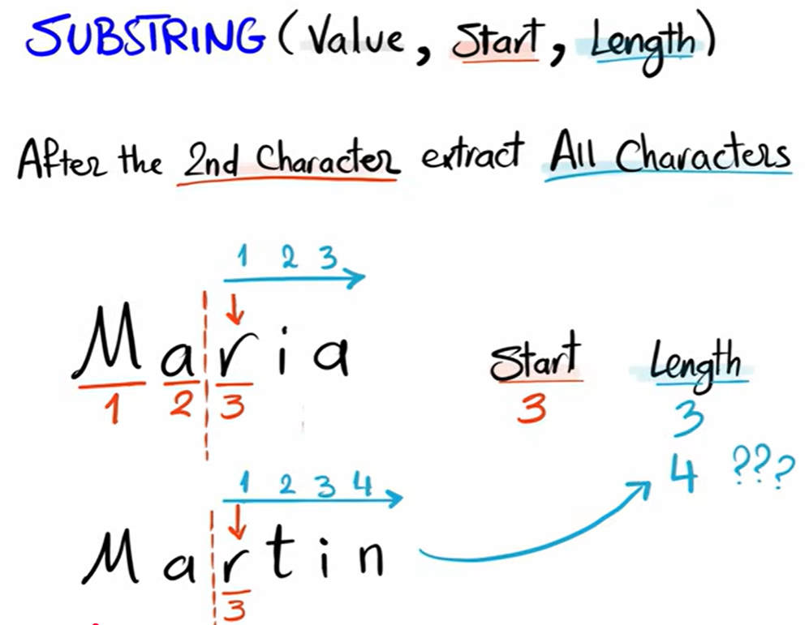
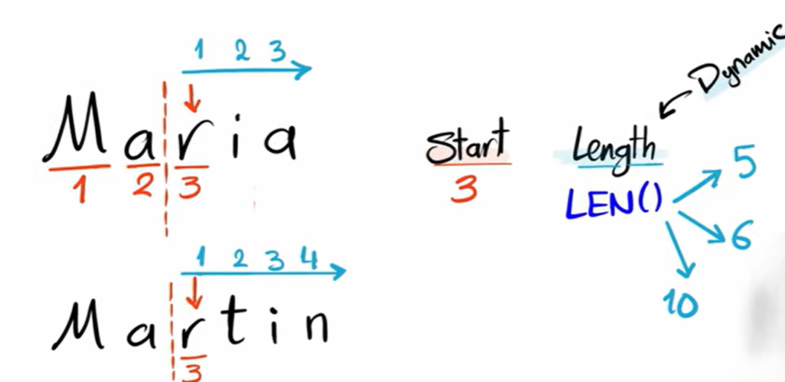

# `SUBSTRING()`

`SUBSTRING()` is a string function used to **extract a part of a string**.

**Syntax**

```sql id="s1"
SUBSTRING(string, start_position, length)
```

* `start_position` → where to start (1-based index)
* `length` → how many characters to extract

<br>



but we have to specify the `length` we have to calculate it we can do is add an `length()` function here that can make it dynamic and we don't have to calculate the length manually 




---

## Important notes:

* Index starts from **1 (not 0)**
* If length goes beyond string → returns available characters only
* If start position is out of range → returns empty string
* If the string is NULL, then SUBSTRING() also returns NULL.

---

