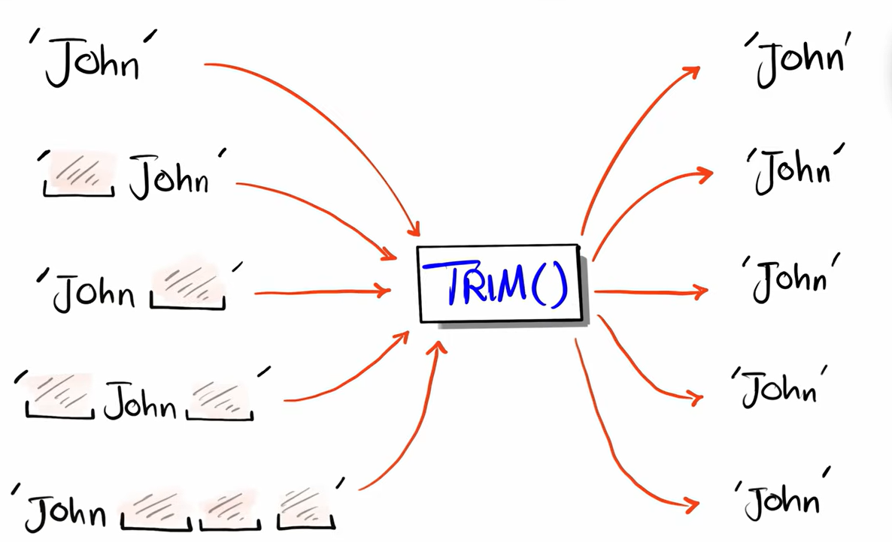

# `TRIM()`

`TRIM()` is a string function used to remove unwanted characters (usually spaces) from the beginning and/or end of a string.

**Basic syntax**

```sql id="t1"
TRIM(string)
```

<br>





---

## Important point

`TRIM()` removes:

* spaces before text
* spaces after text

It does NOT remove spaces in the middle.

Example:

```sql id="t4"
SELECT TRIM('  Hello World  ');
```

Result:

```id="t5"
Hello World
```

Middle space remains.

---

## Removing specific characters

**Syntax**

```sql
TRIM(character FROM string)
```

**Example**

```sql id="t7"
SELECT TRIM('*' FROM '***Hello***');
```

Result:

```id="t8"
Hello
```

here an problem occurs and that is that what if the text is `***Hel*lo***`

so it will not remove that `*` in the middle so to solve this problem we will use `REPLACE`

---

## LEFT and RIGHT trimming

**LTRIM()**

Removes spaces from left side only.

```sql id="t9"
SELECT LTRIM('   Hello');
```

**RTRIM()**

Removes spaces from right side only.

```sql id="t10"
SELECT RTRIM('Hello   ');
```

---

## Why TRIM is important

Extra spaces can cause:

* wrong comparisons
* duplicate-looking values
* failed joins/searches

Example:

```sql id="t12"
'John'
```

is different from:

```sql id="t13"
'John '
```

So:

```sql id="t14"
SELECT *
FROM users
WHERE TRIM(name) = 'John';
```

helps avoid problems.

---

## NULL behavior

```sql id="t15"
SELECT TRIM(NULL);
```

Result:

```test
NULL
```

---

