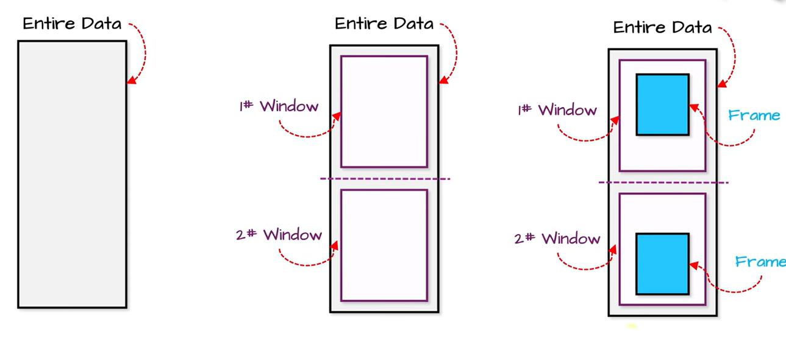
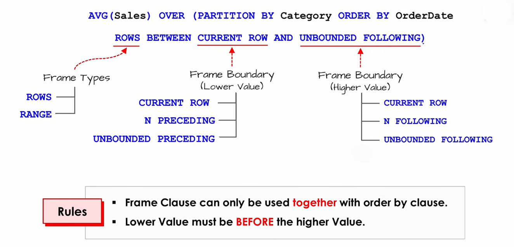

# Frame Clause

The **Frame Clause** defines **which rows inside the window are used for the calculation**.

Think of it like this:

```text
PARTITION BY -> Which group?
ORDER BY     -> In what order?
FRAME        -> Which rows from that ordered group?
```




**Syntax**

```sql
OVER (
    PARTITION BY column
    ORDER BY column
    ROWS | RANGE ...
)
```

The frame clause comes after `ORDER BY`.




---

### Step 1: Find the current row

Suppose we have:

| orderid | sales |
| ------- | ----- |
| 1       | 100   |
| 2       | 200   |
| 3       | 300   |
| 4       | 400   |
| 5       | 500   |

And we are currently on:

```text
orderid = 3
sales   = 300
```

This is the **current row**.

---

### Step 2: Decide where the frame starts

Possible starting points:

**Current row**

```sql
CURRENT ROW
```

Starts here:

```text
100
200
[300] ← start
400
500
```

---

**One row before**

```sql
1 PRECEDING
```

Starts here:

```text
100
[200] ← start
300
400
500
```

---

**Two rows before**

```sql
2 PRECEDING
```

Starts here:

```text
[100] ← start
200
300
400
500
```

---

**Beginning of partition**

```sql
UNBOUNDED PRECEDING
```

Starts at the first row.

---

### Step 3: Decide where the frame ends

Possible ending points:

**Current row**

```sql
CURRENT ROW
```

Ends here:

```text
100
200
[300] ← end
400
500
```

---

**One row after**

```sql
1 FOLLOWING
```

Ends here:

```text
100
200
300
[400] ← end
500
```

---

**Last row**

```sql
UNBOUNDED FOLLOWING
```

Ends at the end of the partition.

---

### Examples

**Example 1**

```sql
ROWS BETWEEN CURRENT ROW AND CURRENT ROW
```

Current row = 300

Frame:

```text
[300]
```

Only one row.

---

**Example 2**

```sql
ROWS BETWEEN 1 PRECEDING AND CURRENT ROW
```

Current row = 300

Frame:

```text
[200, 300]
```

---

**Example 3**

```sql
ROWS BETWEEN 2 PRECEDING AND CURRENT ROW
```

Frame:

```text
[100, 200, 300]
```

---

**Example 4**

```sql
ROWS BETWEEN CURRENT ROW AND 1 FOLLOWING
```

Frame:

```text
[300, 400]
```

---

**Example 5**

```sql
ROWS BETWEEN 1 PRECEDING AND 1 FOLLOWING
```

Frame:

```text
[200, 300, 400]
```

---

**Example 6 (Running Total)**

```sql
ROWS BETWEEN UNBOUNDED PRECEDING
AND CURRENT ROW
```

For row 300:

```text
[100, 200, 300]
```

For row 500:

```text
[100, 200, 300, 400, 500]
```

This is why it creates a running sum.

---

### Easy way to build a frame clause

Ask two questions:

- 1. Where should I start?

    * `UNBOUNDED PRECEDING`
    * `2 PRECEDING`
    * `1 PRECEDING`
    * `CURRENT ROW`

- 2. Where should I end?

    * `CURRENT ROW`
    * `1 FOLLOWING`
    * `2 FOLLOWING`
    * `UNBOUNDED FOLLOWING`

Then put them together:

```sql
ROWS BETWEEN <start> AND <end>
```

Examples:

```sql
ROWS BETWEEN 1 PRECEDING AND CURRENT ROW
```

```sql
ROWS BETWEEN 2 PRECEDING AND 2 FOLLOWING
```

```sql
ROWS BETWEEN UNBOUNDED PRECEDING AND CURRENT ROW
```

```sql
ROWS BETWEEN CURRENT ROW AND UNBOUNDED FOLLOWING
```

A frame clause only makes sense when there is an order:

```sql
SUM(sales) OVER (
    ORDER BY orderid
    ROWS BETWEEN 1 PRECEDING AND CURRENT ROW
)
```

because SQL needs to know what "previous" and "following" rows mean. Without `ORDER BY`, concepts like `1 PRECEDING` or `1 FOLLOWING` are undefined.


we have talked about ROW lets talk about Range


`RANGE` is similar to `ROWS`, but they work very differently.


## ROWS vs RANGE

### ROWS

`ROWS` counts **physical rows**.

```sql
ROWS BETWEEN 1 PRECEDING AND CURRENT ROW
```

means:

> Take exactly 1 row before the current row and the current row.

---

Example:

| id  | sales |
| --- | ----- |
| 1   | 100   |
| 2   | 200   |
| 3   | 300   |
| 4   | 400   |

Current row = `id = 3`

Frame:

```text
[200, 300]
```

Because it takes **1 actual row before**.

---

# RANGE

`RANGE` works with **values**, not row positions.

Suppose:

| id  | sales |
| --- | ----- |
| 1   | 100   |
| 2   | 100   |
| 3   | 200   |
| 4   | 300   |

Query:

```sql
SUM(sales) OVER (
    ORDER BY sales
    RANGE BETWEEN CURRENT ROW AND CURRENT ROW
)
```

Current row = sales 100

With `RANGE`, SQL says:

> Include all rows whose ORDER BY value equals the current row's ORDER BY value.

Frame:

```text
[100, 100]
```

not just one row.

Result:

| sales | sum |
| ----- | --- |
| 100   | 200 |
| 100   | 200 |
| 200   | 200 |
| 300   | 300 |

---

## The biggest difference

### ROWS

```sql
ROWS BETWEEN CURRENT ROW AND CURRENT ROW
```

For first `100`:

```text
[100]
```

SUM = 100

For second `100`:

```text
[100]
```

SUM = 100

---

### RANGE

```sql
RANGE BETWEEN CURRENT ROW AND CURRENT ROW
```

For first `100`:

```text
[100,100]
```

SUM = 200

For second `100`:

```text
[100,100]
```

SUM = 200

Because `RANGE` groups rows with the same ordering value.

---

## Default behavior

When you write:

```sql
SUM(sales) OVER (ORDER BY orderid)
```

many databases treat it as:

```sql
SUM(sales) OVER (
    ORDER BY orderid
    RANGE BETWEEN UNBOUNDED PRECEDING
    AND CURRENT ROW
)
```

by default.

If `orderid` is unique, you won't notice a difference.

If there are duplicates, `RANGE` and `ROWS` can produce different results.

---

## Example with duplicates

| value |
| ----- |
| 10    |
| 10    |
| 20    |

### ROWS

```sql
SUM(value) OVER (
    ORDER BY value
    ROWS BETWEEN UNBOUNDED PRECEDING
    AND CURRENT ROW
)
```

Result:

| value | sum |
| ----- | --- |
| 10    | 10  |
| 10    | 20  |
| 20    | 40  |

---

### RANGE

```sql
SUM(value) OVER (
    ORDER BY value
    RANGE BETWEEN UNBOUNDED PRECEDING
    AND CURRENT ROW
)
```

For the first `10`, SQL includes **all rows with value 10** because they have the same ORDER BY value.

Result:

| value | sum |
| ----- | --- |
| 10    | 20  |
| 10    | 20  |
| 20    | 40  |

---

## Simple memory trick

* **ROWS** = count rows by position.

  * Previous row
  * Next row
  * 2 rows before
  * 3 rows after

* **RANGE** = count by ORDER BY values.

  * Same value
  * Values within a numeric/date range
  * Includes all "ties" (duplicate ORDER BY values)
