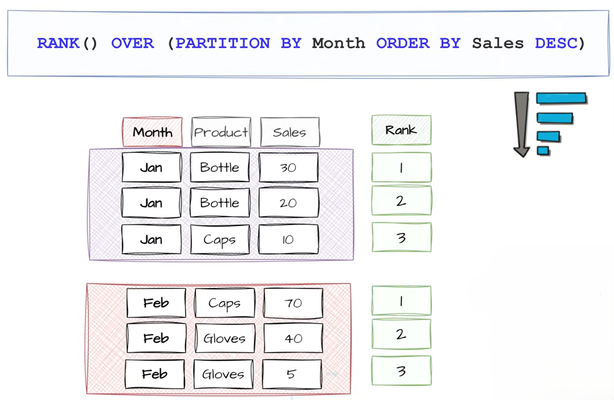

# ORDER BY in Window Functions

`ORDER BY` inside `OVER()` tells SQL:

> "In what order should the rows be processed within the window?"

It is **different** from the normal `ORDER BY` at the end of a query.

**Syntax**

```sql
window_function() OVER (
    ORDER BY column_name
)
```


