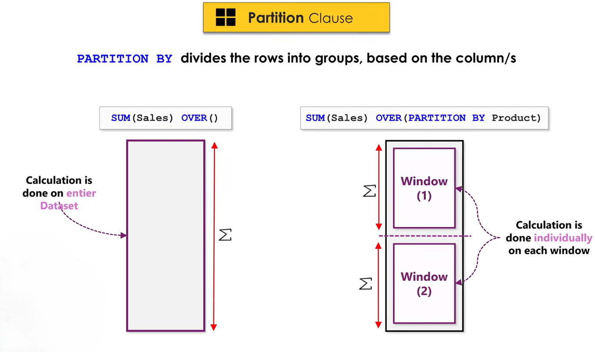
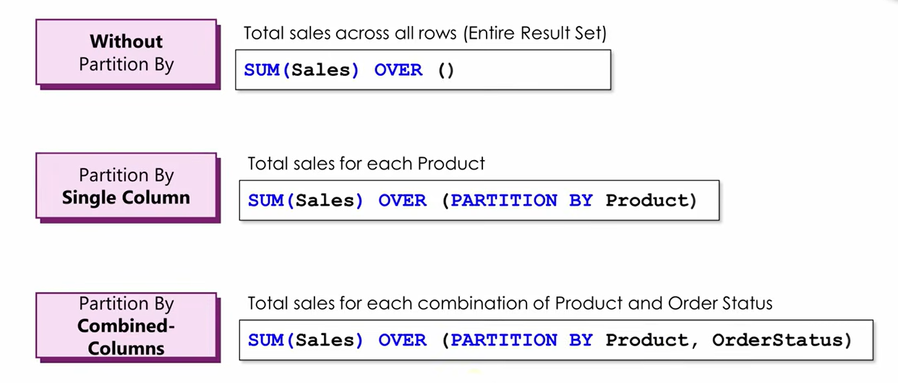
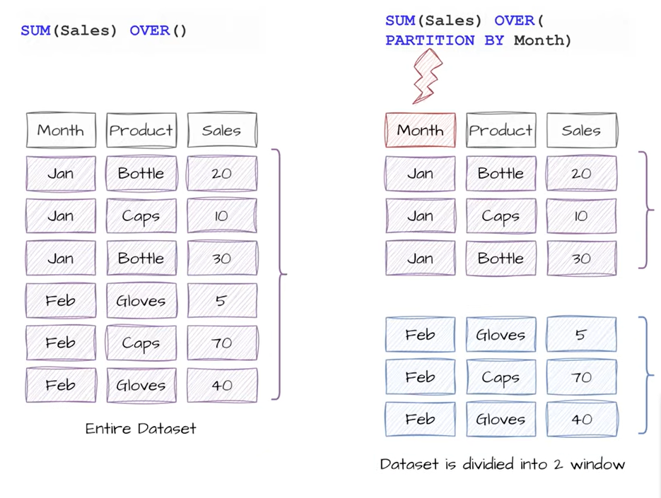

# PARTITION BY

`PARTITION BY` is used with **window functions** to divide rows into groups (partitions) before performing a calculation.

**Syntax**

```sql
window_function() OVER (
    PARTITION BY column_name
)
```



### Options



### Example




