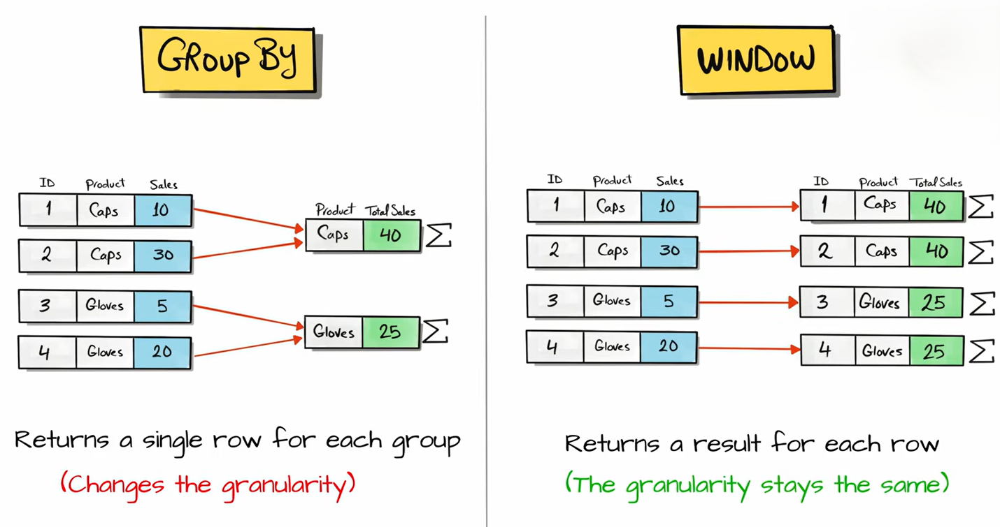
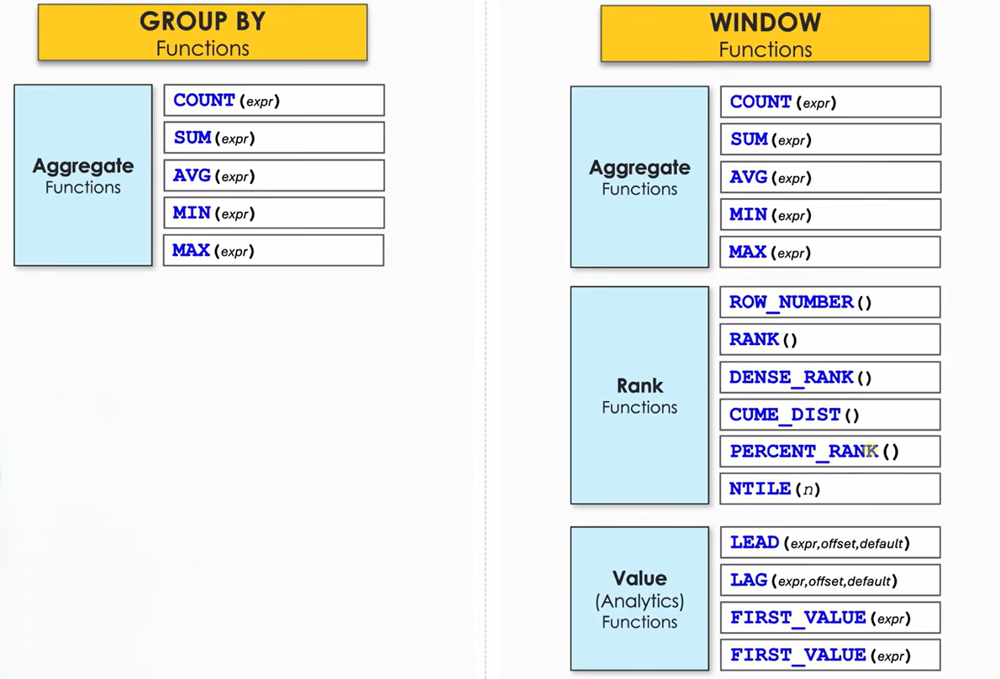
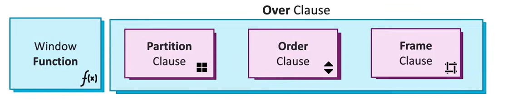
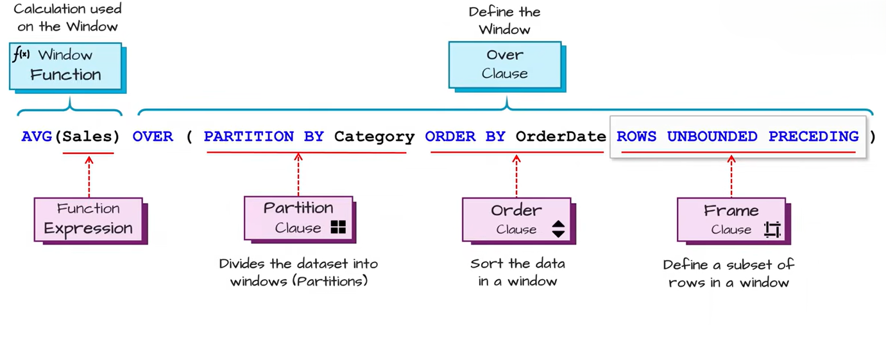
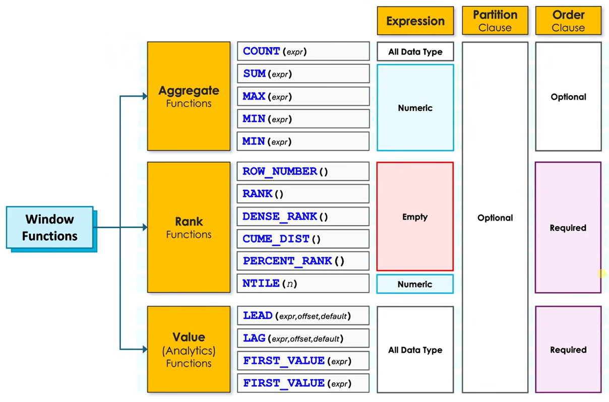

# Window Functions

SQL window functions perform calculations across a set of table rows that are related to the current row, without collapsing the rows into a single summary row. Unlike standard GROUP BY aggregations, window functions allow you to preserve the identity and detail of each individual record while simultaneously appending aggregated or calculated metrics alongside them.

## Window Functions vs GROUP BY

| GROUP BY                                                            | Window Functions                                         |
| ------------------------------------------------------------------- | -------------------------------------------------------- |
| Groups rows together                                                | Keeps all rows                                           |
| Returns one row per group                                           | Returns every original row                               |
| Used for summaries                                                  | Used for analysis while keeping details                  |
| Cannot show individual row data and group aggregate together easily | Can show both individual row data and aggregate together |
| Uses aggregate functions only                                       | Uses `OVER()` with window functions                      |

 

 

* **GROUP BY** → "Give me one result per group."
* **Window Function** → "Give me every row, plus calculations based on related rows."

 

 

## Syntax

Now lets talk about syntax of windows function it is generally written as 

 

 

In SQL, the `OVER` clause allows you to calculate aggregate values (like sums or averages) for a group of rows without collapsing your data into a single row.

- [Partition Clause](./Clause/Partition%20Clause/Readme.md)
- [ORDER BY Clause](./Clause/ORDER%20BY/Readme.md)
- [Frame Clause](./Clause/Frame%20Clause/Readme.md)

 

 

>[!NOTE]
> frame clause is meaningful only when SQL knows the order of rows. so frame clause needs ORDER BY to work

