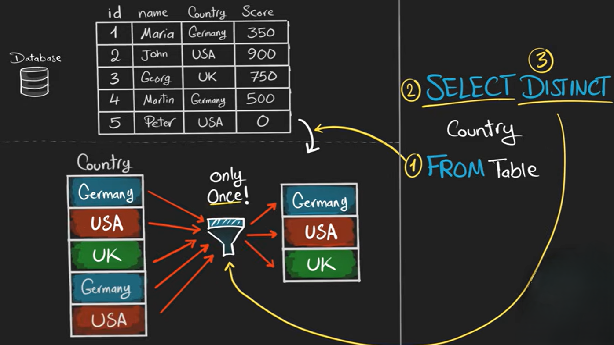

# DISTINCT

The **`DISTINCT` clause in SQL** is used to **remove duplicate values** from the result of a query. It ensures that the output contains **only unique records**.

**Syntax**

```sql
SELECT DISTINCT column_name
FROM table_name;
```

**Example**

Table: `Students`

| id  | name  | city    |
| --- | ----- | ------- |
| 1   | Ali   | Lahore  |
| 2   | Sara  | Lahore  |
| 3   | Ahmed | Karachi |
| 4   | Ali   | Lahore  |

Query:

```sql
SELECT DISTINCT name
FROM Students;
```

Result:

| name  |
| ----- |
| Ali   |
| Sara  |
| Ahmed |

Here, **duplicate names are removed**.

---

### Using DISTINCT with Multiple Columns

```sql
SELECT DISTINCT name, city
FROM Students;
```

This returns **unique combinations** of `name` and `city`.

---




### Key Points

* Removes **duplicate rows**.
* Works with **one or multiple columns**.
* Used after `SELECT` and before column names.

Example:

```sql
SELECT DISTINCT city
FROM Students;
```

This will show each **city only once**.
