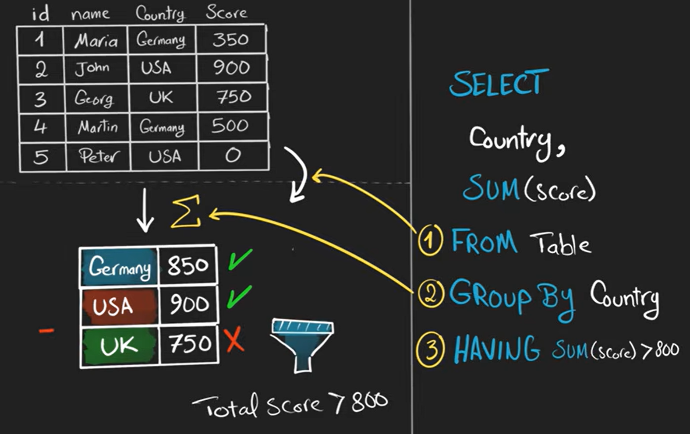
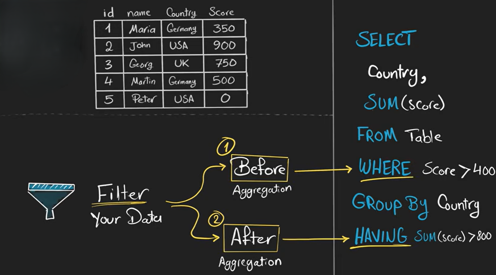
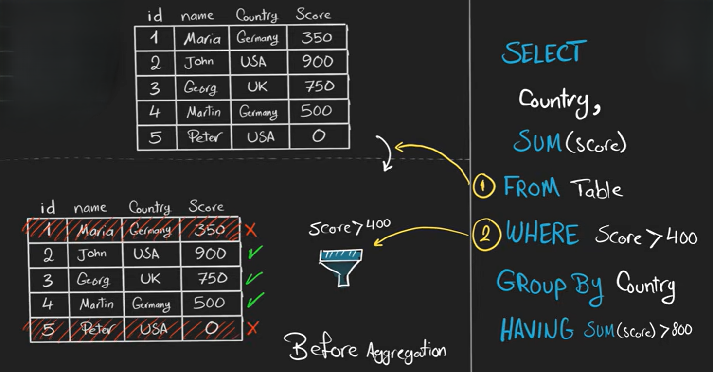
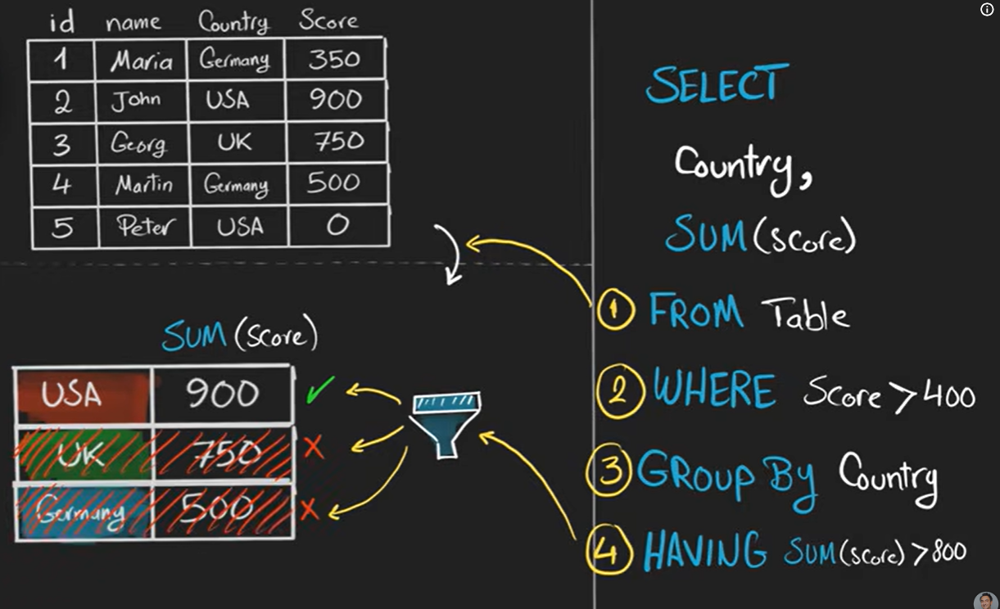

# HAVING

The **HAVING clause** in **SQL** is used to **filter groups of data after the `GROUP BY` clause**. It is mainly used with **aggregate functions** like `COUNT()`, `SUM()`, `AVG()`, `MAX()`, and `MIN()`.

**Syntax**

```sql
SELECT column_name, aggregate_function(column_name)
FROM table_name
GROUP BY column_name
HAVING condition;
```

**Example**

```sql
SELECT department, COUNT(employee_id)
FROM employees
GROUP BY department
HAVING COUNT(employee_id) > 5;
```

**Explanation:**

* `GROUP BY` groups employees by department.
* `HAVING` filters the groups and shows **only departments with more than 5 employees**.

---

<br>





### Difference Between WHERE and HAVING

| WHERE                          | HAVING                        |
| ------------------------------ | ----------------------------- |
| Filters rows before grouping   | Filters groups after grouping |
| Cannot use aggregate functions | Can use aggregate functions   |

the main difference is when is the filter applied and this acctually changes the last result



<br>
<br>



<br>
<br>





so here we can see that the germany is filtered out 


