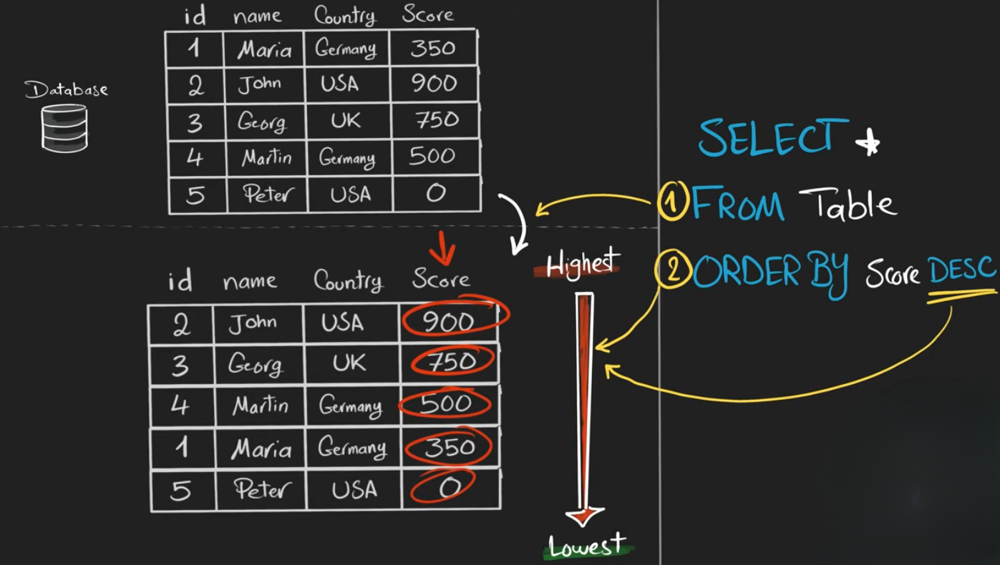
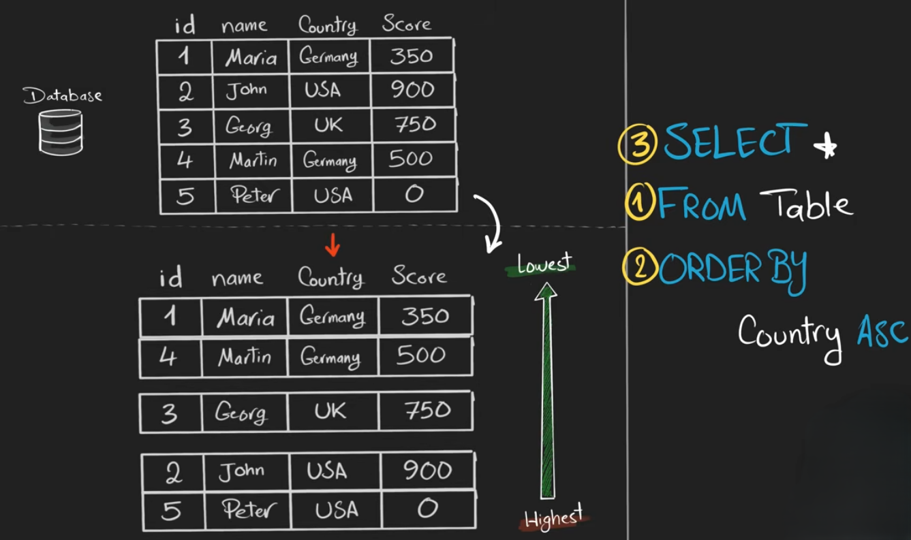
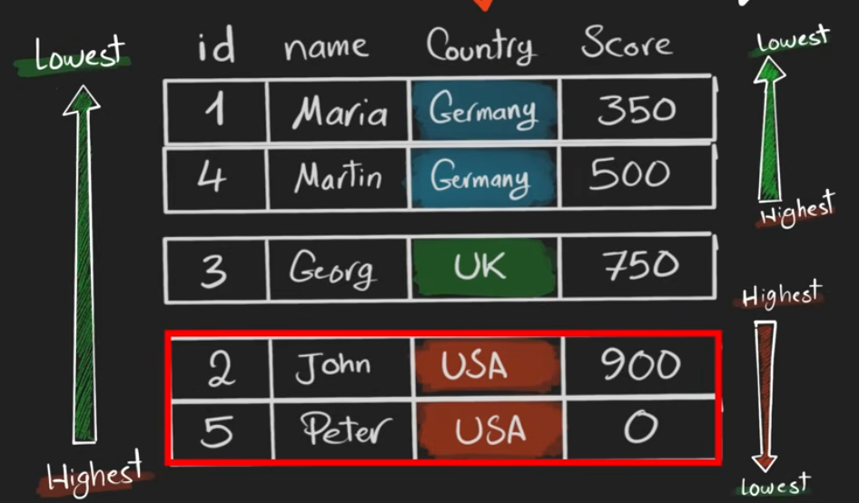
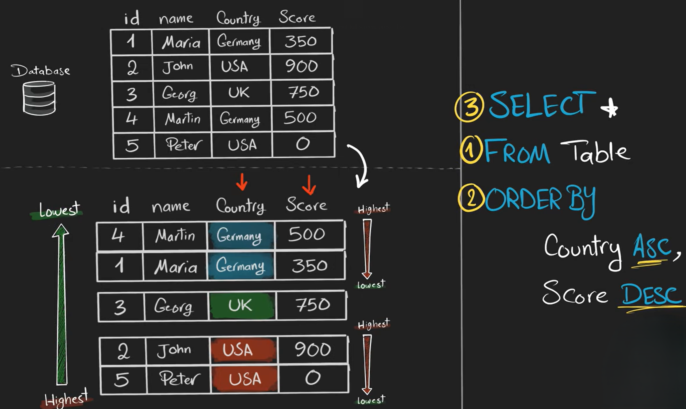

# **ORDER BY**

The **`ORDER BY` clause** is used to **sort the result set** of a query by one or more columns.

* By default, it sorts in **ascending order** (`ASC`).
* You can also sort in **descending order** (`DESC`).
* `ORDER BY` does **not change the data in the table**, it only changes the **display order**.

```sql
SELECT column1, column2, ...
FROM table_name
ORDER BY column1 ASC|DESC;
```

* `column1`→ Columns to sort by.
* `ASC` → Ascending order (default).
* `DESC` → Descending order.




<br>
<br>

**Examples**

### a) Sort by one column (ascending – default):

```sql
SELECT first_name, grade
FROM students
ORDER BY grade;
```

* Result is sorted **A → Z** or **smallest → largest** depending on the data type.

### b) Sort by one column descending:

```sql
SELECT first_name, grade
FROM students
ORDER BY grade DESC;
```

* Result is sorted **Z → A** or **largest → smallest**.

### c) Sort by multiple columns:

```sql
SELECT first_name, last_name, grade
FROM students
ORDER BY grade ASC, last_name DESC;
```

* First, sort by `grade` ascending.
* Then, within the same grade, sort by `last_name` descending.

---

## **Notes About ORDER BY**

* `ORDER BY` always comes **after WHERE, GROUP BY, or HAVING** in a query.
* Can sort **text, numbers, or dates**.
* Sorting by multiple columns allows **precise control** over the order of results.

---

## **multi-column ORDER BY (hierarchical or priority sorting)**



<br>
<br>




here we can see that there is no clean way how data is sorted as score is not sorted properlly we can sort it by using 


```sql
SELECT column1, column2, ...
FROM table_name
ORDER BY column1 ASC|DESC , column2 ASC|DESC ;
```




---

### **priority**


**Priority in a multi-column `ORDER BY`** refers to the sequence in which columns are used to sort the result set. The **first column listed** has the **highest priority**, meaning all rows are primarily sorted by this column. The **second column** acts as a **secondary sort** and only organizes rows that have the **same value in the first column**. Additional columns follow the same rule, each serving as a tie-breaker for the previous columns.


**Example**


Table: `students`

| name   | grade | marks |
| ------ | ----- | ----- |
| Ali    | A     | 90    |
| Sara   | A     | 85    |
| Hamza  | B     | 95    |
| Bilal  | B     | 80    |
| Ayesha | A     | 88    |

**Query**:

```sql
SELECT name, grade, marks
FROM students
ORDER BY grade ASC, marks DESC;
```

**How Priority Works**:

1. **Primary priority = grade ASC** → sort all rows by `grade` ascending: A → B

| name   | grade | marks |
| ------ | ----- | ----- |
| Ali    | A     | 90    |
| Sara   | A     | 85    |
| Ayesha | A     | 88    |
| Hamza  | B     | 95    |
| Bilal  | B     | 80    |

2. **Secondary priority = marks DESC** → only sort rows with the **same grade** by `marks` descending

| name   | grade | marks |
| ------ | ----- | ----- |
| Ali    | A     | 90    |
| Ayesha | A     | 88    |
| Sara   | A     | 85    |
| Hamza  | B     | 95    |
| Bilal  | B     | 80    |

---


