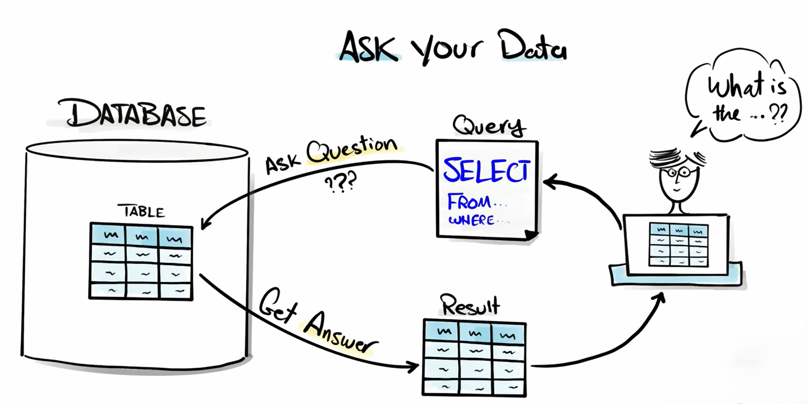
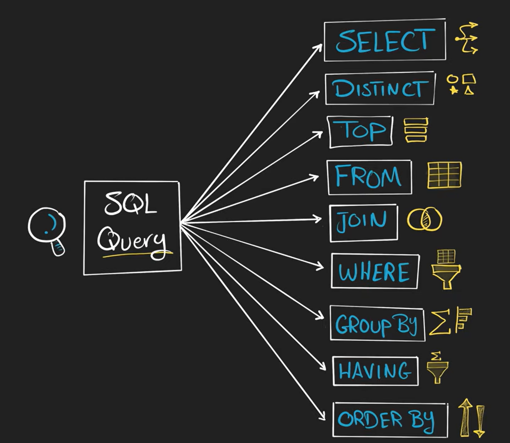

# data query

A **data query in SQL** refers to a request made to a database to retrieve specific information stored in its tables. It is primarily performed using the **SELECT** statement, which allows users to access and view data without modifying it.

In SQL (Structured Query Language), queries are used to:

* Retrieve specific columns or all columns from a table
* Filter data using conditions (e.g., `WHERE`)
* Sort results (`ORDER BY`)
* Group data (`GROUP BY`)
* Combine multiple tables using joins

Data queries are part of **Data Query Language (DQL)**, which is a subset of SQL focused only on fetching data. Unlike Data Manipulation Language (DML) commands such as `INSERT`, `UPDATE`, or `DELETE`, data queries do not change the stored data — they only display it.

In simple terms, a data query is a way of asking the database a question and getting the required data as a result.

---

## clauses 

In SQL, **clauses** are keywords or parts of a statement that perform specific functions within a query. They define how the data should be selected, filtered, grouped, or sorted.

A clause is a building block of an SQL statement. Each clause serves a different purpose, and together they form a complete query.

Common SQL clauses include:

* **SELECT** – Specifies the columns to retrieve from a table.
* **FROM** – Specifies the table from which to retrieve the data.

[click](./SELECT&FROM/Readme.md) here to learn about SELECT & FROM

* **WHERE** – Filters records based on a given condition.
* **GROUP BY** – Groups rows that have the same values in specified columns.
* **HAVING** – Filters grouped data (used with GROUP BY).
* **ORDER BY** – Sorts the result in ascending or descending order.
* **LIMIT** (or TOP in some systems) – Restricts the number of rows returned.

Each clause has a specific position in the query and must follow the correct order. Together, clauses control how the database processes and returns the data.

