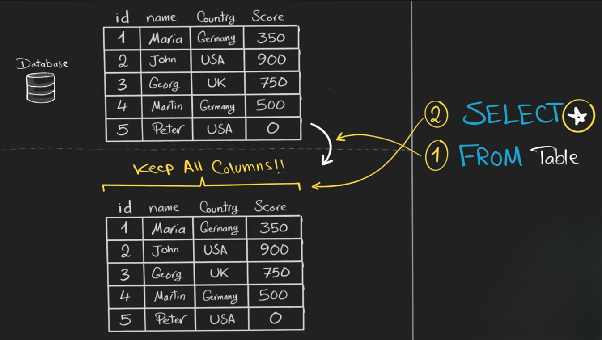
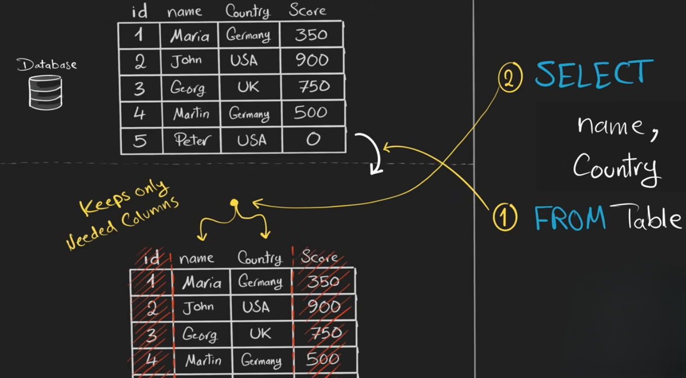

# **SELECT & FROM**



<br>
<br>

## **SELECT Statement in SQL**

The **`SELECT` statement** is the primary SQL command used to **retrieve data from a database**. It is part of the **Data Query Language (DQL)**. `SELECT` allows you to specify exactly which columns and rows you want to see from one or more tables.


```sql
SELECT column1, column2, ...
FROM table_name;
```

* `column1, column2, ...` → Names of the columns you want to retrieve.
* `table_name` → Name of the table where the data is stored.

**Example:**

```sql
SELECT first_name, last_name
FROM students;
```




This retrieves the `first_name` and `last_name` of all students from the `students` table.

---

## **Selecting All Columns**

To retrieve **all columns**, you can use `*`:

```sql
SELECT *
FROM students;
```

This fetches **every column** of the table.

---

## **FROM Clause**

The **`FROM` clause** specifies **the table(s) from which to retrieve data**. It tells the database **where to look** for the columns listed in the `SELECT` statement.

**Examples:**

* Basic usage:

```sql
SELECT first_name, last_name
FROM students;
```

* Using an **alias** for the table:

```sql
SELECT s.first_name, s.last_name
FROM students AS s;
```

This is very useful if the table name is long or if there are multiple tables with similar column names.


**Notes:**

* `FROM` always comes **after SELECT**.
* Can include **table aliases, joins, or subqueries**.
* Specifies the **source table(s)** for your data.

---

## **Limiting Results**

Some databases allow limiting the number of rows:

```sql
SELECT * 
FROM students
LIMIT 5;
```

This fetches only the first 5 rows.

---


