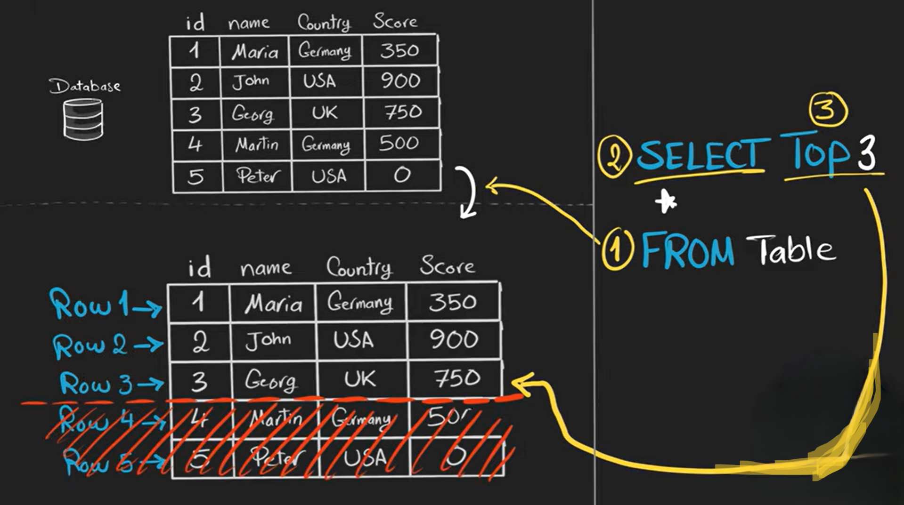

# TOP

`TOP` in SQL is used to **limit the number of rows returned** from a query.

It is mainly used in **SQL Server (T-SQL)**.

```sql
SELECT TOP number column1, column2
FROM table_name;
```

Example:

```sql
SELECT TOP 5 *
FROM students;
```

This returns the **first 5 rows**.




---

## **TOP with PERCENT**

```sql
SELECT TOP 10 PERCENT *
FROM students;
```

This returns the **top 10% of rows**.

---

## **TOP with ORDER BY**

To get the *highest* or *lowest* values, you must use `ORDER BY`.

Example: Get highest 3 salaries:

```sql
SELECT TOP 3 *
FROM employees
ORDER BY salary DESC;
```

Example: Get lowest 3 salaries:

```sql
SELECT TOP 3 *
FROM employees
ORDER BY salary ASC;
```

---

## **Important**

`TOP` is **not available in MySQL**.

---

# LIMIT (MySQL & PostgreSQL)

`LIMIT` is used to **limit the number of rows** in MySQL and PostgreSQL.

Basic syntax:

```sql
SELECT column1, column2
FROM table_name
LIMIT number;
```

Example:

```sql
SELECT *
FROM students
LIMIT 5;
```

This returns the **first 5 rows**.

---

## **LIMIT with ORDER BY**

To get highest or lowest values:

Highest 3 salaries:

```sql
SELECT *
FROM employees
ORDER BY salary DESC
LIMIT 3;
```

Lowest 3 salaries:

```sql
SELECT *
FROM employees
ORDER BY salary ASC
LIMIT 3;
```

---

## **LIMIT with OFFSET (skip rows)**

```sql
SELECT *
FROM table
LIMIT 10, 5;
```

This means:

* Skip **10 rows**
* Return the next **5 rows**

Equivalent to SQL Server:

```sql
OFFSET 10 ROWS
FETCH NEXT 5 ROWS ONLY;
```

---

# Oracle alternative

```sql
FETCH FIRST 5 ROWS ONLY;
```

---

<br>
<br>

Here’s a quick mapping for clarity:

| Database      | Row-limiting keyword      | Notes                            |
| ------------- | ------------------------- | -------------------------------- |
| SQL Server    | `TOP`                     | Also `OFFSET…FETCH` works        |
| MySQL         | `LIMIT`                   | Can use `LIMIT offset, count`    |
| PostgreSQL    | `LIMIT`                   | Can also use `OFFSET` separately |
| Oracle (12c+) | `FETCH FIRST n ROWS ONLY` | Older versions used `ROWNUM`     |
