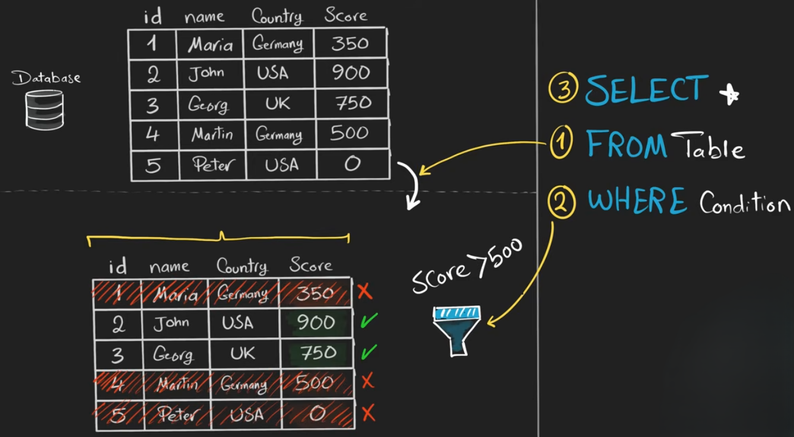

# **WHERE**

The **`WHERE` clause** is used to **filter records** from a table based on a condition. It allows you to retrieve **only the rows that meet certain criteria**.

* Without `WHERE`, SQL returns **all rows** from the table.
* With `WHERE`, you can control **exactly which rows** to get.


```sql
SELECT column1, column2, ...
FROM table_name
WHERE condition;
```

* `condition` → A logical expression that must be **true** for the row to be included.




**Example:**

```sql
SELECT first_name, last_name
FROM students
WHERE grade = 'A';
```

* This retrieves **only students who have grade 'A'**.

---

## **Using Comparison Operators**

You can use these operators in `WHERE` conditions:

| Operator | Meaning                  | Example      |
| -------- | ------------------------ | ------------ |
| =        | Equal to                 | grade = 'B'  |
| <> or != | Not equal to             | grade <> 'A' |
| >        | Greater than             | score > 50   |
| <        | Less than                | score < 70   |
| >=       | Greater than or equal to | age >= 18    |
| <=       | Less than or equal to    | age <= 25    |

---

## **Using Logical Operators**

You can combine conditions with:

| Operator | Meaning                      | Example                    |
| -------- | ---------------------------- | -------------------------- |
| AND      | Both conditions must be true | grade = 'A' AND age > 18   |
| OR       | Either condition can be true | grade = 'A' OR grade = 'B' |
| NOT      | Negates the condition        | NOT grade = 'C'            |

**Example:**

```sql
SELECT first_name, last_name
FROM students
WHERE grade = 'A' AND age > 18;
```

* Fetches students with **grade 'A'** **and** **age over 18**.

---

## **Using Pattern Matching (LIKE)**

`LIKE` is used to filter **text data**:

```sql
SELECT first_name, last_name
FROM students
WHERE first_name LIKE 'A%';
```

* `%` → any number of characters
* `_` → exactly one character

Examples:

* `'A%'` → starts with A
* `'%n'` → ends with n
* `'%ar%'` → contains ar

---

## **Using BETWEEN, IN, IS NULL**

* **BETWEEN** → Check if a value is in a range:

```sql
SELECT * FROM students
WHERE age BETWEEN 15 AND 20;
```

* **IN** → Check if a value is in a set:

```sql
SELECT * FROM students
WHERE grade IN ('A', 'B');
```

* **IS NULL** → Check for NULL values:

```sql
SELECT * FROM students
WHERE middle_name IS NULL;
```

---
